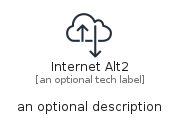
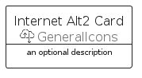
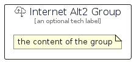

# InternetAlt2


```text
aws-q1-2023/Resource/GeneralIcons/InternetAlt2
```

```text
include('aws-q1-2023/Resource/GeneralIcons/InternetAlt2')
```


| Illustration | InternetAlt2 | InternetAlt2Card | InternetAlt2Group |
| :---: | :---: | :---: | :---: |
|  |  |  |  |


## Sprites
The item provides the following sriptes:

- `<$InternetAlt2Xs>`
- `<$InternetAlt2Sm>`
- `<$InternetAlt2Md>`
- `<$InternetAlt2Lg>`


## InternetAlt2

### Load remotely
```plantuml
@startuml
' configures the library
!global $LIB_BASE_LOCATION="https://raw.githubusercontent.com/tmorin/plantuml-libs/master/distribution"

' loads the library's bootstrap
!include $LIB_BASE_LOCATION/bootstrap.puml

' loads the package bootstrap
include('aws-q1-2023/bootstrap')

' loads the Item which embeds the element InternetAlt2
include('aws-q1-2023/Resource/GeneralIcons/InternetAlt2')

' renders the element
InternetAlt2('InternetAlt2', 'Internet Alt2', 'an optional tech label', 'an optional description')
@enduml
```

### Load locally
```plantuml
@startuml
' configures the library
!global $INCLUSION_MODE="local"
!global $LIB_BASE_LOCATION="../../.."

' loads the library's bootstrap
!include $LIB_BASE_LOCATION/bootstrap.puml

' loads the package bootstrap
include('aws-q1-2023/bootstrap')

' loads the Item which embeds the element InternetAlt2
include('aws-q1-2023/Resource/GeneralIcons/InternetAlt2')

' renders the element
InternetAlt2('InternetAlt2', 'Internet Alt2', 'an optional tech label', 'an optional description')
@enduml
```

## InternetAlt2Card

### Load remotely
```plantuml
@startuml
' configures the library
!global $LIB_BASE_LOCATION="https://raw.githubusercontent.com/tmorin/plantuml-libs/master/distribution"

' loads the library's bootstrap
!include $LIB_BASE_LOCATION/bootstrap.puml

' loads the package bootstrap
include('aws-q1-2023/bootstrap')

' loads the Item which embeds the element InternetAlt2Card
include('aws-q1-2023/Resource/GeneralIcons/InternetAlt2')

' renders the element
InternetAlt2Card('InternetAlt2Card', 'Internet Alt2 Card', 'an optional description')
@enduml
```

### Load locally
```plantuml
@startuml
' configures the library
!global $INCLUSION_MODE="local"
!global $LIB_BASE_LOCATION="../../.."

' loads the library's bootstrap
!include $LIB_BASE_LOCATION/bootstrap.puml

' loads the package bootstrap
include('aws-q1-2023/bootstrap')

' loads the Item which embeds the element InternetAlt2Card
include('aws-q1-2023/Resource/GeneralIcons/InternetAlt2')

' renders the element
InternetAlt2Card('InternetAlt2Card', 'Internet Alt2 Card', 'an optional description')
@enduml
```

## InternetAlt2Group

### Load remotely
```plantuml
@startuml
' configures the library
!global $LIB_BASE_LOCATION="https://raw.githubusercontent.com/tmorin/plantuml-libs/master/distribution"

' loads the library's bootstrap
!include $LIB_BASE_LOCATION/bootstrap.puml

' loads the package bootstrap
include('aws-q1-2023/bootstrap')

' loads the Item which embeds the element InternetAlt2Group
include('aws-q1-2023/Resource/GeneralIcons/InternetAlt2')

' renders the element
InternetAlt2Group('InternetAlt2Group', 'Internet Alt2 Group', 'an optional tech label') {
    note as note
        the content of the group
    end note
}
@enduml
```

### Load locally
```plantuml
@startuml
' configures the library
!global $INCLUSION_MODE="local"
!global $LIB_BASE_LOCATION="../../.."

' loads the library's bootstrap
!include $LIB_BASE_LOCATION/bootstrap.puml

' loads the package bootstrap
include('aws-q1-2023/bootstrap')

' loads the Item which embeds the element InternetAlt2Group
include('aws-q1-2023/Resource/GeneralIcons/InternetAlt2')

' renders the element
InternetAlt2Group('InternetAlt2Group', 'Internet Alt2 Group', 'an optional tech label') {
    note as note
        the content of the group
    end note
}
@enduml
```

