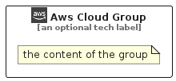

# AwsCloud


```text
aws-q1-2023/Resource/GroupIcons/AwsCloud
```

```text
include('aws-q1-2023/Resource/GroupIcons/AwsCloud')
```


| Illustration | AwsCloud | AwsCloudCard | AwsCloudGroup |
| :---: | :---: | :---: | :---: |
|  |  |  |  |


## AwsCloud

### Load remotely
```plantuml
@startuml
' configures the library
!global $LIB_BASE_LOCATION="https://raw.githubusercontent.com/tmorin/plantuml-libs/master/distribution"

' loads the library's bootstrap
!include $LIB_BASE_LOCATION/bootstrap.puml

' loads the package bootstrap
include('aws-q1-2023/bootstrap')

' loads the Item which embeds the element AwsCloud
include('aws-q1-2023/Resource/GroupIcons/AwsCloud')

' renders the element
AwsCloud('AwsCloud', 'Aws Cloud', 'an optional tech label', 'an optional description')
@enduml
```

### Load locally
```plantuml
@startuml
' configures the library
!global $INCLUSION_MODE="local"
!global $LIB_BASE_LOCATION="../../.."

' loads the library's bootstrap
!include $LIB_BASE_LOCATION/bootstrap.puml

' loads the package bootstrap
include('aws-q1-2023/bootstrap')

' loads the Item which embeds the element AwsCloud
include('aws-q1-2023/Resource/GroupIcons/AwsCloud')

' renders the element
AwsCloud('AwsCloud', 'Aws Cloud', 'an optional tech label', 'an optional description')
@enduml
```

## AwsCloudCard

### Load remotely
```plantuml
@startuml
' configures the library
!global $LIB_BASE_LOCATION="https://raw.githubusercontent.com/tmorin/plantuml-libs/master/distribution"

' loads the library's bootstrap
!include $LIB_BASE_LOCATION/bootstrap.puml

' loads the package bootstrap
include('aws-q1-2023/bootstrap')

' loads the Item which embeds the element AwsCloudCard
include('aws-q1-2023/Resource/GroupIcons/AwsCloud')

' renders the element
AwsCloudCard('AwsCloudCard', 'Aws Cloud Card', 'an optional description')
@enduml
```

### Load locally
```plantuml
@startuml
' configures the library
!global $INCLUSION_MODE="local"
!global $LIB_BASE_LOCATION="../../.."

' loads the library's bootstrap
!include $LIB_BASE_LOCATION/bootstrap.puml

' loads the package bootstrap
include('aws-q1-2023/bootstrap')

' loads the Item which embeds the element AwsCloudCard
include('aws-q1-2023/Resource/GroupIcons/AwsCloud')

' renders the element
AwsCloudCard('AwsCloudCard', 'Aws Cloud Card', 'an optional description')
@enduml
```

## AwsCloudGroup

### Load remotely
```plantuml
@startuml
' configures the library
!global $LIB_BASE_LOCATION="https://raw.githubusercontent.com/tmorin/plantuml-libs/master/distribution"

' loads the library's bootstrap
!include $LIB_BASE_LOCATION/bootstrap.puml

' loads the package bootstrap
include('aws-q1-2023/bootstrap')

' loads the Item which embeds the element AwsCloudGroup
include('aws-q1-2023/Resource/GroupIcons/AwsCloud')

' renders the element
AwsCloudGroup('AwsCloudGroup', 'Aws Cloud Group', 'an optional tech label') {
    note as note
        the content of the group
    end note
}
@enduml
```

### Load locally
```plantuml
@startuml
' configures the library
!global $INCLUSION_MODE="local"
!global $LIB_BASE_LOCATION="../../.."

' loads the library's bootstrap
!include $LIB_BASE_LOCATION/bootstrap.puml

' loads the package bootstrap
include('aws-q1-2023/bootstrap')

' loads the Item which embeds the element AwsCloudGroup
include('aws-q1-2023/Resource/GroupIcons/AwsCloud')

' renders the element
AwsCloudGroup('AwsCloudGroup', 'Aws Cloud Group', 'an optional tech label') {
    note as note
        the content of the group
    end note
}
@enduml
```

