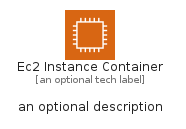
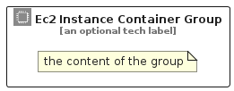

# Ec2InstanceContainer


```text
aws-q1-2023/Resource/GroupIcons/Ec2InstanceContainer
```

```text
include('aws-q1-2023/Resource/GroupIcons/Ec2InstanceContainer')
```


| Illustration | Ec2InstanceContainer | Ec2InstanceContainerCard | Ec2InstanceContainerGroup |
| :---: | :---: | :---: | :---: |
|  |  |  |  |


## Ec2InstanceContainer

### Load remotely
```plantuml
@startuml
' configures the library
!global $LIB_BASE_LOCATION="https://raw.githubusercontent.com/tmorin/plantuml-libs/master/distribution"

' loads the library's bootstrap
!include $LIB_BASE_LOCATION/bootstrap.puml

' loads the package bootstrap
include('aws-q1-2023/bootstrap')

' loads the Item which embeds the element Ec2InstanceContainer
include('aws-q1-2023/Resource/GroupIcons/Ec2InstanceContainer')

' renders the element
Ec2InstanceContainer('Ec2InstanceContainer', 'Ec2 Instance Container', 'an optional tech label', 'an optional description')
@enduml
```

### Load locally
```plantuml
@startuml
' configures the library
!global $INCLUSION_MODE="local"
!global $LIB_BASE_LOCATION="../../.."

' loads the library's bootstrap
!include $LIB_BASE_LOCATION/bootstrap.puml

' loads the package bootstrap
include('aws-q1-2023/bootstrap')

' loads the Item which embeds the element Ec2InstanceContainer
include('aws-q1-2023/Resource/GroupIcons/Ec2InstanceContainer')

' renders the element
Ec2InstanceContainer('Ec2InstanceContainer', 'Ec2 Instance Container', 'an optional tech label', 'an optional description')
@enduml
```

## Ec2InstanceContainerCard

### Load remotely
```plantuml
@startuml
' configures the library
!global $LIB_BASE_LOCATION="https://raw.githubusercontent.com/tmorin/plantuml-libs/master/distribution"

' loads the library's bootstrap
!include $LIB_BASE_LOCATION/bootstrap.puml

' loads the package bootstrap
include('aws-q1-2023/bootstrap')

' loads the Item which embeds the element Ec2InstanceContainerCard
include('aws-q1-2023/Resource/GroupIcons/Ec2InstanceContainer')

' renders the element
Ec2InstanceContainerCard('Ec2InstanceContainerCard', 'Ec2 Instance Container Card', 'an optional description')
@enduml
```

### Load locally
```plantuml
@startuml
' configures the library
!global $INCLUSION_MODE="local"
!global $LIB_BASE_LOCATION="../../.."

' loads the library's bootstrap
!include $LIB_BASE_LOCATION/bootstrap.puml

' loads the package bootstrap
include('aws-q1-2023/bootstrap')

' loads the Item which embeds the element Ec2InstanceContainerCard
include('aws-q1-2023/Resource/GroupIcons/Ec2InstanceContainer')

' renders the element
Ec2InstanceContainerCard('Ec2InstanceContainerCard', 'Ec2 Instance Container Card', 'an optional description')
@enduml
```

## Ec2InstanceContainerGroup

### Load remotely
```plantuml
@startuml
' configures the library
!global $LIB_BASE_LOCATION="https://raw.githubusercontent.com/tmorin/plantuml-libs/master/distribution"

' loads the library's bootstrap
!include $LIB_BASE_LOCATION/bootstrap.puml

' loads the package bootstrap
include('aws-q1-2023/bootstrap')

' loads the Item which embeds the element Ec2InstanceContainerGroup
include('aws-q1-2023/Resource/GroupIcons/Ec2InstanceContainer')

' renders the element
Ec2InstanceContainerGroup('Ec2InstanceContainerGroup', 'Ec2 Instance Container Group', 'an optional tech label') {
    note as note
        the content of the group
    end note
}
@enduml
```

### Load locally
```plantuml
@startuml
' configures the library
!global $INCLUSION_MODE="local"
!global $LIB_BASE_LOCATION="../../.."

' loads the library's bootstrap
!include $LIB_BASE_LOCATION/bootstrap.puml

' loads the package bootstrap
include('aws-q1-2023/bootstrap')

' loads the Item which embeds the element Ec2InstanceContainerGroup
include('aws-q1-2023/Resource/GroupIcons/Ec2InstanceContainer')

' renders the element
Ec2InstanceContainerGroup('Ec2InstanceContainerGroup', 'Ec2 Instance Container Group', 'an optional tech label') {
    note as note
        the content of the group
    end note
}
@enduml
```

