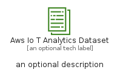

# AwsIoTAnalyticsDataset


```text
aws-q1-2023/Resource/LoT/AwsIoTAnalyticsDataset
```

```text
include('aws-q1-2023/Resource/LoT/AwsIoTAnalyticsDataset')
```


| Illustration | AwsIoTAnalyticsDataset | AwsIoTAnalyticsDatasetCard | AwsIoTAnalyticsDatasetGroup |
| :---: | :---: | :---: | :---: |
|  |  |  |  |


## Sprites
The item provides the following sriptes:

- `<$AwsIoTAnalyticsDatasetXs>`
- `<$AwsIoTAnalyticsDatasetSm>`
- `<$AwsIoTAnalyticsDatasetMd>`
- `<$AwsIoTAnalyticsDatasetLg>`


## AwsIoTAnalyticsDataset

### Load remotely
```plantuml
@startuml
' configures the library
!global $LIB_BASE_LOCATION="https://raw.githubusercontent.com/tmorin/plantuml-libs/master/distribution"

' loads the library's bootstrap
!include $LIB_BASE_LOCATION/bootstrap.puml

' loads the package bootstrap
include('aws-q1-2023/bootstrap')

' loads the Item which embeds the element AwsIoTAnalyticsDataset
include('aws-q1-2023/Resource/LoT/AwsIoTAnalyticsDataset')

' renders the element
AwsIoTAnalyticsDataset('AwsIoTAnalyticsDataset', 'Aws Io T Analytics Dataset', 'an optional tech label', 'an optional description')
@enduml
```

### Load locally
```plantuml
@startuml
' configures the library
!global $INCLUSION_MODE="local"
!global $LIB_BASE_LOCATION="../../.."

' loads the library's bootstrap
!include $LIB_BASE_LOCATION/bootstrap.puml

' loads the package bootstrap
include('aws-q1-2023/bootstrap')

' loads the Item which embeds the element AwsIoTAnalyticsDataset
include('aws-q1-2023/Resource/LoT/AwsIoTAnalyticsDataset')

' renders the element
AwsIoTAnalyticsDataset('AwsIoTAnalyticsDataset', 'Aws Io T Analytics Dataset', 'an optional tech label', 'an optional description')
@enduml
```

## AwsIoTAnalyticsDatasetCard

### Load remotely
```plantuml
@startuml
' configures the library
!global $LIB_BASE_LOCATION="https://raw.githubusercontent.com/tmorin/plantuml-libs/master/distribution"

' loads the library's bootstrap
!include $LIB_BASE_LOCATION/bootstrap.puml

' loads the package bootstrap
include('aws-q1-2023/bootstrap')

' loads the Item which embeds the element AwsIoTAnalyticsDatasetCard
include('aws-q1-2023/Resource/LoT/AwsIoTAnalyticsDataset')

' renders the element
AwsIoTAnalyticsDatasetCard('AwsIoTAnalyticsDatasetCard', 'Aws Io T Analytics Dataset Card', 'an optional description')
@enduml
```

### Load locally
```plantuml
@startuml
' configures the library
!global $INCLUSION_MODE="local"
!global $LIB_BASE_LOCATION="../../.."

' loads the library's bootstrap
!include $LIB_BASE_LOCATION/bootstrap.puml

' loads the package bootstrap
include('aws-q1-2023/bootstrap')

' loads the Item which embeds the element AwsIoTAnalyticsDatasetCard
include('aws-q1-2023/Resource/LoT/AwsIoTAnalyticsDataset')

' renders the element
AwsIoTAnalyticsDatasetCard('AwsIoTAnalyticsDatasetCard', 'Aws Io T Analytics Dataset Card', 'an optional description')
@enduml
```

## AwsIoTAnalyticsDatasetGroup

### Load remotely
```plantuml
@startuml
' configures the library
!global $LIB_BASE_LOCATION="https://raw.githubusercontent.com/tmorin/plantuml-libs/master/distribution"

' loads the library's bootstrap
!include $LIB_BASE_LOCATION/bootstrap.puml

' loads the package bootstrap
include('aws-q1-2023/bootstrap')

' loads the Item which embeds the element AwsIoTAnalyticsDatasetGroup
include('aws-q1-2023/Resource/LoT/AwsIoTAnalyticsDataset')

' renders the element
AwsIoTAnalyticsDatasetGroup('AwsIoTAnalyticsDatasetGroup', 'Aws Io T Analytics Dataset Group', 'an optional tech label') {
    note as note
        the content of the group
    end note
}
@enduml
```

### Load locally
```plantuml
@startuml
' configures the library
!global $INCLUSION_MODE="local"
!global $LIB_BASE_LOCATION="../../.."

' loads the library's bootstrap
!include $LIB_BASE_LOCATION/bootstrap.puml

' loads the package bootstrap
include('aws-q1-2023/bootstrap')

' loads the Item which embeds the element AwsIoTAnalyticsDatasetGroup
include('aws-q1-2023/Resource/LoT/AwsIoTAnalyticsDataset')

' renders the element
AwsIoTAnalyticsDatasetGroup('AwsIoTAnalyticsDatasetGroup', 'Aws Io T Analytics Dataset Group', 'an optional tech label') {
    note as note
        the content of the group
    end note
}
@enduml
```

