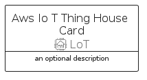

# AwsIoTThingHouse


```text
aws-q1-2023/Resource/LoT/AwsIoTThingHouse
```

```text
include('aws-q1-2023/Resource/LoT/AwsIoTThingHouse')
```


| Illustration | AwsIoTThingHouse | AwsIoTThingHouseCard | AwsIoTThingHouseGroup |
| :---: | :---: | :---: | :---: |
|  |  |  |  |


## Sprites
The item provides the following sriptes:

- `<$AwsIoTThingHouseXs>`
- `<$AwsIoTThingHouseSm>`
- `<$AwsIoTThingHouseMd>`
- `<$AwsIoTThingHouseLg>`


## AwsIoTThingHouse

### Load remotely
```plantuml
@startuml
' configures the library
!global $LIB_BASE_LOCATION="https://raw.githubusercontent.com/tmorin/plantuml-libs/master/distribution"

' loads the library's bootstrap
!include $LIB_BASE_LOCATION/bootstrap.puml

' loads the package bootstrap
include('aws-q1-2023/bootstrap')

' loads the Item which embeds the element AwsIoTThingHouse
include('aws-q1-2023/Resource/LoT/AwsIoTThingHouse')

' renders the element
AwsIoTThingHouse('AwsIoTThingHouse', 'Aws Io T Thing House', 'an optional tech label', 'an optional description')
@enduml
```

### Load locally
```plantuml
@startuml
' configures the library
!global $INCLUSION_MODE="local"
!global $LIB_BASE_LOCATION="../../.."

' loads the library's bootstrap
!include $LIB_BASE_LOCATION/bootstrap.puml

' loads the package bootstrap
include('aws-q1-2023/bootstrap')

' loads the Item which embeds the element AwsIoTThingHouse
include('aws-q1-2023/Resource/LoT/AwsIoTThingHouse')

' renders the element
AwsIoTThingHouse('AwsIoTThingHouse', 'Aws Io T Thing House', 'an optional tech label', 'an optional description')
@enduml
```

## AwsIoTThingHouseCard

### Load remotely
```plantuml
@startuml
' configures the library
!global $LIB_BASE_LOCATION="https://raw.githubusercontent.com/tmorin/plantuml-libs/master/distribution"

' loads the library's bootstrap
!include $LIB_BASE_LOCATION/bootstrap.puml

' loads the package bootstrap
include('aws-q1-2023/bootstrap')

' loads the Item which embeds the element AwsIoTThingHouseCard
include('aws-q1-2023/Resource/LoT/AwsIoTThingHouse')

' renders the element
AwsIoTThingHouseCard('AwsIoTThingHouseCard', 'Aws Io T Thing House Card', 'an optional description')
@enduml
```

### Load locally
```plantuml
@startuml
' configures the library
!global $INCLUSION_MODE="local"
!global $LIB_BASE_LOCATION="../../.."

' loads the library's bootstrap
!include $LIB_BASE_LOCATION/bootstrap.puml

' loads the package bootstrap
include('aws-q1-2023/bootstrap')

' loads the Item which embeds the element AwsIoTThingHouseCard
include('aws-q1-2023/Resource/LoT/AwsIoTThingHouse')

' renders the element
AwsIoTThingHouseCard('AwsIoTThingHouseCard', 'Aws Io T Thing House Card', 'an optional description')
@enduml
```

## AwsIoTThingHouseGroup

### Load remotely
```plantuml
@startuml
' configures the library
!global $LIB_BASE_LOCATION="https://raw.githubusercontent.com/tmorin/plantuml-libs/master/distribution"

' loads the library's bootstrap
!include $LIB_BASE_LOCATION/bootstrap.puml

' loads the package bootstrap
include('aws-q1-2023/bootstrap')

' loads the Item which embeds the element AwsIoTThingHouseGroup
include('aws-q1-2023/Resource/LoT/AwsIoTThingHouse')

' renders the element
AwsIoTThingHouseGroup('AwsIoTThingHouseGroup', 'Aws Io T Thing House Group', 'an optional tech label') {
    note as note
        the content of the group
    end note
}
@enduml
```

### Load locally
```plantuml
@startuml
' configures the library
!global $INCLUSION_MODE="local"
!global $LIB_BASE_LOCATION="../../.."

' loads the library's bootstrap
!include $LIB_BASE_LOCATION/bootstrap.puml

' loads the package bootstrap
include('aws-q1-2023/bootstrap')

' loads the Item which embeds the element AwsIoTThingHouseGroup
include('aws-q1-2023/Resource/LoT/AwsIoTThingHouse')

' renders the element
AwsIoTThingHouseGroup('AwsIoTThingHouseGroup', 'Aws Io T Thing House Group', 'an optional tech label') {
    note as note
        the content of the group
    end note
}
@enduml
```

