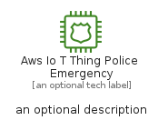

# AwsIoTThingPoliceEmergency


```text
aws-q1-2023/Resource/LoT/AwsIoTThingPoliceEmergency
```

```text
include('aws-q1-2023/Resource/LoT/AwsIoTThingPoliceEmergency')
```


| Illustration | AwsIoTThingPoliceEmergency | AwsIoTThingPoliceEmergencyCard | AwsIoTThingPoliceEmergencyGroup |
| :---: | :---: | :---: | :---: |
|  |  |  |  |


## AwsIoTThingPoliceEmergency

### Load remotely
```plantuml
@startuml
' configures the library
!global $LIB_BASE_LOCATION="https://raw.githubusercontent.com/tmorin/plantuml-libs/master/distribution"

' loads the library's bootstrap
!include $LIB_BASE_LOCATION/bootstrap.puml

' loads the package bootstrap
include('aws-q1-2023/bootstrap')

' loads the Item which embeds the element AwsIoTThingPoliceEmergency
include('aws-q1-2023/Resource/LoT/AwsIoTThingPoliceEmergency')

' renders the element
AwsIoTThingPoliceEmergency('AwsIoTThingPoliceEmergency', 'Aws Io T Thing Police Emergency', 'an optional tech label', 'an optional description')
@enduml
```

### Load locally
```plantuml
@startuml
' configures the library
!global $INCLUSION_MODE="local"
!global $LIB_BASE_LOCATION="../../.."

' loads the library's bootstrap
!include $LIB_BASE_LOCATION/bootstrap.puml

' loads the package bootstrap
include('aws-q1-2023/bootstrap')

' loads the Item which embeds the element AwsIoTThingPoliceEmergency
include('aws-q1-2023/Resource/LoT/AwsIoTThingPoliceEmergency')

' renders the element
AwsIoTThingPoliceEmergency('AwsIoTThingPoliceEmergency', 'Aws Io T Thing Police Emergency', 'an optional tech label', 'an optional description')
@enduml
```

## AwsIoTThingPoliceEmergencyCard

### Load remotely
```plantuml
@startuml
' configures the library
!global $LIB_BASE_LOCATION="https://raw.githubusercontent.com/tmorin/plantuml-libs/master/distribution"

' loads the library's bootstrap
!include $LIB_BASE_LOCATION/bootstrap.puml

' loads the package bootstrap
include('aws-q1-2023/bootstrap')

' loads the Item which embeds the element AwsIoTThingPoliceEmergencyCard
include('aws-q1-2023/Resource/LoT/AwsIoTThingPoliceEmergency')

' renders the element
AwsIoTThingPoliceEmergencyCard('AwsIoTThingPoliceEmergencyCard', 'Aws Io T Thing Police Emergency Card', 'an optional description')
@enduml
```

### Load locally
```plantuml
@startuml
' configures the library
!global $INCLUSION_MODE="local"
!global $LIB_BASE_LOCATION="../../.."

' loads the library's bootstrap
!include $LIB_BASE_LOCATION/bootstrap.puml

' loads the package bootstrap
include('aws-q1-2023/bootstrap')

' loads the Item which embeds the element AwsIoTThingPoliceEmergencyCard
include('aws-q1-2023/Resource/LoT/AwsIoTThingPoliceEmergency')

' renders the element
AwsIoTThingPoliceEmergencyCard('AwsIoTThingPoliceEmergencyCard', 'Aws Io T Thing Police Emergency Card', 'an optional description')
@enduml
```

## AwsIoTThingPoliceEmergencyGroup

### Load remotely
```plantuml
@startuml
' configures the library
!global $LIB_BASE_LOCATION="https://raw.githubusercontent.com/tmorin/plantuml-libs/master/distribution"

' loads the library's bootstrap
!include $LIB_BASE_LOCATION/bootstrap.puml

' loads the package bootstrap
include('aws-q1-2023/bootstrap')

' loads the Item which embeds the element AwsIoTThingPoliceEmergencyGroup
include('aws-q1-2023/Resource/LoT/AwsIoTThingPoliceEmergency')

' renders the element
AwsIoTThingPoliceEmergencyGroup('AwsIoTThingPoliceEmergencyGroup', 'Aws Io T Thing Police Emergency Group', 'an optional tech label') {
    note as note
        the content of the group
    end note
}
@enduml
```

### Load locally
```plantuml
@startuml
' configures the library
!global $INCLUSION_MODE="local"
!global $LIB_BASE_LOCATION="../../.."

' loads the library's bootstrap
!include $LIB_BASE_LOCATION/bootstrap.puml

' loads the package bootstrap
include('aws-q1-2023/bootstrap')

' loads the Item which embeds the element AwsIoTThingPoliceEmergencyGroup
include('aws-q1-2023/Resource/LoT/AwsIoTThingPoliceEmergency')

' renders the element
AwsIoTThingPoliceEmergencyGroup('AwsIoTThingPoliceEmergencyGroup', 'Aws Io T Thing Police Emergency Group', 'an optional tech label') {
    note as note
        the content of the group
    end note
}
@enduml
```

