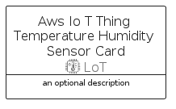

# AwsIoTThingTemperatureHumiditySensor


```text
aws-q1-2023/Resource/LoT/AwsIoTThingTemperatureHumiditySensor
```

```text
include('aws-q1-2023/Resource/LoT/AwsIoTThingTemperatureHumiditySensor')
```


| Illustration | AwsIoTThingTemperatureHumiditySensor | AwsIoTThingTemperatureHumiditySensorCard | AwsIoTThingTemperatureHumiditySensorGroup |
| :---: | :---: | :---: | :---: |
|  |  |  |  |


## Sprites
The item provides the following sriptes:

- `<$AwsIoTThingTemperatureHumiditySensorXs>`
- `<$AwsIoTThingTemperatureHumiditySensorSm>`
- `<$AwsIoTThingTemperatureHumiditySensorMd>`
- `<$AwsIoTThingTemperatureHumiditySensorLg>`


## AwsIoTThingTemperatureHumiditySensor

### Load remotely
```plantuml
@startuml
' configures the library
!global $LIB_BASE_LOCATION="https://raw.githubusercontent.com/tmorin/plantuml-libs/master/distribution"

' loads the library's bootstrap
!include $LIB_BASE_LOCATION/bootstrap.puml

' loads the package bootstrap
include('aws-q1-2023/bootstrap')

' loads the Item which embeds the element AwsIoTThingTemperatureHumiditySensor
include('aws-q1-2023/Resource/LoT/AwsIoTThingTemperatureHumiditySensor')

' renders the element
AwsIoTThingTemperatureHumiditySensor('AwsIoTThingTemperatureHumiditySensor', 'Aws Io T Thing Temperature Humidity Sensor', 'an optional tech label', 'an optional description')
@enduml
```

### Load locally
```plantuml
@startuml
' configures the library
!global $INCLUSION_MODE="local"
!global $LIB_BASE_LOCATION="../../.."

' loads the library's bootstrap
!include $LIB_BASE_LOCATION/bootstrap.puml

' loads the package bootstrap
include('aws-q1-2023/bootstrap')

' loads the Item which embeds the element AwsIoTThingTemperatureHumiditySensor
include('aws-q1-2023/Resource/LoT/AwsIoTThingTemperatureHumiditySensor')

' renders the element
AwsIoTThingTemperatureHumiditySensor('AwsIoTThingTemperatureHumiditySensor', 'Aws Io T Thing Temperature Humidity Sensor', 'an optional tech label', 'an optional description')
@enduml
```

## AwsIoTThingTemperatureHumiditySensorCard

### Load remotely
```plantuml
@startuml
' configures the library
!global $LIB_BASE_LOCATION="https://raw.githubusercontent.com/tmorin/plantuml-libs/master/distribution"

' loads the library's bootstrap
!include $LIB_BASE_LOCATION/bootstrap.puml

' loads the package bootstrap
include('aws-q1-2023/bootstrap')

' loads the Item which embeds the element AwsIoTThingTemperatureHumiditySensorCard
include('aws-q1-2023/Resource/LoT/AwsIoTThingTemperatureHumiditySensor')

' renders the element
AwsIoTThingTemperatureHumiditySensorCard('AwsIoTThingTemperatureHumiditySensorCard', 'Aws Io T Thing Temperature Humidity Sensor Card', 'an optional description')
@enduml
```

### Load locally
```plantuml
@startuml
' configures the library
!global $INCLUSION_MODE="local"
!global $LIB_BASE_LOCATION="../../.."

' loads the library's bootstrap
!include $LIB_BASE_LOCATION/bootstrap.puml

' loads the package bootstrap
include('aws-q1-2023/bootstrap')

' loads the Item which embeds the element AwsIoTThingTemperatureHumiditySensorCard
include('aws-q1-2023/Resource/LoT/AwsIoTThingTemperatureHumiditySensor')

' renders the element
AwsIoTThingTemperatureHumiditySensorCard('AwsIoTThingTemperatureHumiditySensorCard', 'Aws Io T Thing Temperature Humidity Sensor Card', 'an optional description')
@enduml
```

## AwsIoTThingTemperatureHumiditySensorGroup

### Load remotely
```plantuml
@startuml
' configures the library
!global $LIB_BASE_LOCATION="https://raw.githubusercontent.com/tmorin/plantuml-libs/master/distribution"

' loads the library's bootstrap
!include $LIB_BASE_LOCATION/bootstrap.puml

' loads the package bootstrap
include('aws-q1-2023/bootstrap')

' loads the Item which embeds the element AwsIoTThingTemperatureHumiditySensorGroup
include('aws-q1-2023/Resource/LoT/AwsIoTThingTemperatureHumiditySensor')

' renders the element
AwsIoTThingTemperatureHumiditySensorGroup('AwsIoTThingTemperatureHumiditySensorGroup', 'Aws Io T Thing Temperature Humidity Sensor Group', 'an optional tech label') {
    note as note
        the content of the group
    end note
}
@enduml
```

### Load locally
```plantuml
@startuml
' configures the library
!global $INCLUSION_MODE="local"
!global $LIB_BASE_LOCATION="../../.."

' loads the library's bootstrap
!include $LIB_BASE_LOCATION/bootstrap.puml

' loads the package bootstrap
include('aws-q1-2023/bootstrap')

' loads the Item which embeds the element AwsIoTThingTemperatureHumiditySensorGroup
include('aws-q1-2023/Resource/LoT/AwsIoTThingTemperatureHumiditySensor')

' renders the element
AwsIoTThingTemperatureHumiditySensorGroup('AwsIoTThingTemperatureHumiditySensorGroup', 'Aws Io T Thing Temperature Humidity Sensor Group', 'an optional tech label') {
    note as note
        the content of the group
    end note
}
@enduml
```

