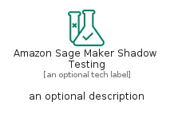

# AmazonSageMakerShadowTesting


```text
aws-q1-2023/Resource/MachineLearning/AmazonSageMakerShadowTesting
```

```text
include('aws-q1-2023/Resource/MachineLearning/AmazonSageMakerShadowTesting')
```


| Illustration | AmazonSageMakerShadowTesting | AmazonSageMakerShadowTestingCard | AmazonSageMakerShadowTestingGroup |
| :---: | :---: | :---: | :---: |
|  |  |  |  |


## AmazonSageMakerShadowTesting

### Load remotely
```plantuml
@startuml
' configures the library
!global $LIB_BASE_LOCATION="https://raw.githubusercontent.com/tmorin/plantuml-libs/master/distribution"

' loads the library's bootstrap
!include $LIB_BASE_LOCATION/bootstrap.puml

' loads the package bootstrap
include('aws-q1-2023/bootstrap')

' loads the Item which embeds the element AmazonSageMakerShadowTesting
include('aws-q1-2023/Resource/MachineLearning/AmazonSageMakerShadowTesting')

' renders the element
AmazonSageMakerShadowTesting('AmazonSageMakerShadowTesting', 'Amazon Sage Maker Shadow Testing', 'an optional tech label', 'an optional description')
@enduml
```

### Load locally
```plantuml
@startuml
' configures the library
!global $INCLUSION_MODE="local"
!global $LIB_BASE_LOCATION="../../.."

' loads the library's bootstrap
!include $LIB_BASE_LOCATION/bootstrap.puml

' loads the package bootstrap
include('aws-q1-2023/bootstrap')

' loads the Item which embeds the element AmazonSageMakerShadowTesting
include('aws-q1-2023/Resource/MachineLearning/AmazonSageMakerShadowTesting')

' renders the element
AmazonSageMakerShadowTesting('AmazonSageMakerShadowTesting', 'Amazon Sage Maker Shadow Testing', 'an optional tech label', 'an optional description')
@enduml
```

## AmazonSageMakerShadowTestingCard

### Load remotely
```plantuml
@startuml
' configures the library
!global $LIB_BASE_LOCATION="https://raw.githubusercontent.com/tmorin/plantuml-libs/master/distribution"

' loads the library's bootstrap
!include $LIB_BASE_LOCATION/bootstrap.puml

' loads the package bootstrap
include('aws-q1-2023/bootstrap')

' loads the Item which embeds the element AmazonSageMakerShadowTestingCard
include('aws-q1-2023/Resource/MachineLearning/AmazonSageMakerShadowTesting')

' renders the element
AmazonSageMakerShadowTestingCard('AmazonSageMakerShadowTestingCard', 'Amazon Sage Maker Shadow Testing Card', 'an optional description')
@enduml
```

### Load locally
```plantuml
@startuml
' configures the library
!global $INCLUSION_MODE="local"
!global $LIB_BASE_LOCATION="../../.."

' loads the library's bootstrap
!include $LIB_BASE_LOCATION/bootstrap.puml

' loads the package bootstrap
include('aws-q1-2023/bootstrap')

' loads the Item which embeds the element AmazonSageMakerShadowTestingCard
include('aws-q1-2023/Resource/MachineLearning/AmazonSageMakerShadowTesting')

' renders the element
AmazonSageMakerShadowTestingCard('AmazonSageMakerShadowTestingCard', 'Amazon Sage Maker Shadow Testing Card', 'an optional description')
@enduml
```

## AmazonSageMakerShadowTestingGroup

### Load remotely
```plantuml
@startuml
' configures the library
!global $LIB_BASE_LOCATION="https://raw.githubusercontent.com/tmorin/plantuml-libs/master/distribution"

' loads the library's bootstrap
!include $LIB_BASE_LOCATION/bootstrap.puml

' loads the package bootstrap
include('aws-q1-2023/bootstrap')

' loads the Item which embeds the element AmazonSageMakerShadowTestingGroup
include('aws-q1-2023/Resource/MachineLearning/AmazonSageMakerShadowTesting')

' renders the element
AmazonSageMakerShadowTestingGroup('AmazonSageMakerShadowTestingGroup', 'Amazon Sage Maker Shadow Testing Group', 'an optional tech label') {
    note as note
        the content of the group
    end note
}
@enduml
```

### Load locally
```plantuml
@startuml
' configures the library
!global $INCLUSION_MODE="local"
!global $LIB_BASE_LOCATION="../../.."

' loads the library's bootstrap
!include $LIB_BASE_LOCATION/bootstrap.puml

' loads the package bootstrap
include('aws-q1-2023/bootstrap')

' loads the Item which embeds the element AmazonSageMakerShadowTestingGroup
include('aws-q1-2023/Resource/MachineLearning/AmazonSageMakerShadowTesting')

' renders the element
AmazonSageMakerShadowTestingGroup('AmazonSageMakerShadowTestingGroup', 'Amazon Sage Maker Shadow Testing Group', 'an optional tech label') {
    note as note
        the content of the group
    end note
}
@enduml
```

