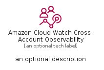

# AmazonCloudWatchCrossAccountObservability


```text
aws-q1-2023/Resource/ManagementGovernance/AmazonCloudWatchCrossAccountObservability
```

```text
include('aws-q1-2023/Resource/ManagementGovernance/AmazonCloudWatchCrossAccountObservability')
```


| Illustration | AmazonCloudWatchCrossAccountObservability | AmazonCloudWatchCrossAccountObservabilityCard | AmazonCloudWatchCrossAccountObservabilityGroup |
| :---: | :---: | :---: | :---: |
|  |  |  |  |


## Sprites
The item provides the following sriptes:

- `<$AmazonCloudWatchCrossAccountObservabilityXs>`
- `<$AmazonCloudWatchCrossAccountObservabilitySm>`
- `<$AmazonCloudWatchCrossAccountObservabilityMd>`
- `<$AmazonCloudWatchCrossAccountObservabilityLg>`


## AmazonCloudWatchCrossAccountObservability

### Load remotely
```plantuml
@startuml
' configures the library
!global $LIB_BASE_LOCATION="https://raw.githubusercontent.com/tmorin/plantuml-libs/master/distribution"

' loads the library's bootstrap
!include $LIB_BASE_LOCATION/bootstrap.puml

' loads the package bootstrap
include('aws-q1-2023/bootstrap')

' loads the Item which embeds the element AmazonCloudWatchCrossAccountObservability
include('aws-q1-2023/Resource/ManagementGovernance/AmazonCloudWatchCrossAccountObservability')

' renders the element
AmazonCloudWatchCrossAccountObservability('AmazonCloudWatchCrossAccountObservability', 'Amazon Cloud Watch Cross Account Observability', 'an optional tech label', 'an optional description')
@enduml
```

### Load locally
```plantuml
@startuml
' configures the library
!global $INCLUSION_MODE="local"
!global $LIB_BASE_LOCATION="../../.."

' loads the library's bootstrap
!include $LIB_BASE_LOCATION/bootstrap.puml

' loads the package bootstrap
include('aws-q1-2023/bootstrap')

' loads the Item which embeds the element AmazonCloudWatchCrossAccountObservability
include('aws-q1-2023/Resource/ManagementGovernance/AmazonCloudWatchCrossAccountObservability')

' renders the element
AmazonCloudWatchCrossAccountObservability('AmazonCloudWatchCrossAccountObservability', 'Amazon Cloud Watch Cross Account Observability', 'an optional tech label', 'an optional description')
@enduml
```

## AmazonCloudWatchCrossAccountObservabilityCard

### Load remotely
```plantuml
@startuml
' configures the library
!global $LIB_BASE_LOCATION="https://raw.githubusercontent.com/tmorin/plantuml-libs/master/distribution"

' loads the library's bootstrap
!include $LIB_BASE_LOCATION/bootstrap.puml

' loads the package bootstrap
include('aws-q1-2023/bootstrap')

' loads the Item which embeds the element AmazonCloudWatchCrossAccountObservabilityCard
include('aws-q1-2023/Resource/ManagementGovernance/AmazonCloudWatchCrossAccountObservability')

' renders the element
AmazonCloudWatchCrossAccountObservabilityCard('AmazonCloudWatchCrossAccountObservabilityCard', 'Amazon Cloud Watch Cross Account Observability Card', 'an optional description')
@enduml
```

### Load locally
```plantuml
@startuml
' configures the library
!global $INCLUSION_MODE="local"
!global $LIB_BASE_LOCATION="../../.."

' loads the library's bootstrap
!include $LIB_BASE_LOCATION/bootstrap.puml

' loads the package bootstrap
include('aws-q1-2023/bootstrap')

' loads the Item which embeds the element AmazonCloudWatchCrossAccountObservabilityCard
include('aws-q1-2023/Resource/ManagementGovernance/AmazonCloudWatchCrossAccountObservability')

' renders the element
AmazonCloudWatchCrossAccountObservabilityCard('AmazonCloudWatchCrossAccountObservabilityCard', 'Amazon Cloud Watch Cross Account Observability Card', 'an optional description')
@enduml
```

## AmazonCloudWatchCrossAccountObservabilityGroup

### Load remotely
```plantuml
@startuml
' configures the library
!global $LIB_BASE_LOCATION="https://raw.githubusercontent.com/tmorin/plantuml-libs/master/distribution"

' loads the library's bootstrap
!include $LIB_BASE_LOCATION/bootstrap.puml

' loads the package bootstrap
include('aws-q1-2023/bootstrap')

' loads the Item which embeds the element AmazonCloudWatchCrossAccountObservabilityGroup
include('aws-q1-2023/Resource/ManagementGovernance/AmazonCloudWatchCrossAccountObservability')

' renders the element
AmazonCloudWatchCrossAccountObservabilityGroup('AmazonCloudWatchCrossAccountObservabilityGroup', 'Amazon Cloud Watch Cross Account Observability Group', 'an optional tech label') {
    note as note
        the content of the group
    end note
}
@enduml
```

### Load locally
```plantuml
@startuml
' configures the library
!global $INCLUSION_MODE="local"
!global $LIB_BASE_LOCATION="../../.."

' loads the library's bootstrap
!include $LIB_BASE_LOCATION/bootstrap.puml

' loads the package bootstrap
include('aws-q1-2023/bootstrap')

' loads the Item which embeds the element AmazonCloudWatchCrossAccountObservabilityGroup
include('aws-q1-2023/Resource/ManagementGovernance/AmazonCloudWatchCrossAccountObservability')

' renders the element
AmazonCloudWatchCrossAccountObservabilityGroup('AmazonCloudWatchCrossAccountObservabilityGroup', 'Amazon Cloud Watch Cross Account Observability Group', 'an optional tech label') {
    note as note
        the content of the group
    end note
}
@enduml
```

