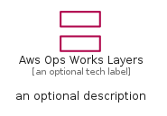
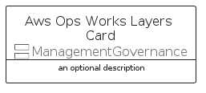
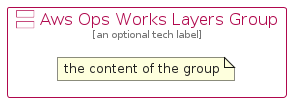

# AwsOpsWorksLayers


```text
aws-q1-2023/Resource/ManagementGovernance/AwsOpsWorksLayers
```

```text
include('aws-q1-2023/Resource/ManagementGovernance/AwsOpsWorksLayers')
```


| Illustration | AwsOpsWorksLayers | AwsOpsWorksLayersCard | AwsOpsWorksLayersGroup |
| :---: | :---: | :---: | :---: |
|  |  |  |  |


## AwsOpsWorksLayers

### Load remotely
```plantuml
@startuml
' configures the library
!global $LIB_BASE_LOCATION="https://raw.githubusercontent.com/tmorin/plantuml-libs/master/distribution"

' loads the library's bootstrap
!include $LIB_BASE_LOCATION/bootstrap.puml

' loads the package bootstrap
include('aws-q1-2023/bootstrap')

' loads the Item which embeds the element AwsOpsWorksLayers
include('aws-q1-2023/Resource/ManagementGovernance/AwsOpsWorksLayers')

' renders the element
AwsOpsWorksLayers('AwsOpsWorksLayers', 'Aws Ops Works Layers', 'an optional tech label', 'an optional description')
@enduml
```

### Load locally
```plantuml
@startuml
' configures the library
!global $INCLUSION_MODE="local"
!global $LIB_BASE_LOCATION="../../.."

' loads the library's bootstrap
!include $LIB_BASE_LOCATION/bootstrap.puml

' loads the package bootstrap
include('aws-q1-2023/bootstrap')

' loads the Item which embeds the element AwsOpsWorksLayers
include('aws-q1-2023/Resource/ManagementGovernance/AwsOpsWorksLayers')

' renders the element
AwsOpsWorksLayers('AwsOpsWorksLayers', 'Aws Ops Works Layers', 'an optional tech label', 'an optional description')
@enduml
```

## AwsOpsWorksLayersCard

### Load remotely
```plantuml
@startuml
' configures the library
!global $LIB_BASE_LOCATION="https://raw.githubusercontent.com/tmorin/plantuml-libs/master/distribution"

' loads the library's bootstrap
!include $LIB_BASE_LOCATION/bootstrap.puml

' loads the package bootstrap
include('aws-q1-2023/bootstrap')

' loads the Item which embeds the element AwsOpsWorksLayersCard
include('aws-q1-2023/Resource/ManagementGovernance/AwsOpsWorksLayers')

' renders the element
AwsOpsWorksLayersCard('AwsOpsWorksLayersCard', 'Aws Ops Works Layers Card', 'an optional description')
@enduml
```

### Load locally
```plantuml
@startuml
' configures the library
!global $INCLUSION_MODE="local"
!global $LIB_BASE_LOCATION="../../.."

' loads the library's bootstrap
!include $LIB_BASE_LOCATION/bootstrap.puml

' loads the package bootstrap
include('aws-q1-2023/bootstrap')

' loads the Item which embeds the element AwsOpsWorksLayersCard
include('aws-q1-2023/Resource/ManagementGovernance/AwsOpsWorksLayers')

' renders the element
AwsOpsWorksLayersCard('AwsOpsWorksLayersCard', 'Aws Ops Works Layers Card', 'an optional description')
@enduml
```

## AwsOpsWorksLayersGroup

### Load remotely
```plantuml
@startuml
' configures the library
!global $LIB_BASE_LOCATION="https://raw.githubusercontent.com/tmorin/plantuml-libs/master/distribution"

' loads the library's bootstrap
!include $LIB_BASE_LOCATION/bootstrap.puml

' loads the package bootstrap
include('aws-q1-2023/bootstrap')

' loads the Item which embeds the element AwsOpsWorksLayersGroup
include('aws-q1-2023/Resource/ManagementGovernance/AwsOpsWorksLayers')

' renders the element
AwsOpsWorksLayersGroup('AwsOpsWorksLayersGroup', 'Aws Ops Works Layers Group', 'an optional tech label') {
    note as note
        the content of the group
    end note
}
@enduml
```

### Load locally
```plantuml
@startuml
' configures the library
!global $INCLUSION_MODE="local"
!global $LIB_BASE_LOCATION="../../.."

' loads the library's bootstrap
!include $LIB_BASE_LOCATION/bootstrap.puml

' loads the package bootstrap
include('aws-q1-2023/bootstrap')

' loads the Item which embeds the element AwsOpsWorksLayersGroup
include('aws-q1-2023/Resource/ManagementGovernance/AwsOpsWorksLayers')

' renders the element
AwsOpsWorksLayersGroup('AwsOpsWorksLayersGroup', 'Aws Ops Works Layers Group', 'an optional tech label') {
    note as note
        the content of the group
    end note
}
@enduml
```

