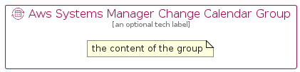

# AwsSystemsManagerChangeCalendar


```text
aws-q1-2023/Resource/ManagementGovernance/AwsSystemsManagerChangeCalendar
```

```text
include('aws-q1-2023/Resource/ManagementGovernance/AwsSystemsManagerChangeCalendar')
```


| Illustration | AwsSystemsManagerChangeCalendar | AwsSystemsManagerChangeCalendarCard | AwsSystemsManagerChangeCalendarGroup |
| :---: | :---: | :---: | :---: |
|  |  |  |  |


## Sprites
The item provides the following sriptes:

- `<$AwsSystemsManagerChangeCalendarXs>`
- `<$AwsSystemsManagerChangeCalendarSm>`
- `<$AwsSystemsManagerChangeCalendarMd>`
- `<$AwsSystemsManagerChangeCalendarLg>`


## AwsSystemsManagerChangeCalendar

### Load remotely
```plantuml
@startuml
' configures the library
!global $LIB_BASE_LOCATION="https://raw.githubusercontent.com/tmorin/plantuml-libs/master/distribution"

' loads the library's bootstrap
!include $LIB_BASE_LOCATION/bootstrap.puml

' loads the package bootstrap
include('aws-q1-2023/bootstrap')

' loads the Item which embeds the element AwsSystemsManagerChangeCalendar
include('aws-q1-2023/Resource/ManagementGovernance/AwsSystemsManagerChangeCalendar')

' renders the element
AwsSystemsManagerChangeCalendar('AwsSystemsManagerChangeCalendar', 'Aws Systems Manager Change Calendar', 'an optional tech label', 'an optional description')
@enduml
```

### Load locally
```plantuml
@startuml
' configures the library
!global $INCLUSION_MODE="local"
!global $LIB_BASE_LOCATION="../../.."

' loads the library's bootstrap
!include $LIB_BASE_LOCATION/bootstrap.puml

' loads the package bootstrap
include('aws-q1-2023/bootstrap')

' loads the Item which embeds the element AwsSystemsManagerChangeCalendar
include('aws-q1-2023/Resource/ManagementGovernance/AwsSystemsManagerChangeCalendar')

' renders the element
AwsSystemsManagerChangeCalendar('AwsSystemsManagerChangeCalendar', 'Aws Systems Manager Change Calendar', 'an optional tech label', 'an optional description')
@enduml
```

## AwsSystemsManagerChangeCalendarCard

### Load remotely
```plantuml
@startuml
' configures the library
!global $LIB_BASE_LOCATION="https://raw.githubusercontent.com/tmorin/plantuml-libs/master/distribution"

' loads the library's bootstrap
!include $LIB_BASE_LOCATION/bootstrap.puml

' loads the package bootstrap
include('aws-q1-2023/bootstrap')

' loads the Item which embeds the element AwsSystemsManagerChangeCalendarCard
include('aws-q1-2023/Resource/ManagementGovernance/AwsSystemsManagerChangeCalendar')

' renders the element
AwsSystemsManagerChangeCalendarCard('AwsSystemsManagerChangeCalendarCard', 'Aws Systems Manager Change Calendar Card', 'an optional description')
@enduml
```

### Load locally
```plantuml
@startuml
' configures the library
!global $INCLUSION_MODE="local"
!global $LIB_BASE_LOCATION="../../.."

' loads the library's bootstrap
!include $LIB_BASE_LOCATION/bootstrap.puml

' loads the package bootstrap
include('aws-q1-2023/bootstrap')

' loads the Item which embeds the element AwsSystemsManagerChangeCalendarCard
include('aws-q1-2023/Resource/ManagementGovernance/AwsSystemsManagerChangeCalendar')

' renders the element
AwsSystemsManagerChangeCalendarCard('AwsSystemsManagerChangeCalendarCard', 'Aws Systems Manager Change Calendar Card', 'an optional description')
@enduml
```

## AwsSystemsManagerChangeCalendarGroup

### Load remotely
```plantuml
@startuml
' configures the library
!global $LIB_BASE_LOCATION="https://raw.githubusercontent.com/tmorin/plantuml-libs/master/distribution"

' loads the library's bootstrap
!include $LIB_BASE_LOCATION/bootstrap.puml

' loads the package bootstrap
include('aws-q1-2023/bootstrap')

' loads the Item which embeds the element AwsSystemsManagerChangeCalendarGroup
include('aws-q1-2023/Resource/ManagementGovernance/AwsSystemsManagerChangeCalendar')

' renders the element
AwsSystemsManagerChangeCalendarGroup('AwsSystemsManagerChangeCalendarGroup', 'Aws Systems Manager Change Calendar Group', 'an optional tech label') {
    note as note
        the content of the group
    end note
}
@enduml
```

### Load locally
```plantuml
@startuml
' configures the library
!global $INCLUSION_MODE="local"
!global $LIB_BASE_LOCATION="../../.."

' loads the library's bootstrap
!include $LIB_BASE_LOCATION/bootstrap.puml

' loads the package bootstrap
include('aws-q1-2023/bootstrap')

' loads the Item which embeds the element AwsSystemsManagerChangeCalendarGroup
include('aws-q1-2023/Resource/ManagementGovernance/AwsSystemsManagerChangeCalendar')

' renders the element
AwsSystemsManagerChangeCalendarGroup('AwsSystemsManagerChangeCalendarGroup', 'Aws Systems Manager Change Calendar Group', 'an optional tech label') {
    note as note
        the content of the group
    end note
}
@enduml
```

