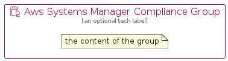

# AwsSystemsManagerCompliance


```text
aws-q1-2023/Resource/ManagementGovernance/AwsSystemsManagerCompliance
```

```text
include('aws-q1-2023/Resource/ManagementGovernance/AwsSystemsManagerCompliance')
```


| Illustration | AwsSystemsManagerCompliance | AwsSystemsManagerComplianceCard | AwsSystemsManagerComplianceGroup |
| :---: | :---: | :---: | :---: |
|  |  |  |  |


## AwsSystemsManagerCompliance

### Load remotely
```plantuml
@startuml
' configures the library
!global $LIB_BASE_LOCATION="https://raw.githubusercontent.com/tmorin/plantuml-libs/master/distribution"

' loads the library's bootstrap
!include $LIB_BASE_LOCATION/bootstrap.puml

' loads the package bootstrap
include('aws-q1-2023/bootstrap')

' loads the Item which embeds the element AwsSystemsManagerCompliance
include('aws-q1-2023/Resource/ManagementGovernance/AwsSystemsManagerCompliance')

' renders the element
AwsSystemsManagerCompliance('AwsSystemsManagerCompliance', 'Aws Systems Manager Compliance', 'an optional tech label', 'an optional description')
@enduml
```

### Load locally
```plantuml
@startuml
' configures the library
!global $INCLUSION_MODE="local"
!global $LIB_BASE_LOCATION="../../.."

' loads the library's bootstrap
!include $LIB_BASE_LOCATION/bootstrap.puml

' loads the package bootstrap
include('aws-q1-2023/bootstrap')

' loads the Item which embeds the element AwsSystemsManagerCompliance
include('aws-q1-2023/Resource/ManagementGovernance/AwsSystemsManagerCompliance')

' renders the element
AwsSystemsManagerCompliance('AwsSystemsManagerCompliance', 'Aws Systems Manager Compliance', 'an optional tech label', 'an optional description')
@enduml
```

## AwsSystemsManagerComplianceCard

### Load remotely
```plantuml
@startuml
' configures the library
!global $LIB_BASE_LOCATION="https://raw.githubusercontent.com/tmorin/plantuml-libs/master/distribution"

' loads the library's bootstrap
!include $LIB_BASE_LOCATION/bootstrap.puml

' loads the package bootstrap
include('aws-q1-2023/bootstrap')

' loads the Item which embeds the element AwsSystemsManagerComplianceCard
include('aws-q1-2023/Resource/ManagementGovernance/AwsSystemsManagerCompliance')

' renders the element
AwsSystemsManagerComplianceCard('AwsSystemsManagerComplianceCard', 'Aws Systems Manager Compliance Card', 'an optional description')
@enduml
```

### Load locally
```plantuml
@startuml
' configures the library
!global $INCLUSION_MODE="local"
!global $LIB_BASE_LOCATION="../../.."

' loads the library's bootstrap
!include $LIB_BASE_LOCATION/bootstrap.puml

' loads the package bootstrap
include('aws-q1-2023/bootstrap')

' loads the Item which embeds the element AwsSystemsManagerComplianceCard
include('aws-q1-2023/Resource/ManagementGovernance/AwsSystemsManagerCompliance')

' renders the element
AwsSystemsManagerComplianceCard('AwsSystemsManagerComplianceCard', 'Aws Systems Manager Compliance Card', 'an optional description')
@enduml
```

## AwsSystemsManagerComplianceGroup

### Load remotely
```plantuml
@startuml
' configures the library
!global $LIB_BASE_LOCATION="https://raw.githubusercontent.com/tmorin/plantuml-libs/master/distribution"

' loads the library's bootstrap
!include $LIB_BASE_LOCATION/bootstrap.puml

' loads the package bootstrap
include('aws-q1-2023/bootstrap')

' loads the Item which embeds the element AwsSystemsManagerComplianceGroup
include('aws-q1-2023/Resource/ManagementGovernance/AwsSystemsManagerCompliance')

' renders the element
AwsSystemsManagerComplianceGroup('AwsSystemsManagerComplianceGroup', 'Aws Systems Manager Compliance Group', 'an optional tech label') {
    note as note
        the content of the group
    end note
}
@enduml
```

### Load locally
```plantuml
@startuml
' configures the library
!global $INCLUSION_MODE="local"
!global $LIB_BASE_LOCATION="../../.."

' loads the library's bootstrap
!include $LIB_BASE_LOCATION/bootstrap.puml

' loads the package bootstrap
include('aws-q1-2023/bootstrap')

' loads the Item which embeds the element AwsSystemsManagerComplianceGroup
include('aws-q1-2023/Resource/ManagementGovernance/AwsSystemsManagerCompliance')

' renders the element
AwsSystemsManagerComplianceGroup('AwsSystemsManagerComplianceGroup', 'Aws Systems Manager Compliance Group', 'an optional tech label') {
    note as note
        the content of the group
    end note
}
@enduml
```

