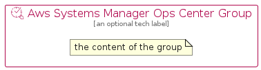

# AwsSystemsManagerOpsCenter


```text
aws-q1-2023/Resource/ManagementGovernance/AwsSystemsManagerOpsCenter
```

```text
include('aws-q1-2023/Resource/ManagementGovernance/AwsSystemsManagerOpsCenter')
```


| Illustration | AwsSystemsManagerOpsCenter | AwsSystemsManagerOpsCenterCard | AwsSystemsManagerOpsCenterGroup |
| :---: | :---: | :---: | :---: |
|  |  |  |  |


## Sprites
The item provides the following sriptes:

- `<$AwsSystemsManagerOpsCenterXs>`
- `<$AwsSystemsManagerOpsCenterSm>`
- `<$AwsSystemsManagerOpsCenterMd>`
- `<$AwsSystemsManagerOpsCenterLg>`


## AwsSystemsManagerOpsCenter

### Load remotely
```plantuml
@startuml
' configures the library
!global $LIB_BASE_LOCATION="https://raw.githubusercontent.com/tmorin/plantuml-libs/master/distribution"

' loads the library's bootstrap
!include $LIB_BASE_LOCATION/bootstrap.puml

' loads the package bootstrap
include('aws-q1-2023/bootstrap')

' loads the Item which embeds the element AwsSystemsManagerOpsCenter
include('aws-q1-2023/Resource/ManagementGovernance/AwsSystemsManagerOpsCenter')

' renders the element
AwsSystemsManagerOpsCenter('AwsSystemsManagerOpsCenter', 'Aws Systems Manager Ops Center', 'an optional tech label', 'an optional description')
@enduml
```

### Load locally
```plantuml
@startuml
' configures the library
!global $INCLUSION_MODE="local"
!global $LIB_BASE_LOCATION="../../.."

' loads the library's bootstrap
!include $LIB_BASE_LOCATION/bootstrap.puml

' loads the package bootstrap
include('aws-q1-2023/bootstrap')

' loads the Item which embeds the element AwsSystemsManagerOpsCenter
include('aws-q1-2023/Resource/ManagementGovernance/AwsSystemsManagerOpsCenter')

' renders the element
AwsSystemsManagerOpsCenter('AwsSystemsManagerOpsCenter', 'Aws Systems Manager Ops Center', 'an optional tech label', 'an optional description')
@enduml
```

## AwsSystemsManagerOpsCenterCard

### Load remotely
```plantuml
@startuml
' configures the library
!global $LIB_BASE_LOCATION="https://raw.githubusercontent.com/tmorin/plantuml-libs/master/distribution"

' loads the library's bootstrap
!include $LIB_BASE_LOCATION/bootstrap.puml

' loads the package bootstrap
include('aws-q1-2023/bootstrap')

' loads the Item which embeds the element AwsSystemsManagerOpsCenterCard
include('aws-q1-2023/Resource/ManagementGovernance/AwsSystemsManagerOpsCenter')

' renders the element
AwsSystemsManagerOpsCenterCard('AwsSystemsManagerOpsCenterCard', 'Aws Systems Manager Ops Center Card', 'an optional description')
@enduml
```

### Load locally
```plantuml
@startuml
' configures the library
!global $INCLUSION_MODE="local"
!global $LIB_BASE_LOCATION="../../.."

' loads the library's bootstrap
!include $LIB_BASE_LOCATION/bootstrap.puml

' loads the package bootstrap
include('aws-q1-2023/bootstrap')

' loads the Item which embeds the element AwsSystemsManagerOpsCenterCard
include('aws-q1-2023/Resource/ManagementGovernance/AwsSystemsManagerOpsCenter')

' renders the element
AwsSystemsManagerOpsCenterCard('AwsSystemsManagerOpsCenterCard', 'Aws Systems Manager Ops Center Card', 'an optional description')
@enduml
```

## AwsSystemsManagerOpsCenterGroup

### Load remotely
```plantuml
@startuml
' configures the library
!global $LIB_BASE_LOCATION="https://raw.githubusercontent.com/tmorin/plantuml-libs/master/distribution"

' loads the library's bootstrap
!include $LIB_BASE_LOCATION/bootstrap.puml

' loads the package bootstrap
include('aws-q1-2023/bootstrap')

' loads the Item which embeds the element AwsSystemsManagerOpsCenterGroup
include('aws-q1-2023/Resource/ManagementGovernance/AwsSystemsManagerOpsCenter')

' renders the element
AwsSystemsManagerOpsCenterGroup('AwsSystemsManagerOpsCenterGroup', 'Aws Systems Manager Ops Center Group', 'an optional tech label') {
    note as note
        the content of the group
    end note
}
@enduml
```

### Load locally
```plantuml
@startuml
' configures the library
!global $INCLUSION_MODE="local"
!global $LIB_BASE_LOCATION="../../.."

' loads the library's bootstrap
!include $LIB_BASE_LOCATION/bootstrap.puml

' loads the package bootstrap
include('aws-q1-2023/bootstrap')

' loads the Item which embeds the element AwsSystemsManagerOpsCenterGroup
include('aws-q1-2023/Resource/ManagementGovernance/AwsSystemsManagerOpsCenter')

' renders the element
AwsSystemsManagerOpsCenterGroup('AwsSystemsManagerOpsCenterGroup', 'Aws Systems Manager Ops Center Group', 'an optional tech label') {
    note as note
        the content of the group
    end note
}
@enduml
```

