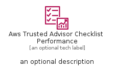
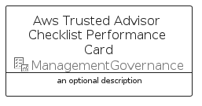

# AwsTrustedAdvisorChecklistPerformance


```text
aws-q1-2023/Resource/ManagementGovernance/AwsTrustedAdvisorChecklistPerformance
```

```text
include('aws-q1-2023/Resource/ManagementGovernance/AwsTrustedAdvisorChecklistPerformance')
```


| Illustration | AwsTrustedAdvisorChecklistPerformance | AwsTrustedAdvisorChecklistPerformanceCard | AwsTrustedAdvisorChecklistPerformanceGroup |
| :---: | :---: | :---: | :---: |
|  |  |  |  |


## Sprites
The item provides the following sriptes:

- `<$AwsTrustedAdvisorChecklistPerformanceXs>`
- `<$AwsTrustedAdvisorChecklistPerformanceSm>`
- `<$AwsTrustedAdvisorChecklistPerformanceMd>`
- `<$AwsTrustedAdvisorChecklistPerformanceLg>`


## AwsTrustedAdvisorChecklistPerformance

### Load remotely
```plantuml
@startuml
' configures the library
!global $LIB_BASE_LOCATION="https://raw.githubusercontent.com/tmorin/plantuml-libs/master/distribution"

' loads the library's bootstrap
!include $LIB_BASE_LOCATION/bootstrap.puml

' loads the package bootstrap
include('aws-q1-2023/bootstrap')

' loads the Item which embeds the element AwsTrustedAdvisorChecklistPerformance
include('aws-q1-2023/Resource/ManagementGovernance/AwsTrustedAdvisorChecklistPerformance')

' renders the element
AwsTrustedAdvisorChecklistPerformance('AwsTrustedAdvisorChecklistPerformance', 'Aws Trusted Advisor Checklist Performance', 'an optional tech label', 'an optional description')
@enduml
```

### Load locally
```plantuml
@startuml
' configures the library
!global $INCLUSION_MODE="local"
!global $LIB_BASE_LOCATION="../../.."

' loads the library's bootstrap
!include $LIB_BASE_LOCATION/bootstrap.puml

' loads the package bootstrap
include('aws-q1-2023/bootstrap')

' loads the Item which embeds the element AwsTrustedAdvisorChecklistPerformance
include('aws-q1-2023/Resource/ManagementGovernance/AwsTrustedAdvisorChecklistPerformance')

' renders the element
AwsTrustedAdvisorChecklistPerformance('AwsTrustedAdvisorChecklistPerformance', 'Aws Trusted Advisor Checklist Performance', 'an optional tech label', 'an optional description')
@enduml
```

## AwsTrustedAdvisorChecklistPerformanceCard

### Load remotely
```plantuml
@startuml
' configures the library
!global $LIB_BASE_LOCATION="https://raw.githubusercontent.com/tmorin/plantuml-libs/master/distribution"

' loads the library's bootstrap
!include $LIB_BASE_LOCATION/bootstrap.puml

' loads the package bootstrap
include('aws-q1-2023/bootstrap')

' loads the Item which embeds the element AwsTrustedAdvisorChecklistPerformanceCard
include('aws-q1-2023/Resource/ManagementGovernance/AwsTrustedAdvisorChecklistPerformance')

' renders the element
AwsTrustedAdvisorChecklistPerformanceCard('AwsTrustedAdvisorChecklistPerformanceCard', 'Aws Trusted Advisor Checklist Performance Card', 'an optional description')
@enduml
```

### Load locally
```plantuml
@startuml
' configures the library
!global $INCLUSION_MODE="local"
!global $LIB_BASE_LOCATION="../../.."

' loads the library's bootstrap
!include $LIB_BASE_LOCATION/bootstrap.puml

' loads the package bootstrap
include('aws-q1-2023/bootstrap')

' loads the Item which embeds the element AwsTrustedAdvisorChecklistPerformanceCard
include('aws-q1-2023/Resource/ManagementGovernance/AwsTrustedAdvisorChecklistPerformance')

' renders the element
AwsTrustedAdvisorChecklistPerformanceCard('AwsTrustedAdvisorChecklistPerformanceCard', 'Aws Trusted Advisor Checklist Performance Card', 'an optional description')
@enduml
```

## AwsTrustedAdvisorChecklistPerformanceGroup

### Load remotely
```plantuml
@startuml
' configures the library
!global $LIB_BASE_LOCATION="https://raw.githubusercontent.com/tmorin/plantuml-libs/master/distribution"

' loads the library's bootstrap
!include $LIB_BASE_LOCATION/bootstrap.puml

' loads the package bootstrap
include('aws-q1-2023/bootstrap')

' loads the Item which embeds the element AwsTrustedAdvisorChecklistPerformanceGroup
include('aws-q1-2023/Resource/ManagementGovernance/AwsTrustedAdvisorChecklistPerformance')

' renders the element
AwsTrustedAdvisorChecklistPerformanceGroup('AwsTrustedAdvisorChecklistPerformanceGroup', 'Aws Trusted Advisor Checklist Performance Group', 'an optional tech label') {
    note as note
        the content of the group
    end note
}
@enduml
```

### Load locally
```plantuml
@startuml
' configures the library
!global $INCLUSION_MODE="local"
!global $LIB_BASE_LOCATION="../../.."

' loads the library's bootstrap
!include $LIB_BASE_LOCATION/bootstrap.puml

' loads the package bootstrap
include('aws-q1-2023/bootstrap')

' loads the Item which embeds the element AwsTrustedAdvisorChecklistPerformanceGroup
include('aws-q1-2023/Resource/ManagementGovernance/AwsTrustedAdvisorChecklistPerformance')

' renders the element
AwsTrustedAdvisorChecklistPerformanceGroup('AwsTrustedAdvisorChecklistPerformanceGroup', 'Aws Trusted Advisor Checklist Performance Group', 'an optional tech label') {
    note as note
        the content of the group
    end note
}
@enduml
```

