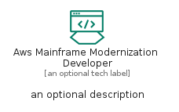

# AwsMainframeModernizationDeveloper


```text
aws-q1-2023/Resource/MigrationAndTransfer/AwsMainframeModernizationDeveloper
```

```text
include('aws-q1-2023/Resource/MigrationAndTransfer/AwsMainframeModernizationDeveloper')
```


| Illustration | AwsMainframeModernizationDeveloper | AwsMainframeModernizationDeveloperCard | AwsMainframeModernizationDeveloperGroup |
| :---: | :---: | :---: | :---: |
|  |  |  |  |


## Sprites
The item provides the following sriptes:

- `<$AwsMainframeModernizationDeveloperXs>`
- `<$AwsMainframeModernizationDeveloperSm>`
- `<$AwsMainframeModernizationDeveloperMd>`
- `<$AwsMainframeModernizationDeveloperLg>`


## AwsMainframeModernizationDeveloper

### Load remotely
```plantuml
@startuml
' configures the library
!global $LIB_BASE_LOCATION="https://raw.githubusercontent.com/tmorin/plantuml-libs/master/distribution"

' loads the library's bootstrap
!include $LIB_BASE_LOCATION/bootstrap.puml

' loads the package bootstrap
include('aws-q1-2023/bootstrap')

' loads the Item which embeds the element AwsMainframeModernizationDeveloper
include('aws-q1-2023/Resource/MigrationAndTransfer/AwsMainframeModernizationDeveloper')

' renders the element
AwsMainframeModernizationDeveloper('AwsMainframeModernizationDeveloper', 'Aws Mainframe Modernization Developer', 'an optional tech label', 'an optional description')
@enduml
```

### Load locally
```plantuml
@startuml
' configures the library
!global $INCLUSION_MODE="local"
!global $LIB_BASE_LOCATION="../../.."

' loads the library's bootstrap
!include $LIB_BASE_LOCATION/bootstrap.puml

' loads the package bootstrap
include('aws-q1-2023/bootstrap')

' loads the Item which embeds the element AwsMainframeModernizationDeveloper
include('aws-q1-2023/Resource/MigrationAndTransfer/AwsMainframeModernizationDeveloper')

' renders the element
AwsMainframeModernizationDeveloper('AwsMainframeModernizationDeveloper', 'Aws Mainframe Modernization Developer', 'an optional tech label', 'an optional description')
@enduml
```

## AwsMainframeModernizationDeveloperCard

### Load remotely
```plantuml
@startuml
' configures the library
!global $LIB_BASE_LOCATION="https://raw.githubusercontent.com/tmorin/plantuml-libs/master/distribution"

' loads the library's bootstrap
!include $LIB_BASE_LOCATION/bootstrap.puml

' loads the package bootstrap
include('aws-q1-2023/bootstrap')

' loads the Item which embeds the element AwsMainframeModernizationDeveloperCard
include('aws-q1-2023/Resource/MigrationAndTransfer/AwsMainframeModernizationDeveloper')

' renders the element
AwsMainframeModernizationDeveloperCard('AwsMainframeModernizationDeveloperCard', 'Aws Mainframe Modernization Developer Card', 'an optional description')
@enduml
```

### Load locally
```plantuml
@startuml
' configures the library
!global $INCLUSION_MODE="local"
!global $LIB_BASE_LOCATION="../../.."

' loads the library's bootstrap
!include $LIB_BASE_LOCATION/bootstrap.puml

' loads the package bootstrap
include('aws-q1-2023/bootstrap')

' loads the Item which embeds the element AwsMainframeModernizationDeveloperCard
include('aws-q1-2023/Resource/MigrationAndTransfer/AwsMainframeModernizationDeveloper')

' renders the element
AwsMainframeModernizationDeveloperCard('AwsMainframeModernizationDeveloperCard', 'Aws Mainframe Modernization Developer Card', 'an optional description')
@enduml
```

## AwsMainframeModernizationDeveloperGroup

### Load remotely
```plantuml
@startuml
' configures the library
!global $LIB_BASE_LOCATION="https://raw.githubusercontent.com/tmorin/plantuml-libs/master/distribution"

' loads the library's bootstrap
!include $LIB_BASE_LOCATION/bootstrap.puml

' loads the package bootstrap
include('aws-q1-2023/bootstrap')

' loads the Item which embeds the element AwsMainframeModernizationDeveloperGroup
include('aws-q1-2023/Resource/MigrationAndTransfer/AwsMainframeModernizationDeveloper')

' renders the element
AwsMainframeModernizationDeveloperGroup('AwsMainframeModernizationDeveloperGroup', 'Aws Mainframe Modernization Developer Group', 'an optional tech label') {
    note as note
        the content of the group
    end note
}
@enduml
```

### Load locally
```plantuml
@startuml
' configures the library
!global $INCLUSION_MODE="local"
!global $LIB_BASE_LOCATION="../../.."

' loads the library's bootstrap
!include $LIB_BASE_LOCATION/bootstrap.puml

' loads the package bootstrap
include('aws-q1-2023/bootstrap')

' loads the Item which embeds the element AwsMainframeModernizationDeveloperGroup
include('aws-q1-2023/Resource/MigrationAndTransfer/AwsMainframeModernizationDeveloper')

' renders the element
AwsMainframeModernizationDeveloperGroup('AwsMainframeModernizationDeveloperGroup', 'Aws Mainframe Modernization Developer Group', 'an optional tech label') {
    note as note
        the content of the group
    end note
}
@enduml
```

