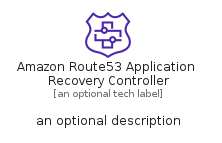

# AmazonRoute53ApplicationRecoveryController


```text
aws-q1-2023/Resource/NetworkingAndContentDelivery/AmazonRoute53ApplicationRecoveryController
```

```text
include('aws-q1-2023/Resource/NetworkingAndContentDelivery/AmazonRoute53ApplicationRecoveryController')
```


| Illustration | AmazonRoute53ApplicationRecoveryController | AmazonRoute53ApplicationRecoveryControllerCard | AmazonRoute53ApplicationRecoveryControllerGroup |
| :---: | :---: | :---: | :---: |
|  |  |  |  |


## Sprites
The item provides the following sriptes:

- `<$AmazonRoute53ApplicationRecoveryControllerXs>`
- `<$AmazonRoute53ApplicationRecoveryControllerSm>`
- `<$AmazonRoute53ApplicationRecoveryControllerMd>`
- `<$AmazonRoute53ApplicationRecoveryControllerLg>`


## AmazonRoute53ApplicationRecoveryController

### Load remotely
```plantuml
@startuml
' configures the library
!global $LIB_BASE_LOCATION="https://raw.githubusercontent.com/tmorin/plantuml-libs/master/distribution"

' loads the library's bootstrap
!include $LIB_BASE_LOCATION/bootstrap.puml

' loads the package bootstrap
include('aws-q1-2023/bootstrap')

' loads the Item which embeds the element AmazonRoute53ApplicationRecoveryController
include('aws-q1-2023/Resource/NetworkingAndContentDelivery/AmazonRoute53ApplicationRecoveryController')

' renders the element
AmazonRoute53ApplicationRecoveryController('AmazonRoute53ApplicationRecoveryController', 'Amazon Route53 Application Recovery Controller', 'an optional tech label', 'an optional description')
@enduml
```

### Load locally
```plantuml
@startuml
' configures the library
!global $INCLUSION_MODE="local"
!global $LIB_BASE_LOCATION="../../.."

' loads the library's bootstrap
!include $LIB_BASE_LOCATION/bootstrap.puml

' loads the package bootstrap
include('aws-q1-2023/bootstrap')

' loads the Item which embeds the element AmazonRoute53ApplicationRecoveryController
include('aws-q1-2023/Resource/NetworkingAndContentDelivery/AmazonRoute53ApplicationRecoveryController')

' renders the element
AmazonRoute53ApplicationRecoveryController('AmazonRoute53ApplicationRecoveryController', 'Amazon Route53 Application Recovery Controller', 'an optional tech label', 'an optional description')
@enduml
```

## AmazonRoute53ApplicationRecoveryControllerCard

### Load remotely
```plantuml
@startuml
' configures the library
!global $LIB_BASE_LOCATION="https://raw.githubusercontent.com/tmorin/plantuml-libs/master/distribution"

' loads the library's bootstrap
!include $LIB_BASE_LOCATION/bootstrap.puml

' loads the package bootstrap
include('aws-q1-2023/bootstrap')

' loads the Item which embeds the element AmazonRoute53ApplicationRecoveryControllerCard
include('aws-q1-2023/Resource/NetworkingAndContentDelivery/AmazonRoute53ApplicationRecoveryController')

' renders the element
AmazonRoute53ApplicationRecoveryControllerCard('AmazonRoute53ApplicationRecoveryControllerCard', 'Amazon Route53 Application Recovery Controller Card', 'an optional description')
@enduml
```

### Load locally
```plantuml
@startuml
' configures the library
!global $INCLUSION_MODE="local"
!global $LIB_BASE_LOCATION="../../.."

' loads the library's bootstrap
!include $LIB_BASE_LOCATION/bootstrap.puml

' loads the package bootstrap
include('aws-q1-2023/bootstrap')

' loads the Item which embeds the element AmazonRoute53ApplicationRecoveryControllerCard
include('aws-q1-2023/Resource/NetworkingAndContentDelivery/AmazonRoute53ApplicationRecoveryController')

' renders the element
AmazonRoute53ApplicationRecoveryControllerCard('AmazonRoute53ApplicationRecoveryControllerCard', 'Amazon Route53 Application Recovery Controller Card', 'an optional description')
@enduml
```

## AmazonRoute53ApplicationRecoveryControllerGroup

### Load remotely
```plantuml
@startuml
' configures the library
!global $LIB_BASE_LOCATION="https://raw.githubusercontent.com/tmorin/plantuml-libs/master/distribution"

' loads the library's bootstrap
!include $LIB_BASE_LOCATION/bootstrap.puml

' loads the package bootstrap
include('aws-q1-2023/bootstrap')

' loads the Item which embeds the element AmazonRoute53ApplicationRecoveryControllerGroup
include('aws-q1-2023/Resource/NetworkingAndContentDelivery/AmazonRoute53ApplicationRecoveryController')

' renders the element
AmazonRoute53ApplicationRecoveryControllerGroup('AmazonRoute53ApplicationRecoveryControllerGroup', 'Amazon Route53 Application Recovery Controller Group', 'an optional tech label') {
    note as note
        the content of the group
    end note
}
@enduml
```

### Load locally
```plantuml
@startuml
' configures the library
!global $INCLUSION_MODE="local"
!global $LIB_BASE_LOCATION="../../.."

' loads the library's bootstrap
!include $LIB_BASE_LOCATION/bootstrap.puml

' loads the package bootstrap
include('aws-q1-2023/bootstrap')

' loads the Item which embeds the element AmazonRoute53ApplicationRecoveryControllerGroup
include('aws-q1-2023/Resource/NetworkingAndContentDelivery/AmazonRoute53ApplicationRecoveryController')

' renders the element
AmazonRoute53ApplicationRecoveryControllerGroup('AmazonRoute53ApplicationRecoveryControllerGroup', 'Amazon Route53 Application Recovery Controller Group', 'an optional tech label') {
    note as note
        the content of the group
    end note
}
@enduml
```

