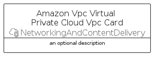
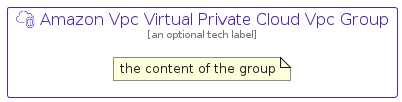

# AmazonVpcVirtualPrivateCloudVpc


```text
aws-q1-2023/Resource/NetworkingAndContentDelivery/AmazonVpcVirtualPrivateCloudVpc
```

```text
include('aws-q1-2023/Resource/NetworkingAndContentDelivery/AmazonVpcVirtualPrivateCloudVpc')
```


| Illustration | AmazonVpcVirtualPrivateCloudVpc | AmazonVpcVirtualPrivateCloudVpcCard | AmazonVpcVirtualPrivateCloudVpcGroup |
| :---: | :---: | :---: | :---: |
|  |  |  |  |


## AmazonVpcVirtualPrivateCloudVpc

### Load remotely
```plantuml
@startuml
' configures the library
!global $LIB_BASE_LOCATION="https://raw.githubusercontent.com/tmorin/plantuml-libs/master/distribution"

' loads the library's bootstrap
!include $LIB_BASE_LOCATION/bootstrap.puml

' loads the package bootstrap
include('aws-q1-2023/bootstrap')

' loads the Item which embeds the element AmazonVpcVirtualPrivateCloudVpc
include('aws-q1-2023/Resource/NetworkingAndContentDelivery/AmazonVpcVirtualPrivateCloudVpc')

' renders the element
AmazonVpcVirtualPrivateCloudVpc('AmazonVpcVirtualPrivateCloudVpc', 'Amazon Vpc Virtual Private Cloud Vpc', 'an optional tech label', 'an optional description')
@enduml
```

### Load locally
```plantuml
@startuml
' configures the library
!global $INCLUSION_MODE="local"
!global $LIB_BASE_LOCATION="../../.."

' loads the library's bootstrap
!include $LIB_BASE_LOCATION/bootstrap.puml

' loads the package bootstrap
include('aws-q1-2023/bootstrap')

' loads the Item which embeds the element AmazonVpcVirtualPrivateCloudVpc
include('aws-q1-2023/Resource/NetworkingAndContentDelivery/AmazonVpcVirtualPrivateCloudVpc')

' renders the element
AmazonVpcVirtualPrivateCloudVpc('AmazonVpcVirtualPrivateCloudVpc', 'Amazon Vpc Virtual Private Cloud Vpc', 'an optional tech label', 'an optional description')
@enduml
```

## AmazonVpcVirtualPrivateCloudVpcCard

### Load remotely
```plantuml
@startuml
' configures the library
!global $LIB_BASE_LOCATION="https://raw.githubusercontent.com/tmorin/plantuml-libs/master/distribution"

' loads the library's bootstrap
!include $LIB_BASE_LOCATION/bootstrap.puml

' loads the package bootstrap
include('aws-q1-2023/bootstrap')

' loads the Item which embeds the element AmazonVpcVirtualPrivateCloudVpcCard
include('aws-q1-2023/Resource/NetworkingAndContentDelivery/AmazonVpcVirtualPrivateCloudVpc')

' renders the element
AmazonVpcVirtualPrivateCloudVpcCard('AmazonVpcVirtualPrivateCloudVpcCard', 'Amazon Vpc Virtual Private Cloud Vpc Card', 'an optional description')
@enduml
```

### Load locally
```plantuml
@startuml
' configures the library
!global $INCLUSION_MODE="local"
!global $LIB_BASE_LOCATION="../../.."

' loads the library's bootstrap
!include $LIB_BASE_LOCATION/bootstrap.puml

' loads the package bootstrap
include('aws-q1-2023/bootstrap')

' loads the Item which embeds the element AmazonVpcVirtualPrivateCloudVpcCard
include('aws-q1-2023/Resource/NetworkingAndContentDelivery/AmazonVpcVirtualPrivateCloudVpc')

' renders the element
AmazonVpcVirtualPrivateCloudVpcCard('AmazonVpcVirtualPrivateCloudVpcCard', 'Amazon Vpc Virtual Private Cloud Vpc Card', 'an optional description')
@enduml
```

## AmazonVpcVirtualPrivateCloudVpcGroup

### Load remotely
```plantuml
@startuml
' configures the library
!global $LIB_BASE_LOCATION="https://raw.githubusercontent.com/tmorin/plantuml-libs/master/distribution"

' loads the library's bootstrap
!include $LIB_BASE_LOCATION/bootstrap.puml

' loads the package bootstrap
include('aws-q1-2023/bootstrap')

' loads the Item which embeds the element AmazonVpcVirtualPrivateCloudVpcGroup
include('aws-q1-2023/Resource/NetworkingAndContentDelivery/AmazonVpcVirtualPrivateCloudVpc')

' renders the element
AmazonVpcVirtualPrivateCloudVpcGroup('AmazonVpcVirtualPrivateCloudVpcGroup', 'Amazon Vpc Virtual Private Cloud Vpc Group', 'an optional tech label') {
    note as note
        the content of the group
    end note
}
@enduml
```

### Load locally
```plantuml
@startuml
' configures the library
!global $INCLUSION_MODE="local"
!global $LIB_BASE_LOCATION="../../.."

' loads the library's bootstrap
!include $LIB_BASE_LOCATION/bootstrap.puml

' loads the package bootstrap
include('aws-q1-2023/bootstrap')

' loads the Item which embeds the element AmazonVpcVirtualPrivateCloudVpcGroup
include('aws-q1-2023/Resource/NetworkingAndContentDelivery/AmazonVpcVirtualPrivateCloudVpc')

' renders the element
AmazonVpcVirtualPrivateCloudVpcGroup('AmazonVpcVirtualPrivateCloudVpcGroup', 'Amazon Vpc Virtual Private Cloud Vpc Group', 'an optional tech label') {
    note as note
        the content of the group
    end note
}
@enduml
```

