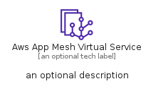
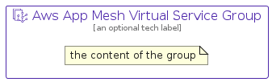

# AwsAppMeshVirtualService


```text
aws-q1-2023/Resource/NetworkingAndContentDelivery/AwsAppMeshVirtualService
```

```text
include('aws-q1-2023/Resource/NetworkingAndContentDelivery/AwsAppMeshVirtualService')
```


| Illustration | AwsAppMeshVirtualService | AwsAppMeshVirtualServiceCard | AwsAppMeshVirtualServiceGroup |
| :---: | :---: | :---: | :---: |
|  |  |  |  |


## AwsAppMeshVirtualService

### Load remotely
```plantuml
@startuml
' configures the library
!global $LIB_BASE_LOCATION="https://raw.githubusercontent.com/tmorin/plantuml-libs/master/distribution"

' loads the library's bootstrap
!include $LIB_BASE_LOCATION/bootstrap.puml

' loads the package bootstrap
include('aws-q1-2023/bootstrap')

' loads the Item which embeds the element AwsAppMeshVirtualService
include('aws-q1-2023/Resource/NetworkingAndContentDelivery/AwsAppMeshVirtualService')

' renders the element
AwsAppMeshVirtualService('AwsAppMeshVirtualService', 'Aws App Mesh Virtual Service', 'an optional tech label', 'an optional description')
@enduml
```

### Load locally
```plantuml
@startuml
' configures the library
!global $INCLUSION_MODE="local"
!global $LIB_BASE_LOCATION="../../.."

' loads the library's bootstrap
!include $LIB_BASE_LOCATION/bootstrap.puml

' loads the package bootstrap
include('aws-q1-2023/bootstrap')

' loads the Item which embeds the element AwsAppMeshVirtualService
include('aws-q1-2023/Resource/NetworkingAndContentDelivery/AwsAppMeshVirtualService')

' renders the element
AwsAppMeshVirtualService('AwsAppMeshVirtualService', 'Aws App Mesh Virtual Service', 'an optional tech label', 'an optional description')
@enduml
```

## AwsAppMeshVirtualServiceCard

### Load remotely
```plantuml
@startuml
' configures the library
!global $LIB_BASE_LOCATION="https://raw.githubusercontent.com/tmorin/plantuml-libs/master/distribution"

' loads the library's bootstrap
!include $LIB_BASE_LOCATION/bootstrap.puml

' loads the package bootstrap
include('aws-q1-2023/bootstrap')

' loads the Item which embeds the element AwsAppMeshVirtualServiceCard
include('aws-q1-2023/Resource/NetworkingAndContentDelivery/AwsAppMeshVirtualService')

' renders the element
AwsAppMeshVirtualServiceCard('AwsAppMeshVirtualServiceCard', 'Aws App Mesh Virtual Service Card', 'an optional description')
@enduml
```

### Load locally
```plantuml
@startuml
' configures the library
!global $INCLUSION_MODE="local"
!global $LIB_BASE_LOCATION="../../.."

' loads the library's bootstrap
!include $LIB_BASE_LOCATION/bootstrap.puml

' loads the package bootstrap
include('aws-q1-2023/bootstrap')

' loads the Item which embeds the element AwsAppMeshVirtualServiceCard
include('aws-q1-2023/Resource/NetworkingAndContentDelivery/AwsAppMeshVirtualService')

' renders the element
AwsAppMeshVirtualServiceCard('AwsAppMeshVirtualServiceCard', 'Aws App Mesh Virtual Service Card', 'an optional description')
@enduml
```

## AwsAppMeshVirtualServiceGroup

### Load remotely
```plantuml
@startuml
' configures the library
!global $LIB_BASE_LOCATION="https://raw.githubusercontent.com/tmorin/plantuml-libs/master/distribution"

' loads the library's bootstrap
!include $LIB_BASE_LOCATION/bootstrap.puml

' loads the package bootstrap
include('aws-q1-2023/bootstrap')

' loads the Item which embeds the element AwsAppMeshVirtualServiceGroup
include('aws-q1-2023/Resource/NetworkingAndContentDelivery/AwsAppMeshVirtualService')

' renders the element
AwsAppMeshVirtualServiceGroup('AwsAppMeshVirtualServiceGroup', 'Aws App Mesh Virtual Service Group', 'an optional tech label') {
    note as note
        the content of the group
    end note
}
@enduml
```

### Load locally
```plantuml
@startuml
' configures the library
!global $INCLUSION_MODE="local"
!global $LIB_BASE_LOCATION="../../.."

' loads the library's bootstrap
!include $LIB_BASE_LOCATION/bootstrap.puml

' loads the package bootstrap
include('aws-q1-2023/bootstrap')

' loads the Item which embeds the element AwsAppMeshVirtualServiceGroup
include('aws-q1-2023/Resource/NetworkingAndContentDelivery/AwsAppMeshVirtualService')

' renders the element
AwsAppMeshVirtualServiceGroup('AwsAppMeshVirtualServiceGroup', 'Aws App Mesh Virtual Service Group', 'an optional tech label') {
    note as note
        the content of the group
    end note
}
@enduml
```

