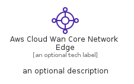

# AwsCloudWanCoreNetworkEdge


```text
aws-q1-2023/Resource/NetworkingAndContentDelivery/AwsCloudWanCoreNetworkEdge
```

```text
include('aws-q1-2023/Resource/NetworkingAndContentDelivery/AwsCloudWanCoreNetworkEdge')
```


| Illustration | AwsCloudWanCoreNetworkEdge | AwsCloudWanCoreNetworkEdgeCard | AwsCloudWanCoreNetworkEdgeGroup |
| :---: | :---: | :---: | :---: |
|  |  |  |  |


## Sprites
The item provides the following sriptes:

- `<$AwsCloudWanCoreNetworkEdgeXs>`
- `<$AwsCloudWanCoreNetworkEdgeSm>`
- `<$AwsCloudWanCoreNetworkEdgeMd>`
- `<$AwsCloudWanCoreNetworkEdgeLg>`


## AwsCloudWanCoreNetworkEdge

### Load remotely
```plantuml
@startuml
' configures the library
!global $LIB_BASE_LOCATION="https://raw.githubusercontent.com/tmorin/plantuml-libs/master/distribution"

' loads the library's bootstrap
!include $LIB_BASE_LOCATION/bootstrap.puml

' loads the package bootstrap
include('aws-q1-2023/bootstrap')

' loads the Item which embeds the element AwsCloudWanCoreNetworkEdge
include('aws-q1-2023/Resource/NetworkingAndContentDelivery/AwsCloudWanCoreNetworkEdge')

' renders the element
AwsCloudWanCoreNetworkEdge('AwsCloudWanCoreNetworkEdge', 'Aws Cloud Wan Core Network Edge', 'an optional tech label', 'an optional description')
@enduml
```

### Load locally
```plantuml
@startuml
' configures the library
!global $INCLUSION_MODE="local"
!global $LIB_BASE_LOCATION="../../.."

' loads the library's bootstrap
!include $LIB_BASE_LOCATION/bootstrap.puml

' loads the package bootstrap
include('aws-q1-2023/bootstrap')

' loads the Item which embeds the element AwsCloudWanCoreNetworkEdge
include('aws-q1-2023/Resource/NetworkingAndContentDelivery/AwsCloudWanCoreNetworkEdge')

' renders the element
AwsCloudWanCoreNetworkEdge('AwsCloudWanCoreNetworkEdge', 'Aws Cloud Wan Core Network Edge', 'an optional tech label', 'an optional description')
@enduml
```

## AwsCloudWanCoreNetworkEdgeCard

### Load remotely
```plantuml
@startuml
' configures the library
!global $LIB_BASE_LOCATION="https://raw.githubusercontent.com/tmorin/plantuml-libs/master/distribution"

' loads the library's bootstrap
!include $LIB_BASE_LOCATION/bootstrap.puml

' loads the package bootstrap
include('aws-q1-2023/bootstrap')

' loads the Item which embeds the element AwsCloudWanCoreNetworkEdgeCard
include('aws-q1-2023/Resource/NetworkingAndContentDelivery/AwsCloudWanCoreNetworkEdge')

' renders the element
AwsCloudWanCoreNetworkEdgeCard('AwsCloudWanCoreNetworkEdgeCard', 'Aws Cloud Wan Core Network Edge Card', 'an optional description')
@enduml
```

### Load locally
```plantuml
@startuml
' configures the library
!global $INCLUSION_MODE="local"
!global $LIB_BASE_LOCATION="../../.."

' loads the library's bootstrap
!include $LIB_BASE_LOCATION/bootstrap.puml

' loads the package bootstrap
include('aws-q1-2023/bootstrap')

' loads the Item which embeds the element AwsCloudWanCoreNetworkEdgeCard
include('aws-q1-2023/Resource/NetworkingAndContentDelivery/AwsCloudWanCoreNetworkEdge')

' renders the element
AwsCloudWanCoreNetworkEdgeCard('AwsCloudWanCoreNetworkEdgeCard', 'Aws Cloud Wan Core Network Edge Card', 'an optional description')
@enduml
```

## AwsCloudWanCoreNetworkEdgeGroup

### Load remotely
```plantuml
@startuml
' configures the library
!global $LIB_BASE_LOCATION="https://raw.githubusercontent.com/tmorin/plantuml-libs/master/distribution"

' loads the library's bootstrap
!include $LIB_BASE_LOCATION/bootstrap.puml

' loads the package bootstrap
include('aws-q1-2023/bootstrap')

' loads the Item which embeds the element AwsCloudWanCoreNetworkEdgeGroup
include('aws-q1-2023/Resource/NetworkingAndContentDelivery/AwsCloudWanCoreNetworkEdge')

' renders the element
AwsCloudWanCoreNetworkEdgeGroup('AwsCloudWanCoreNetworkEdgeGroup', 'Aws Cloud Wan Core Network Edge Group', 'an optional tech label') {
    note as note
        the content of the group
    end note
}
@enduml
```

### Load locally
```plantuml
@startuml
' configures the library
!global $INCLUSION_MODE="local"
!global $LIB_BASE_LOCATION="../../.."

' loads the library's bootstrap
!include $LIB_BASE_LOCATION/bootstrap.puml

' loads the package bootstrap
include('aws-q1-2023/bootstrap')

' loads the Item which embeds the element AwsCloudWanCoreNetworkEdgeGroup
include('aws-q1-2023/Resource/NetworkingAndContentDelivery/AwsCloudWanCoreNetworkEdge')

' renders the element
AwsCloudWanCoreNetworkEdgeGroup('AwsCloudWanCoreNetworkEdgeGroup', 'Aws Cloud Wan Core Network Edge Group', 'an optional tech label') {
    note as note
        the content of the group
    end note
}
@enduml
```

