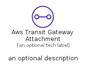
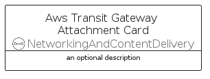
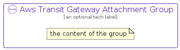

# AwsTransitGatewayAttachment


```text
aws-q1-2023/Resource/NetworkingAndContentDelivery/AwsTransitGatewayAttachment
```

```text
include('aws-q1-2023/Resource/NetworkingAndContentDelivery/AwsTransitGatewayAttachment')
```


| Illustration | AwsTransitGatewayAttachment | AwsTransitGatewayAttachmentCard | AwsTransitGatewayAttachmentGroup |
| :---: | :---: | :---: | :---: |
|  |  |  |  |


## Sprites
The item provides the following sriptes:

- `<$AwsTransitGatewayAttachmentXs>`
- `<$AwsTransitGatewayAttachmentSm>`
- `<$AwsTransitGatewayAttachmentMd>`
- `<$AwsTransitGatewayAttachmentLg>`


## AwsTransitGatewayAttachment

### Load remotely
```plantuml
@startuml
' configures the library
!global $LIB_BASE_LOCATION="https://raw.githubusercontent.com/tmorin/plantuml-libs/master/distribution"

' loads the library's bootstrap
!include $LIB_BASE_LOCATION/bootstrap.puml

' loads the package bootstrap
include('aws-q1-2023/bootstrap')

' loads the Item which embeds the element AwsTransitGatewayAttachment
include('aws-q1-2023/Resource/NetworkingAndContentDelivery/AwsTransitGatewayAttachment')

' renders the element
AwsTransitGatewayAttachment('AwsTransitGatewayAttachment', 'Aws Transit Gateway Attachment', 'an optional tech label', 'an optional description')
@enduml
```

### Load locally
```plantuml
@startuml
' configures the library
!global $INCLUSION_MODE="local"
!global $LIB_BASE_LOCATION="../../.."

' loads the library's bootstrap
!include $LIB_BASE_LOCATION/bootstrap.puml

' loads the package bootstrap
include('aws-q1-2023/bootstrap')

' loads the Item which embeds the element AwsTransitGatewayAttachment
include('aws-q1-2023/Resource/NetworkingAndContentDelivery/AwsTransitGatewayAttachment')

' renders the element
AwsTransitGatewayAttachment('AwsTransitGatewayAttachment', 'Aws Transit Gateway Attachment', 'an optional tech label', 'an optional description')
@enduml
```

## AwsTransitGatewayAttachmentCard

### Load remotely
```plantuml
@startuml
' configures the library
!global $LIB_BASE_LOCATION="https://raw.githubusercontent.com/tmorin/plantuml-libs/master/distribution"

' loads the library's bootstrap
!include $LIB_BASE_LOCATION/bootstrap.puml

' loads the package bootstrap
include('aws-q1-2023/bootstrap')

' loads the Item which embeds the element AwsTransitGatewayAttachmentCard
include('aws-q1-2023/Resource/NetworkingAndContentDelivery/AwsTransitGatewayAttachment')

' renders the element
AwsTransitGatewayAttachmentCard('AwsTransitGatewayAttachmentCard', 'Aws Transit Gateway Attachment Card', 'an optional description')
@enduml
```

### Load locally
```plantuml
@startuml
' configures the library
!global $INCLUSION_MODE="local"
!global $LIB_BASE_LOCATION="../../.."

' loads the library's bootstrap
!include $LIB_BASE_LOCATION/bootstrap.puml

' loads the package bootstrap
include('aws-q1-2023/bootstrap')

' loads the Item which embeds the element AwsTransitGatewayAttachmentCard
include('aws-q1-2023/Resource/NetworkingAndContentDelivery/AwsTransitGatewayAttachment')

' renders the element
AwsTransitGatewayAttachmentCard('AwsTransitGatewayAttachmentCard', 'Aws Transit Gateway Attachment Card', 'an optional description')
@enduml
```

## AwsTransitGatewayAttachmentGroup

### Load remotely
```plantuml
@startuml
' configures the library
!global $LIB_BASE_LOCATION="https://raw.githubusercontent.com/tmorin/plantuml-libs/master/distribution"

' loads the library's bootstrap
!include $LIB_BASE_LOCATION/bootstrap.puml

' loads the package bootstrap
include('aws-q1-2023/bootstrap')

' loads the Item which embeds the element AwsTransitGatewayAttachmentGroup
include('aws-q1-2023/Resource/NetworkingAndContentDelivery/AwsTransitGatewayAttachment')

' renders the element
AwsTransitGatewayAttachmentGroup('AwsTransitGatewayAttachmentGroup', 'Aws Transit Gateway Attachment Group', 'an optional tech label') {
    note as note
        the content of the group
    end note
}
@enduml
```

### Load locally
```plantuml
@startuml
' configures the library
!global $INCLUSION_MODE="local"
!global $LIB_BASE_LOCATION="../../.."

' loads the library's bootstrap
!include $LIB_BASE_LOCATION/bootstrap.puml

' loads the package bootstrap
include('aws-q1-2023/bootstrap')

' loads the Item which embeds the element AwsTransitGatewayAttachmentGroup
include('aws-q1-2023/Resource/NetworkingAndContentDelivery/AwsTransitGatewayAttachment')

' renders the element
AwsTransitGatewayAttachmentGroup('AwsTransitGatewayAttachmentGroup', 'Aws Transit Gateway Attachment Group', 'an optional tech label') {
    note as note
        the content of the group
    end note
}
@enduml
```

