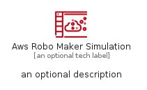
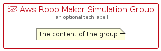

# AwsRoboMakerSimulation


```text
aws-q1-2023/Resource/Robotics/AwsRoboMakerSimulation
```

```text
include('aws-q1-2023/Resource/Robotics/AwsRoboMakerSimulation')
```


| Illustration | AwsRoboMakerSimulation | AwsRoboMakerSimulationCard | AwsRoboMakerSimulationGroup |
| :---: | :---: | :---: | :---: |
|  |  |  |  |


## AwsRoboMakerSimulation

### Load remotely
```plantuml
@startuml
' configures the library
!global $LIB_BASE_LOCATION="https://raw.githubusercontent.com/tmorin/plantuml-libs/master/distribution"

' loads the library's bootstrap
!include $LIB_BASE_LOCATION/bootstrap.puml

' loads the package bootstrap
include('aws-q1-2023/bootstrap')

' loads the Item which embeds the element AwsRoboMakerSimulation
include('aws-q1-2023/Resource/Robotics/AwsRoboMakerSimulation')

' renders the element
AwsRoboMakerSimulation('AwsRoboMakerSimulation', 'Aws Robo Maker Simulation', 'an optional tech label', 'an optional description')
@enduml
```

### Load locally
```plantuml
@startuml
' configures the library
!global $INCLUSION_MODE="local"
!global $LIB_BASE_LOCATION="../../.."

' loads the library's bootstrap
!include $LIB_BASE_LOCATION/bootstrap.puml

' loads the package bootstrap
include('aws-q1-2023/bootstrap')

' loads the Item which embeds the element AwsRoboMakerSimulation
include('aws-q1-2023/Resource/Robotics/AwsRoboMakerSimulation')

' renders the element
AwsRoboMakerSimulation('AwsRoboMakerSimulation', 'Aws Robo Maker Simulation', 'an optional tech label', 'an optional description')
@enduml
```

## AwsRoboMakerSimulationCard

### Load remotely
```plantuml
@startuml
' configures the library
!global $LIB_BASE_LOCATION="https://raw.githubusercontent.com/tmorin/plantuml-libs/master/distribution"

' loads the library's bootstrap
!include $LIB_BASE_LOCATION/bootstrap.puml

' loads the package bootstrap
include('aws-q1-2023/bootstrap')

' loads the Item which embeds the element AwsRoboMakerSimulationCard
include('aws-q1-2023/Resource/Robotics/AwsRoboMakerSimulation')

' renders the element
AwsRoboMakerSimulationCard('AwsRoboMakerSimulationCard', 'Aws Robo Maker Simulation Card', 'an optional description')
@enduml
```

### Load locally
```plantuml
@startuml
' configures the library
!global $INCLUSION_MODE="local"
!global $LIB_BASE_LOCATION="../../.."

' loads the library's bootstrap
!include $LIB_BASE_LOCATION/bootstrap.puml

' loads the package bootstrap
include('aws-q1-2023/bootstrap')

' loads the Item which embeds the element AwsRoboMakerSimulationCard
include('aws-q1-2023/Resource/Robotics/AwsRoboMakerSimulation')

' renders the element
AwsRoboMakerSimulationCard('AwsRoboMakerSimulationCard', 'Aws Robo Maker Simulation Card', 'an optional description')
@enduml
```

## AwsRoboMakerSimulationGroup

### Load remotely
```plantuml
@startuml
' configures the library
!global $LIB_BASE_LOCATION="https://raw.githubusercontent.com/tmorin/plantuml-libs/master/distribution"

' loads the library's bootstrap
!include $LIB_BASE_LOCATION/bootstrap.puml

' loads the package bootstrap
include('aws-q1-2023/bootstrap')

' loads the Item which embeds the element AwsRoboMakerSimulationGroup
include('aws-q1-2023/Resource/Robotics/AwsRoboMakerSimulation')

' renders the element
AwsRoboMakerSimulationGroup('AwsRoboMakerSimulationGroup', 'Aws Robo Maker Simulation Group', 'an optional tech label') {
    note as note
        the content of the group
    end note
}
@enduml
```

### Load locally
```plantuml
@startuml
' configures the library
!global $INCLUSION_MODE="local"
!global $LIB_BASE_LOCATION="../../.."

' loads the library's bootstrap
!include $LIB_BASE_LOCATION/bootstrap.puml

' loads the package bootstrap
include('aws-q1-2023/bootstrap')

' loads the Item which embeds the element AwsRoboMakerSimulationGroup
include('aws-q1-2023/Resource/Robotics/AwsRoboMakerSimulation')

' renders the element
AwsRoboMakerSimulationGroup('AwsRoboMakerSimulationGroup', 'Aws Robo Maker Simulation Group', 'an optional tech label') {
    note as note
        the content of the group
    end note
}
@enduml
```

