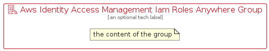

# AwsIdentityAccessManagementIamRolesAnywhere


```text
aws-q1-2023/Resource/SecurityIdentityAndCompliance/AwsIdentityAccessManagementIamRolesAnywhere
```

```text
include('aws-q1-2023/Resource/SecurityIdentityAndCompliance/AwsIdentityAccessManagementIamRolesAnywhere')
```


| Illustration | AwsIdentityAccessManagementIamRolesAnywhere | AwsIdentityAccessManagementIamRolesAnywhereCard | AwsIdentityAccessManagementIamRolesAnywhereGroup |
| :---: | :---: | :---: | :---: |
|  |  |  |  |


## AwsIdentityAccessManagementIamRolesAnywhere

### Load remotely
```plantuml
@startuml
' configures the library
!global $LIB_BASE_LOCATION="https://raw.githubusercontent.com/tmorin/plantuml-libs/master/distribution"

' loads the library's bootstrap
!include $LIB_BASE_LOCATION/bootstrap.puml

' loads the package bootstrap
include('aws-q1-2023/bootstrap')

' loads the Item which embeds the element AwsIdentityAccessManagementIamRolesAnywhere
include('aws-q1-2023/Resource/SecurityIdentityAndCompliance/AwsIdentityAccessManagementIamRolesAnywhere')

' renders the element
AwsIdentityAccessManagementIamRolesAnywhere('AwsIdentityAccessManagementIamRolesAnywhere', 'Aws Identity Access Management Iam Roles Anywhere', 'an optional tech label', 'an optional description')
@enduml
```

### Load locally
```plantuml
@startuml
' configures the library
!global $INCLUSION_MODE="local"
!global $LIB_BASE_LOCATION="../../.."

' loads the library's bootstrap
!include $LIB_BASE_LOCATION/bootstrap.puml

' loads the package bootstrap
include('aws-q1-2023/bootstrap')

' loads the Item which embeds the element AwsIdentityAccessManagementIamRolesAnywhere
include('aws-q1-2023/Resource/SecurityIdentityAndCompliance/AwsIdentityAccessManagementIamRolesAnywhere')

' renders the element
AwsIdentityAccessManagementIamRolesAnywhere('AwsIdentityAccessManagementIamRolesAnywhere', 'Aws Identity Access Management Iam Roles Anywhere', 'an optional tech label', 'an optional description')
@enduml
```

## AwsIdentityAccessManagementIamRolesAnywhereCard

### Load remotely
```plantuml
@startuml
' configures the library
!global $LIB_BASE_LOCATION="https://raw.githubusercontent.com/tmorin/plantuml-libs/master/distribution"

' loads the library's bootstrap
!include $LIB_BASE_LOCATION/bootstrap.puml

' loads the package bootstrap
include('aws-q1-2023/bootstrap')

' loads the Item which embeds the element AwsIdentityAccessManagementIamRolesAnywhereCard
include('aws-q1-2023/Resource/SecurityIdentityAndCompliance/AwsIdentityAccessManagementIamRolesAnywhere')

' renders the element
AwsIdentityAccessManagementIamRolesAnywhereCard('AwsIdentityAccessManagementIamRolesAnywhereCard', 'Aws Identity Access Management Iam Roles Anywhere Card', 'an optional description')
@enduml
```

### Load locally
```plantuml
@startuml
' configures the library
!global $INCLUSION_MODE="local"
!global $LIB_BASE_LOCATION="../../.."

' loads the library's bootstrap
!include $LIB_BASE_LOCATION/bootstrap.puml

' loads the package bootstrap
include('aws-q1-2023/bootstrap')

' loads the Item which embeds the element AwsIdentityAccessManagementIamRolesAnywhereCard
include('aws-q1-2023/Resource/SecurityIdentityAndCompliance/AwsIdentityAccessManagementIamRolesAnywhere')

' renders the element
AwsIdentityAccessManagementIamRolesAnywhereCard('AwsIdentityAccessManagementIamRolesAnywhereCard', 'Aws Identity Access Management Iam Roles Anywhere Card', 'an optional description')
@enduml
```

## AwsIdentityAccessManagementIamRolesAnywhereGroup

### Load remotely
```plantuml
@startuml
' configures the library
!global $LIB_BASE_LOCATION="https://raw.githubusercontent.com/tmorin/plantuml-libs/master/distribution"

' loads the library's bootstrap
!include $LIB_BASE_LOCATION/bootstrap.puml

' loads the package bootstrap
include('aws-q1-2023/bootstrap')

' loads the Item which embeds the element AwsIdentityAccessManagementIamRolesAnywhereGroup
include('aws-q1-2023/Resource/SecurityIdentityAndCompliance/AwsIdentityAccessManagementIamRolesAnywhere')

' renders the element
AwsIdentityAccessManagementIamRolesAnywhereGroup('AwsIdentityAccessManagementIamRolesAnywhereGroup', 'Aws Identity Access Management Iam Roles Anywhere Group', 'an optional tech label') {
    note as note
        the content of the group
    end note
}
@enduml
```

### Load locally
```plantuml
@startuml
' configures the library
!global $INCLUSION_MODE="local"
!global $LIB_BASE_LOCATION="../../.."

' loads the library's bootstrap
!include $LIB_BASE_LOCATION/bootstrap.puml

' loads the package bootstrap
include('aws-q1-2023/bootstrap')

' loads the Item which embeds the element AwsIdentityAccessManagementIamRolesAnywhereGroup
include('aws-q1-2023/Resource/SecurityIdentityAndCompliance/AwsIdentityAccessManagementIamRolesAnywhere')

' renders the element
AwsIdentityAccessManagementIamRolesAnywhereGroup('AwsIdentityAccessManagementIamRolesAnywhereGroup', 'Aws Identity Access Management Iam Roles Anywhere Group', 'an optional tech label') {
    note as note
        the content of the group
    end note
}
@enduml
```

