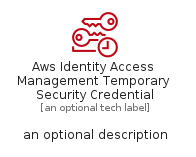

# AwsIdentityAccessManagementTemporarySecurityCredential


```text
aws-q1-2023/Resource/SecurityIdentityAndCompliance/AwsIdentityAccessManagementTemporarySecurityCredential
```

```text
include('aws-q1-2023/Resource/SecurityIdentityAndCompliance/AwsIdentityAccessManagementTemporarySecurityCredential')
```


| Illustration | AwsIdentityAccessManagementTemporarySecurityCredential | AwsIdentityAccessManagementTemporarySecurityCredentialCard | AwsIdentityAccessManagementTemporarySecurityCredentialGroup |
| :---: | :---: | :---: | :---: |
|  |  |  |  |


## Sprites
The item provides the following sriptes:

- `<$AwsIdentityAccessManagementTemporarySecurityCredentialXs>`
- `<$AwsIdentityAccessManagementTemporarySecurityCredentialSm>`
- `<$AwsIdentityAccessManagementTemporarySecurityCredentialMd>`
- `<$AwsIdentityAccessManagementTemporarySecurityCredentialLg>`


## AwsIdentityAccessManagementTemporarySecurityCredential

### Load remotely
```plantuml
@startuml
' configures the library
!global $LIB_BASE_LOCATION="https://raw.githubusercontent.com/tmorin/plantuml-libs/master/distribution"

' loads the library's bootstrap
!include $LIB_BASE_LOCATION/bootstrap.puml

' loads the package bootstrap
include('aws-q1-2023/bootstrap')

' loads the Item which embeds the element AwsIdentityAccessManagementTemporarySecurityCredential
include('aws-q1-2023/Resource/SecurityIdentityAndCompliance/AwsIdentityAccessManagementTemporarySecurityCredential')

' renders the element
AwsIdentityAccessManagementTemporarySecurityCredential('AwsIdentityAccessManagementTemporarySecurityCredential', 'Aws Identity Access Management Temporary Security Credential', 'an optional tech label', 'an optional description')
@enduml
```

### Load locally
```plantuml
@startuml
' configures the library
!global $INCLUSION_MODE="local"
!global $LIB_BASE_LOCATION="../../.."

' loads the library's bootstrap
!include $LIB_BASE_LOCATION/bootstrap.puml

' loads the package bootstrap
include('aws-q1-2023/bootstrap')

' loads the Item which embeds the element AwsIdentityAccessManagementTemporarySecurityCredential
include('aws-q1-2023/Resource/SecurityIdentityAndCompliance/AwsIdentityAccessManagementTemporarySecurityCredential')

' renders the element
AwsIdentityAccessManagementTemporarySecurityCredential('AwsIdentityAccessManagementTemporarySecurityCredential', 'Aws Identity Access Management Temporary Security Credential', 'an optional tech label', 'an optional description')
@enduml
```

## AwsIdentityAccessManagementTemporarySecurityCredentialCard

### Load remotely
```plantuml
@startuml
' configures the library
!global $LIB_BASE_LOCATION="https://raw.githubusercontent.com/tmorin/plantuml-libs/master/distribution"

' loads the library's bootstrap
!include $LIB_BASE_LOCATION/bootstrap.puml

' loads the package bootstrap
include('aws-q1-2023/bootstrap')

' loads the Item which embeds the element AwsIdentityAccessManagementTemporarySecurityCredentialCard
include('aws-q1-2023/Resource/SecurityIdentityAndCompliance/AwsIdentityAccessManagementTemporarySecurityCredential')

' renders the element
AwsIdentityAccessManagementTemporarySecurityCredentialCard('AwsIdentityAccessManagementTemporarySecurityCredentialCard', 'Aws Identity Access Management Temporary Security Credential Card', 'an optional description')
@enduml
```

### Load locally
```plantuml
@startuml
' configures the library
!global $INCLUSION_MODE="local"
!global $LIB_BASE_LOCATION="../../.."

' loads the library's bootstrap
!include $LIB_BASE_LOCATION/bootstrap.puml

' loads the package bootstrap
include('aws-q1-2023/bootstrap')

' loads the Item which embeds the element AwsIdentityAccessManagementTemporarySecurityCredentialCard
include('aws-q1-2023/Resource/SecurityIdentityAndCompliance/AwsIdentityAccessManagementTemporarySecurityCredential')

' renders the element
AwsIdentityAccessManagementTemporarySecurityCredentialCard('AwsIdentityAccessManagementTemporarySecurityCredentialCard', 'Aws Identity Access Management Temporary Security Credential Card', 'an optional description')
@enduml
```

## AwsIdentityAccessManagementTemporarySecurityCredentialGroup

### Load remotely
```plantuml
@startuml
' configures the library
!global $LIB_BASE_LOCATION="https://raw.githubusercontent.com/tmorin/plantuml-libs/master/distribution"

' loads the library's bootstrap
!include $LIB_BASE_LOCATION/bootstrap.puml

' loads the package bootstrap
include('aws-q1-2023/bootstrap')

' loads the Item which embeds the element AwsIdentityAccessManagementTemporarySecurityCredentialGroup
include('aws-q1-2023/Resource/SecurityIdentityAndCompliance/AwsIdentityAccessManagementTemporarySecurityCredential')

' renders the element
AwsIdentityAccessManagementTemporarySecurityCredentialGroup('AwsIdentityAccessManagementTemporarySecurityCredentialGroup', 'Aws Identity Access Management Temporary Security Credential Group', 'an optional tech label') {
    note as note
        the content of the group
    end note
}
@enduml
```

### Load locally
```plantuml
@startuml
' configures the library
!global $INCLUSION_MODE="local"
!global $LIB_BASE_LOCATION="../../.."

' loads the library's bootstrap
!include $LIB_BASE_LOCATION/bootstrap.puml

' loads the package bootstrap
include('aws-q1-2023/bootstrap')

' loads the Item which embeds the element AwsIdentityAccessManagementTemporarySecurityCredentialGroup
include('aws-q1-2023/Resource/SecurityIdentityAndCompliance/AwsIdentityAccessManagementTemporarySecurityCredential')

' renders the element
AwsIdentityAccessManagementTemporarySecurityCredentialGroup('AwsIdentityAccessManagementTemporarySecurityCredentialGroup', 'Aws Identity Access Management Temporary Security Credential Group', 'an optional tech label') {
    note as note
        the content of the group
    end note
}
@enduml
```

