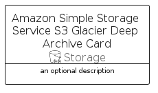

# AmazonSimpleStorageServiceS3GlacierDeepArchive


```text
aws-q1-2023/Resource/Storage/AmazonSimpleStorageServiceS3GlacierDeepArchive
```

```text
include('aws-q1-2023/Resource/Storage/AmazonSimpleStorageServiceS3GlacierDeepArchive')
```


| Illustration | AmazonSimpleStorageServiceS3GlacierDeepArchive | AmazonSimpleStorageServiceS3GlacierDeepArchiveCard | AmazonSimpleStorageServiceS3GlacierDeepArchiveGroup |
| :---: | :---: | :---: | :---: |
|  |  |  |  |


## Sprites
The item provides the following sriptes:

- `<$AmazonSimpleStorageServiceS3GlacierDeepArchiveXs>`
- `<$AmazonSimpleStorageServiceS3GlacierDeepArchiveSm>`
- `<$AmazonSimpleStorageServiceS3GlacierDeepArchiveMd>`
- `<$AmazonSimpleStorageServiceS3GlacierDeepArchiveLg>`


## AmazonSimpleStorageServiceS3GlacierDeepArchive

### Load remotely
```plantuml
@startuml
' configures the library
!global $LIB_BASE_LOCATION="https://raw.githubusercontent.com/tmorin/plantuml-libs/master/distribution"

' loads the library's bootstrap
!include $LIB_BASE_LOCATION/bootstrap.puml

' loads the package bootstrap
include('aws-q1-2023/bootstrap')

' loads the Item which embeds the element AmazonSimpleStorageServiceS3GlacierDeepArchive
include('aws-q1-2023/Resource/Storage/AmazonSimpleStorageServiceS3GlacierDeepArchive')

' renders the element
AmazonSimpleStorageServiceS3GlacierDeepArchive('AmazonSimpleStorageServiceS3GlacierDeepArchive', 'Amazon Simple Storage Service S3 Glacier Deep Archive', 'an optional tech label', 'an optional description')
@enduml
```

### Load locally
```plantuml
@startuml
' configures the library
!global $INCLUSION_MODE="local"
!global $LIB_BASE_LOCATION="../../.."

' loads the library's bootstrap
!include $LIB_BASE_LOCATION/bootstrap.puml

' loads the package bootstrap
include('aws-q1-2023/bootstrap')

' loads the Item which embeds the element AmazonSimpleStorageServiceS3GlacierDeepArchive
include('aws-q1-2023/Resource/Storage/AmazonSimpleStorageServiceS3GlacierDeepArchive')

' renders the element
AmazonSimpleStorageServiceS3GlacierDeepArchive('AmazonSimpleStorageServiceS3GlacierDeepArchive', 'Amazon Simple Storage Service S3 Glacier Deep Archive', 'an optional tech label', 'an optional description')
@enduml
```

## AmazonSimpleStorageServiceS3GlacierDeepArchiveCard

### Load remotely
```plantuml
@startuml
' configures the library
!global $LIB_BASE_LOCATION="https://raw.githubusercontent.com/tmorin/plantuml-libs/master/distribution"

' loads the library's bootstrap
!include $LIB_BASE_LOCATION/bootstrap.puml

' loads the package bootstrap
include('aws-q1-2023/bootstrap')

' loads the Item which embeds the element AmazonSimpleStorageServiceS3GlacierDeepArchiveCard
include('aws-q1-2023/Resource/Storage/AmazonSimpleStorageServiceS3GlacierDeepArchive')

' renders the element
AmazonSimpleStorageServiceS3GlacierDeepArchiveCard('AmazonSimpleStorageServiceS3GlacierDeepArchiveCard', 'Amazon Simple Storage Service S3 Glacier Deep Archive Card', 'an optional description')
@enduml
```

### Load locally
```plantuml
@startuml
' configures the library
!global $INCLUSION_MODE="local"
!global $LIB_BASE_LOCATION="../../.."

' loads the library's bootstrap
!include $LIB_BASE_LOCATION/bootstrap.puml

' loads the package bootstrap
include('aws-q1-2023/bootstrap')

' loads the Item which embeds the element AmazonSimpleStorageServiceS3GlacierDeepArchiveCard
include('aws-q1-2023/Resource/Storage/AmazonSimpleStorageServiceS3GlacierDeepArchive')

' renders the element
AmazonSimpleStorageServiceS3GlacierDeepArchiveCard('AmazonSimpleStorageServiceS3GlacierDeepArchiveCard', 'Amazon Simple Storage Service S3 Glacier Deep Archive Card', 'an optional description')
@enduml
```

## AmazonSimpleStorageServiceS3GlacierDeepArchiveGroup

### Load remotely
```plantuml
@startuml
' configures the library
!global $LIB_BASE_LOCATION="https://raw.githubusercontent.com/tmorin/plantuml-libs/master/distribution"

' loads the library's bootstrap
!include $LIB_BASE_LOCATION/bootstrap.puml

' loads the package bootstrap
include('aws-q1-2023/bootstrap')

' loads the Item which embeds the element AmazonSimpleStorageServiceS3GlacierDeepArchiveGroup
include('aws-q1-2023/Resource/Storage/AmazonSimpleStorageServiceS3GlacierDeepArchive')

' renders the element
AmazonSimpleStorageServiceS3GlacierDeepArchiveGroup('AmazonSimpleStorageServiceS3GlacierDeepArchiveGroup', 'Amazon Simple Storage Service S3 Glacier Deep Archive Group', 'an optional tech label') {
    note as note
        the content of the group
    end note
}
@enduml
```

### Load locally
```plantuml
@startuml
' configures the library
!global $INCLUSION_MODE="local"
!global $LIB_BASE_LOCATION="../../.."

' loads the library's bootstrap
!include $LIB_BASE_LOCATION/bootstrap.puml

' loads the package bootstrap
include('aws-q1-2023/bootstrap')

' loads the Item which embeds the element AmazonSimpleStorageServiceS3GlacierDeepArchiveGroup
include('aws-q1-2023/Resource/Storage/AmazonSimpleStorageServiceS3GlacierDeepArchive')

' renders the element
AmazonSimpleStorageServiceS3GlacierDeepArchiveGroup('AmazonSimpleStorageServiceS3GlacierDeepArchiveGroup', 'Amazon Simple Storage Service S3 Glacier Deep Archive Group', 'an optional tech label') {
    note as note
        the content of the group
    end note
}
@enduml
```

