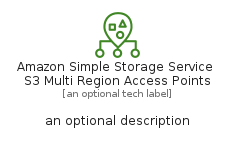

# AmazonSimpleStorageServiceS3MultiRegionAccessPoints


```text
aws-q1-2023/Resource/Storage/AmazonSimpleStorageServiceS3MultiRegionAccessPoints
```

```text
include('aws-q1-2023/Resource/Storage/AmazonSimpleStorageServiceS3MultiRegionAccessPoints')
```


| Illustration | AmazonSimpleStorageServiceS3MultiRegionAccessPoints | AmazonSimpleStorageServiceS3MultiRegionAccessPointsCard | AmazonSimpleStorageServiceS3MultiRegionAccessPointsGroup |
| :---: | :---: | :---: | :---: |
|  |  |  |  |


## AmazonSimpleStorageServiceS3MultiRegionAccessPoints

### Load remotely
```plantuml
@startuml
' configures the library
!global $LIB_BASE_LOCATION="https://raw.githubusercontent.com/tmorin/plantuml-libs/master/distribution"

' loads the library's bootstrap
!include $LIB_BASE_LOCATION/bootstrap.puml

' loads the package bootstrap
include('aws-q1-2023/bootstrap')

' loads the Item which embeds the element AmazonSimpleStorageServiceS3MultiRegionAccessPoints
include('aws-q1-2023/Resource/Storage/AmazonSimpleStorageServiceS3MultiRegionAccessPoints')

' renders the element
AmazonSimpleStorageServiceS3MultiRegionAccessPoints('AmazonSimpleStorageServiceS3MultiRegionAccessPoints', 'Amazon Simple Storage Service S3 Multi Region Access Points', 'an optional tech label', 'an optional description')
@enduml
```

### Load locally
```plantuml
@startuml
' configures the library
!global $INCLUSION_MODE="local"
!global $LIB_BASE_LOCATION="../../.."

' loads the library's bootstrap
!include $LIB_BASE_LOCATION/bootstrap.puml

' loads the package bootstrap
include('aws-q1-2023/bootstrap')

' loads the Item which embeds the element AmazonSimpleStorageServiceS3MultiRegionAccessPoints
include('aws-q1-2023/Resource/Storage/AmazonSimpleStorageServiceS3MultiRegionAccessPoints')

' renders the element
AmazonSimpleStorageServiceS3MultiRegionAccessPoints('AmazonSimpleStorageServiceS3MultiRegionAccessPoints', 'Amazon Simple Storage Service S3 Multi Region Access Points', 'an optional tech label', 'an optional description')
@enduml
```

## AmazonSimpleStorageServiceS3MultiRegionAccessPointsCard

### Load remotely
```plantuml
@startuml
' configures the library
!global $LIB_BASE_LOCATION="https://raw.githubusercontent.com/tmorin/plantuml-libs/master/distribution"

' loads the library's bootstrap
!include $LIB_BASE_LOCATION/bootstrap.puml

' loads the package bootstrap
include('aws-q1-2023/bootstrap')

' loads the Item which embeds the element AmazonSimpleStorageServiceS3MultiRegionAccessPointsCard
include('aws-q1-2023/Resource/Storage/AmazonSimpleStorageServiceS3MultiRegionAccessPoints')

' renders the element
AmazonSimpleStorageServiceS3MultiRegionAccessPointsCard('AmazonSimpleStorageServiceS3MultiRegionAccessPointsCard', 'Amazon Simple Storage Service S3 Multi Region Access Points Card', 'an optional description')
@enduml
```

### Load locally
```plantuml
@startuml
' configures the library
!global $INCLUSION_MODE="local"
!global $LIB_BASE_LOCATION="../../.."

' loads the library's bootstrap
!include $LIB_BASE_LOCATION/bootstrap.puml

' loads the package bootstrap
include('aws-q1-2023/bootstrap')

' loads the Item which embeds the element AmazonSimpleStorageServiceS3MultiRegionAccessPointsCard
include('aws-q1-2023/Resource/Storage/AmazonSimpleStorageServiceS3MultiRegionAccessPoints')

' renders the element
AmazonSimpleStorageServiceS3MultiRegionAccessPointsCard('AmazonSimpleStorageServiceS3MultiRegionAccessPointsCard', 'Amazon Simple Storage Service S3 Multi Region Access Points Card', 'an optional description')
@enduml
```

## AmazonSimpleStorageServiceS3MultiRegionAccessPointsGroup

### Load remotely
```plantuml
@startuml
' configures the library
!global $LIB_BASE_LOCATION="https://raw.githubusercontent.com/tmorin/plantuml-libs/master/distribution"

' loads the library's bootstrap
!include $LIB_BASE_LOCATION/bootstrap.puml

' loads the package bootstrap
include('aws-q1-2023/bootstrap')

' loads the Item which embeds the element AmazonSimpleStorageServiceS3MultiRegionAccessPointsGroup
include('aws-q1-2023/Resource/Storage/AmazonSimpleStorageServiceS3MultiRegionAccessPoints')

' renders the element
AmazonSimpleStorageServiceS3MultiRegionAccessPointsGroup('AmazonSimpleStorageServiceS3MultiRegionAccessPointsGroup', 'Amazon Simple Storage Service S3 Multi Region Access Points Group', 'an optional tech label') {
    note as note
        the content of the group
    end note
}
@enduml
```

### Load locally
```plantuml
@startuml
' configures the library
!global $INCLUSION_MODE="local"
!global $LIB_BASE_LOCATION="../../.."

' loads the library's bootstrap
!include $LIB_BASE_LOCATION/bootstrap.puml

' loads the package bootstrap
include('aws-q1-2023/bootstrap')

' loads the Item which embeds the element AmazonSimpleStorageServiceS3MultiRegionAccessPointsGroup
include('aws-q1-2023/Resource/Storage/AmazonSimpleStorageServiceS3MultiRegionAccessPoints')

' renders the element
AmazonSimpleStorageServiceS3MultiRegionAccessPointsGroup('AmazonSimpleStorageServiceS3MultiRegionAccessPointsGroup', 'Amazon Simple Storage Service S3 Multi Region Access Points Group', 'an optional tech label') {
    note as note
        the content of the group
    end note
}
@enduml
```

