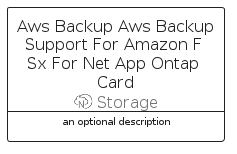

# AwsBackupAwsBackupSupportForAmazonFSxForNetAppOntap


```text
aws-q1-2023/Resource/Storage/AwsBackupAwsBackupSupportForAmazonFSxForNetAppOntap
```

```text
include('aws-q1-2023/Resource/Storage/AwsBackupAwsBackupSupportForAmazonFSxForNetAppOntap')
```


| Illustration | AwsBackupAwsBackupSupportForAmazonFSxForNetAppOntap | AwsBackupAwsBackupSupportForAmazonFSxForNetAppOntapCard | AwsBackupAwsBackupSupportForAmazonFSxForNetAppOntapGroup |
| :---: | :---: | :---: | :---: |
|  |  |  |  |


## Sprites
The item provides the following sriptes:

- `<$AwsBackupAwsBackupSupportForAmazonFSxForNetAppOntapXs>`
- `<$AwsBackupAwsBackupSupportForAmazonFSxForNetAppOntapSm>`
- `<$AwsBackupAwsBackupSupportForAmazonFSxForNetAppOntapMd>`
- `<$AwsBackupAwsBackupSupportForAmazonFSxForNetAppOntapLg>`


## AwsBackupAwsBackupSupportForAmazonFSxForNetAppOntap

### Load remotely
```plantuml
@startuml
' configures the library
!global $LIB_BASE_LOCATION="https://raw.githubusercontent.com/tmorin/plantuml-libs/master/distribution"

' loads the library's bootstrap
!include $LIB_BASE_LOCATION/bootstrap.puml

' loads the package bootstrap
include('aws-q1-2023/bootstrap')

' loads the Item which embeds the element AwsBackupAwsBackupSupportForAmazonFSxForNetAppOntap
include('aws-q1-2023/Resource/Storage/AwsBackupAwsBackupSupportForAmazonFSxForNetAppOntap')

' renders the element
AwsBackupAwsBackupSupportForAmazonFSxForNetAppOntap('AwsBackupAwsBackupSupportForAmazonFSxForNetAppOntap', 'Aws Backup Aws Backup Support For Amazon F Sx For Net App Ontap', 'an optional tech label', 'an optional description')
@enduml
```

### Load locally
```plantuml
@startuml
' configures the library
!global $INCLUSION_MODE="local"
!global $LIB_BASE_LOCATION="../../.."

' loads the library's bootstrap
!include $LIB_BASE_LOCATION/bootstrap.puml

' loads the package bootstrap
include('aws-q1-2023/bootstrap')

' loads the Item which embeds the element AwsBackupAwsBackupSupportForAmazonFSxForNetAppOntap
include('aws-q1-2023/Resource/Storage/AwsBackupAwsBackupSupportForAmazonFSxForNetAppOntap')

' renders the element
AwsBackupAwsBackupSupportForAmazonFSxForNetAppOntap('AwsBackupAwsBackupSupportForAmazonFSxForNetAppOntap', 'Aws Backup Aws Backup Support For Amazon F Sx For Net App Ontap', 'an optional tech label', 'an optional description')
@enduml
```

## AwsBackupAwsBackupSupportForAmazonFSxForNetAppOntapCard

### Load remotely
```plantuml
@startuml
' configures the library
!global $LIB_BASE_LOCATION="https://raw.githubusercontent.com/tmorin/plantuml-libs/master/distribution"

' loads the library's bootstrap
!include $LIB_BASE_LOCATION/bootstrap.puml

' loads the package bootstrap
include('aws-q1-2023/bootstrap')

' loads the Item which embeds the element AwsBackupAwsBackupSupportForAmazonFSxForNetAppOntapCard
include('aws-q1-2023/Resource/Storage/AwsBackupAwsBackupSupportForAmazonFSxForNetAppOntap')

' renders the element
AwsBackupAwsBackupSupportForAmazonFSxForNetAppOntapCard('AwsBackupAwsBackupSupportForAmazonFSxForNetAppOntapCard', 'Aws Backup Aws Backup Support For Amazon F Sx For Net App Ontap Card', 'an optional description')
@enduml
```

### Load locally
```plantuml
@startuml
' configures the library
!global $INCLUSION_MODE="local"
!global $LIB_BASE_LOCATION="../../.."

' loads the library's bootstrap
!include $LIB_BASE_LOCATION/bootstrap.puml

' loads the package bootstrap
include('aws-q1-2023/bootstrap')

' loads the Item which embeds the element AwsBackupAwsBackupSupportForAmazonFSxForNetAppOntapCard
include('aws-q1-2023/Resource/Storage/AwsBackupAwsBackupSupportForAmazonFSxForNetAppOntap')

' renders the element
AwsBackupAwsBackupSupportForAmazonFSxForNetAppOntapCard('AwsBackupAwsBackupSupportForAmazonFSxForNetAppOntapCard', 'Aws Backup Aws Backup Support For Amazon F Sx For Net App Ontap Card', 'an optional description')
@enduml
```

## AwsBackupAwsBackupSupportForAmazonFSxForNetAppOntapGroup

### Load remotely
```plantuml
@startuml
' configures the library
!global $LIB_BASE_LOCATION="https://raw.githubusercontent.com/tmorin/plantuml-libs/master/distribution"

' loads the library's bootstrap
!include $LIB_BASE_LOCATION/bootstrap.puml

' loads the package bootstrap
include('aws-q1-2023/bootstrap')

' loads the Item which embeds the element AwsBackupAwsBackupSupportForAmazonFSxForNetAppOntapGroup
include('aws-q1-2023/Resource/Storage/AwsBackupAwsBackupSupportForAmazonFSxForNetAppOntap')

' renders the element
AwsBackupAwsBackupSupportForAmazonFSxForNetAppOntapGroup('AwsBackupAwsBackupSupportForAmazonFSxForNetAppOntapGroup', 'Aws Backup Aws Backup Support For Amazon F Sx For Net App Ontap Group', 'an optional tech label') {
    note as note
        the content of the group
    end note
}
@enduml
```

### Load locally
```plantuml
@startuml
' configures the library
!global $INCLUSION_MODE="local"
!global $LIB_BASE_LOCATION="../../.."

' loads the library's bootstrap
!include $LIB_BASE_LOCATION/bootstrap.puml

' loads the package bootstrap
include('aws-q1-2023/bootstrap')

' loads the Item which embeds the element AwsBackupAwsBackupSupportForAmazonFSxForNetAppOntapGroup
include('aws-q1-2023/Resource/Storage/AwsBackupAwsBackupSupportForAmazonFSxForNetAppOntap')

' renders the element
AwsBackupAwsBackupSupportForAmazonFSxForNetAppOntapGroup('AwsBackupAwsBackupSupportForAmazonFSxForNetAppOntapGroup', 'Aws Backup Aws Backup Support For Amazon F Sx For Net App Ontap Group', 'an optional tech label') {
    note as note
        the content of the group
    end note
}
@enduml
```

