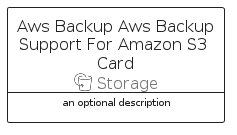

# AwsBackupAwsBackupSupportForAmazonS3


```text
aws-q1-2023/Resource/Storage/AwsBackupAwsBackupSupportForAmazonS3
```

```text
include('aws-q1-2023/Resource/Storage/AwsBackupAwsBackupSupportForAmazonS3')
```


| Illustration | AwsBackupAwsBackupSupportForAmazonS3 | AwsBackupAwsBackupSupportForAmazonS3Card | AwsBackupAwsBackupSupportForAmazonS3Group |
| :---: | :---: | :---: | :---: |
|  |  |  |  |


## Sprites
The item provides the following sriptes:

- `<$AwsBackupAwsBackupSupportForAmazonS3Xs>`
- `<$AwsBackupAwsBackupSupportForAmazonS3Sm>`
- `<$AwsBackupAwsBackupSupportForAmazonS3Md>`
- `<$AwsBackupAwsBackupSupportForAmazonS3Lg>`


## AwsBackupAwsBackupSupportForAmazonS3

### Load remotely
```plantuml
@startuml
' configures the library
!global $LIB_BASE_LOCATION="https://raw.githubusercontent.com/tmorin/plantuml-libs/master/distribution"

' loads the library's bootstrap
!include $LIB_BASE_LOCATION/bootstrap.puml

' loads the package bootstrap
include('aws-q1-2023/bootstrap')

' loads the Item which embeds the element AwsBackupAwsBackupSupportForAmazonS3
include('aws-q1-2023/Resource/Storage/AwsBackupAwsBackupSupportForAmazonS3')

' renders the element
AwsBackupAwsBackupSupportForAmazonS3('AwsBackupAwsBackupSupportForAmazonS3', 'Aws Backup Aws Backup Support For Amazon S3', 'an optional tech label', 'an optional description')
@enduml
```

### Load locally
```plantuml
@startuml
' configures the library
!global $INCLUSION_MODE="local"
!global $LIB_BASE_LOCATION="../../.."

' loads the library's bootstrap
!include $LIB_BASE_LOCATION/bootstrap.puml

' loads the package bootstrap
include('aws-q1-2023/bootstrap')

' loads the Item which embeds the element AwsBackupAwsBackupSupportForAmazonS3
include('aws-q1-2023/Resource/Storage/AwsBackupAwsBackupSupportForAmazonS3')

' renders the element
AwsBackupAwsBackupSupportForAmazonS3('AwsBackupAwsBackupSupportForAmazonS3', 'Aws Backup Aws Backup Support For Amazon S3', 'an optional tech label', 'an optional description')
@enduml
```

## AwsBackupAwsBackupSupportForAmazonS3Card

### Load remotely
```plantuml
@startuml
' configures the library
!global $LIB_BASE_LOCATION="https://raw.githubusercontent.com/tmorin/plantuml-libs/master/distribution"

' loads the library's bootstrap
!include $LIB_BASE_LOCATION/bootstrap.puml

' loads the package bootstrap
include('aws-q1-2023/bootstrap')

' loads the Item which embeds the element AwsBackupAwsBackupSupportForAmazonS3Card
include('aws-q1-2023/Resource/Storage/AwsBackupAwsBackupSupportForAmazonS3')

' renders the element
AwsBackupAwsBackupSupportForAmazonS3Card('AwsBackupAwsBackupSupportForAmazonS3Card', 'Aws Backup Aws Backup Support For Amazon S3 Card', 'an optional description')
@enduml
```

### Load locally
```plantuml
@startuml
' configures the library
!global $INCLUSION_MODE="local"
!global $LIB_BASE_LOCATION="../../.."

' loads the library's bootstrap
!include $LIB_BASE_LOCATION/bootstrap.puml

' loads the package bootstrap
include('aws-q1-2023/bootstrap')

' loads the Item which embeds the element AwsBackupAwsBackupSupportForAmazonS3Card
include('aws-q1-2023/Resource/Storage/AwsBackupAwsBackupSupportForAmazonS3')

' renders the element
AwsBackupAwsBackupSupportForAmazonS3Card('AwsBackupAwsBackupSupportForAmazonS3Card', 'Aws Backup Aws Backup Support For Amazon S3 Card', 'an optional description')
@enduml
```

## AwsBackupAwsBackupSupportForAmazonS3Group

### Load remotely
```plantuml
@startuml
' configures the library
!global $LIB_BASE_LOCATION="https://raw.githubusercontent.com/tmorin/plantuml-libs/master/distribution"

' loads the library's bootstrap
!include $LIB_BASE_LOCATION/bootstrap.puml

' loads the package bootstrap
include('aws-q1-2023/bootstrap')

' loads the Item which embeds the element AwsBackupAwsBackupSupportForAmazonS3Group
include('aws-q1-2023/Resource/Storage/AwsBackupAwsBackupSupportForAmazonS3')

' renders the element
AwsBackupAwsBackupSupportForAmazonS3Group('AwsBackupAwsBackupSupportForAmazonS3Group', 'Aws Backup Aws Backup Support For Amazon S3 Group', 'an optional tech label') {
    note as note
        the content of the group
    end note
}
@enduml
```

### Load locally
```plantuml
@startuml
' configures the library
!global $INCLUSION_MODE="local"
!global $LIB_BASE_LOCATION="../../.."

' loads the library's bootstrap
!include $LIB_BASE_LOCATION/bootstrap.puml

' loads the package bootstrap
include('aws-q1-2023/bootstrap')

' loads the Item which embeds the element AwsBackupAwsBackupSupportForAmazonS3Group
include('aws-q1-2023/Resource/Storage/AwsBackupAwsBackupSupportForAmazonS3')

' renders the element
AwsBackupAwsBackupSupportForAmazonS3Group('AwsBackupAwsBackupSupportForAmazonS3Group', 'Aws Backup Aws Backup Support For Amazon S3 Group', 'an optional tech label') {
    note as note
        the content of the group
    end note
}
@enduml
```

