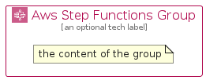

# AwsStepFunctions


```text
aws-q1-2024/Architecture/AppIntegration/AwsStepFunctions
```

```text
include('aws-q1-2024/Architecture/AppIntegration/AwsStepFunctions')
```


| Illustration | AwsStepFunctions | AwsStepFunctionsCard | AwsStepFunctionsGroup |
| :---: | :---: | :---: | :---: |
|  |  |  |  |


## Sprites
The item provides the following sriptes:

- `<$AwsStepFunctionsXs>`
- `<$AwsStepFunctionsSm>`
- `<$AwsStepFunctionsMd>`
- `<$AwsStepFunctionsLg>`


## AwsStepFunctions

### Load remotely
```plantuml
@startuml
' configures the library
!global $LIB_BASE_LOCATION="https://raw.githubusercontent.com/tmorin/plantuml-libs/master/distribution"

' loads the library's bootstrap
!include $LIB_BASE_LOCATION/bootstrap.puml

' loads the package bootstrap
include('aws-q1-2024/bootstrap')

' loads the Item which embeds the element AwsStepFunctions
include('aws-q1-2024/Architecture/AppIntegration/AwsStepFunctions')

' renders the element
AwsStepFunctions('AwsStepFunctions', 'Aws Step Functions', 'an optional tech label', 'an optional description')
@enduml
```

### Load locally
```plantuml
@startuml
' configures the library
!global $INCLUSION_MODE="local"
!global $LIB_BASE_LOCATION="../../.."

' loads the library's bootstrap
!include $LIB_BASE_LOCATION/bootstrap.puml

' loads the package bootstrap
include('aws-q1-2024/bootstrap')

' loads the Item which embeds the element AwsStepFunctions
include('aws-q1-2024/Architecture/AppIntegration/AwsStepFunctions')

' renders the element
AwsStepFunctions('AwsStepFunctions', 'Aws Step Functions', 'an optional tech label', 'an optional description')
@enduml
```

## AwsStepFunctionsCard

### Load remotely
```plantuml
@startuml
' configures the library
!global $LIB_BASE_LOCATION="https://raw.githubusercontent.com/tmorin/plantuml-libs/master/distribution"

' loads the library's bootstrap
!include $LIB_BASE_LOCATION/bootstrap.puml

' loads the package bootstrap
include('aws-q1-2024/bootstrap')

' loads the Item which embeds the element AwsStepFunctionsCard
include('aws-q1-2024/Architecture/AppIntegration/AwsStepFunctions')

' renders the element
AwsStepFunctionsCard('AwsStepFunctionsCard', 'Aws Step Functions Card', 'an optional description')
@enduml
```

### Load locally
```plantuml
@startuml
' configures the library
!global $INCLUSION_MODE="local"
!global $LIB_BASE_LOCATION="../../.."

' loads the library's bootstrap
!include $LIB_BASE_LOCATION/bootstrap.puml

' loads the package bootstrap
include('aws-q1-2024/bootstrap')

' loads the Item which embeds the element AwsStepFunctionsCard
include('aws-q1-2024/Architecture/AppIntegration/AwsStepFunctions')

' renders the element
AwsStepFunctionsCard('AwsStepFunctionsCard', 'Aws Step Functions Card', 'an optional description')
@enduml
```

## AwsStepFunctionsGroup

### Load remotely
```plantuml
@startuml
' configures the library
!global $LIB_BASE_LOCATION="https://raw.githubusercontent.com/tmorin/plantuml-libs/master/distribution"

' loads the library's bootstrap
!include $LIB_BASE_LOCATION/bootstrap.puml

' loads the package bootstrap
include('aws-q1-2024/bootstrap')

' loads the Item which embeds the element AwsStepFunctionsGroup
include('aws-q1-2024/Architecture/AppIntegration/AwsStepFunctions')

' renders the element
AwsStepFunctionsGroup('AwsStepFunctionsGroup', 'Aws Step Functions Group', 'an optional tech label') {
    note as note
        the content of the group
    end note
}
@enduml
```

### Load locally
```plantuml
@startuml
' configures the library
!global $INCLUSION_MODE="local"
!global $LIB_BASE_LOCATION="../../.."

' loads the library's bootstrap
!include $LIB_BASE_LOCATION/bootstrap.puml

' loads the package bootstrap
include('aws-q1-2024/bootstrap')

' loads the Item which embeds the element AwsStepFunctionsGroup
include('aws-q1-2024/Architecture/AppIntegration/AwsStepFunctions')

' renders the element
AwsStepFunctionsGroup('AwsStepFunctionsGroup', 'Aws Step Functions Group', 'an optional tech label') {
    note as note
        the content of the group
    end note
}
@enduml
```

