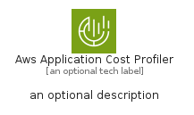
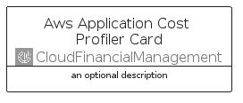
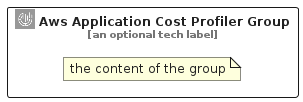

# AwsApplicationCostProfiler


```text
aws-q1-2024/Architecture/CloudFinancialManagement/AwsApplicationCostProfiler
```

```text
include('aws-q1-2024/Architecture/CloudFinancialManagement/AwsApplicationCostProfiler')
```


| Illustration | AwsApplicationCostProfiler | AwsApplicationCostProfilerCard | AwsApplicationCostProfilerGroup |
| :---: | :---: | :---: | :---: |
|  |  |  |  |


## Sprites
The item provides the following sriptes:

- `<$AwsApplicationCostProfilerXs>`
- `<$AwsApplicationCostProfilerSm>`
- `<$AwsApplicationCostProfilerMd>`
- `<$AwsApplicationCostProfilerLg>`


## AwsApplicationCostProfiler

### Load remotely
```plantuml
@startuml
' configures the library
!global $LIB_BASE_LOCATION="https://raw.githubusercontent.com/tmorin/plantuml-libs/master/distribution"

' loads the library's bootstrap
!include $LIB_BASE_LOCATION/bootstrap.puml

' loads the package bootstrap
include('aws-q1-2024/bootstrap')

' loads the Item which embeds the element AwsApplicationCostProfiler
include('aws-q1-2024/Architecture/CloudFinancialManagement/AwsApplicationCostProfiler')

' renders the element
AwsApplicationCostProfiler('AwsApplicationCostProfiler', 'Aws Application Cost Profiler', 'an optional tech label', 'an optional description')
@enduml
```

### Load locally
```plantuml
@startuml
' configures the library
!global $INCLUSION_MODE="local"
!global $LIB_BASE_LOCATION="../../.."

' loads the library's bootstrap
!include $LIB_BASE_LOCATION/bootstrap.puml

' loads the package bootstrap
include('aws-q1-2024/bootstrap')

' loads the Item which embeds the element AwsApplicationCostProfiler
include('aws-q1-2024/Architecture/CloudFinancialManagement/AwsApplicationCostProfiler')

' renders the element
AwsApplicationCostProfiler('AwsApplicationCostProfiler', 'Aws Application Cost Profiler', 'an optional tech label', 'an optional description')
@enduml
```

## AwsApplicationCostProfilerCard

### Load remotely
```plantuml
@startuml
' configures the library
!global $LIB_BASE_LOCATION="https://raw.githubusercontent.com/tmorin/plantuml-libs/master/distribution"

' loads the library's bootstrap
!include $LIB_BASE_LOCATION/bootstrap.puml

' loads the package bootstrap
include('aws-q1-2024/bootstrap')

' loads the Item which embeds the element AwsApplicationCostProfilerCard
include('aws-q1-2024/Architecture/CloudFinancialManagement/AwsApplicationCostProfiler')

' renders the element
AwsApplicationCostProfilerCard('AwsApplicationCostProfilerCard', 'Aws Application Cost Profiler Card', 'an optional description')
@enduml
```

### Load locally
```plantuml
@startuml
' configures the library
!global $INCLUSION_MODE="local"
!global $LIB_BASE_LOCATION="../../.."

' loads the library's bootstrap
!include $LIB_BASE_LOCATION/bootstrap.puml

' loads the package bootstrap
include('aws-q1-2024/bootstrap')

' loads the Item which embeds the element AwsApplicationCostProfilerCard
include('aws-q1-2024/Architecture/CloudFinancialManagement/AwsApplicationCostProfiler')

' renders the element
AwsApplicationCostProfilerCard('AwsApplicationCostProfilerCard', 'Aws Application Cost Profiler Card', 'an optional description')
@enduml
```

## AwsApplicationCostProfilerGroup

### Load remotely
```plantuml
@startuml
' configures the library
!global $LIB_BASE_LOCATION="https://raw.githubusercontent.com/tmorin/plantuml-libs/master/distribution"

' loads the library's bootstrap
!include $LIB_BASE_LOCATION/bootstrap.puml

' loads the package bootstrap
include('aws-q1-2024/bootstrap')

' loads the Item which embeds the element AwsApplicationCostProfilerGroup
include('aws-q1-2024/Architecture/CloudFinancialManagement/AwsApplicationCostProfiler')

' renders the element
AwsApplicationCostProfilerGroup('AwsApplicationCostProfilerGroup', 'Aws Application Cost Profiler Group', 'an optional tech label') {
    note as note
        the content of the group
    end note
}
@enduml
```

### Load locally
```plantuml
@startuml
' configures the library
!global $INCLUSION_MODE="local"
!global $LIB_BASE_LOCATION="../../.."

' loads the library's bootstrap
!include $LIB_BASE_LOCATION/bootstrap.puml

' loads the package bootstrap
include('aws-q1-2024/bootstrap')

' loads the Item which embeds the element AwsApplicationCostProfilerGroup
include('aws-q1-2024/Architecture/CloudFinancialManagement/AwsApplicationCostProfiler')

' renders the element
AwsApplicationCostProfilerGroup('AwsApplicationCostProfilerGroup', 'Aws Application Cost Profiler Group', 'an optional tech label') {
    note as note
        the content of the group
    end note
}
@enduml
```

