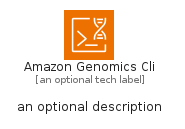
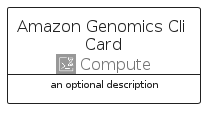

# AmazonGenomicsCli


```text
aws-q1-2024/Architecture/Compute/AmazonGenomicsCli
```

```text
include('aws-q1-2024/Architecture/Compute/AmazonGenomicsCli')
```


| Illustration | AmazonGenomicsCli | AmazonGenomicsCliCard | AmazonGenomicsCliGroup |
| :---: | :---: | :---: | :---: |
|  |  |  |  |


## Sprites
The item provides the following sriptes:

- `<$AmazonGenomicsCliXs>`
- `<$AmazonGenomicsCliSm>`
- `<$AmazonGenomicsCliMd>`
- `<$AmazonGenomicsCliLg>`


## AmazonGenomicsCli

### Load remotely
```plantuml
@startuml
' configures the library
!global $LIB_BASE_LOCATION="https://raw.githubusercontent.com/tmorin/plantuml-libs/master/distribution"

' loads the library's bootstrap
!include $LIB_BASE_LOCATION/bootstrap.puml

' loads the package bootstrap
include('aws-q1-2024/bootstrap')

' loads the Item which embeds the element AmazonGenomicsCli
include('aws-q1-2024/Architecture/Compute/AmazonGenomicsCli')

' renders the element
AmazonGenomicsCli('AmazonGenomicsCli', 'Amazon Genomics Cli', 'an optional tech label', 'an optional description')
@enduml
```

### Load locally
```plantuml
@startuml
' configures the library
!global $INCLUSION_MODE="local"
!global $LIB_BASE_LOCATION="../../.."

' loads the library's bootstrap
!include $LIB_BASE_LOCATION/bootstrap.puml

' loads the package bootstrap
include('aws-q1-2024/bootstrap')

' loads the Item which embeds the element AmazonGenomicsCli
include('aws-q1-2024/Architecture/Compute/AmazonGenomicsCli')

' renders the element
AmazonGenomicsCli('AmazonGenomicsCli', 'Amazon Genomics Cli', 'an optional tech label', 'an optional description')
@enduml
```

## AmazonGenomicsCliCard

### Load remotely
```plantuml
@startuml
' configures the library
!global $LIB_BASE_LOCATION="https://raw.githubusercontent.com/tmorin/plantuml-libs/master/distribution"

' loads the library's bootstrap
!include $LIB_BASE_LOCATION/bootstrap.puml

' loads the package bootstrap
include('aws-q1-2024/bootstrap')

' loads the Item which embeds the element AmazonGenomicsCliCard
include('aws-q1-2024/Architecture/Compute/AmazonGenomicsCli')

' renders the element
AmazonGenomicsCliCard('AmazonGenomicsCliCard', 'Amazon Genomics Cli Card', 'an optional description')
@enduml
```

### Load locally
```plantuml
@startuml
' configures the library
!global $INCLUSION_MODE="local"
!global $LIB_BASE_LOCATION="../../.."

' loads the library's bootstrap
!include $LIB_BASE_LOCATION/bootstrap.puml

' loads the package bootstrap
include('aws-q1-2024/bootstrap')

' loads the Item which embeds the element AmazonGenomicsCliCard
include('aws-q1-2024/Architecture/Compute/AmazonGenomicsCli')

' renders the element
AmazonGenomicsCliCard('AmazonGenomicsCliCard', 'Amazon Genomics Cli Card', 'an optional description')
@enduml
```

## AmazonGenomicsCliGroup

### Load remotely
```plantuml
@startuml
' configures the library
!global $LIB_BASE_LOCATION="https://raw.githubusercontent.com/tmorin/plantuml-libs/master/distribution"

' loads the library's bootstrap
!include $LIB_BASE_LOCATION/bootstrap.puml

' loads the package bootstrap
include('aws-q1-2024/bootstrap')

' loads the Item which embeds the element AmazonGenomicsCliGroup
include('aws-q1-2024/Architecture/Compute/AmazonGenomicsCli')

' renders the element
AmazonGenomicsCliGroup('AmazonGenomicsCliGroup', 'Amazon Genomics Cli Group', 'an optional tech label') {
    note as note
        the content of the group
    end note
}
@enduml
```

### Load locally
```plantuml
@startuml
' configures the library
!global $INCLUSION_MODE="local"
!global $LIB_BASE_LOCATION="../../.."

' loads the library's bootstrap
!include $LIB_BASE_LOCATION/bootstrap.puml

' loads the package bootstrap
include('aws-q1-2024/bootstrap')

' loads the Item which embeds the element AmazonGenomicsCliGroup
include('aws-q1-2024/Architecture/Compute/AmazonGenomicsCli')

' renders the element
AmazonGenomicsCliGroup('AmazonGenomicsCliGroup', 'Amazon Genomics Cli Group', 'an optional tech label') {
    note as note
        the content of the group
    end note
}
@enduml
```

