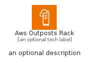
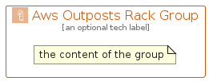

# AwsOutpostsRack


```text
aws-q1-2024/Architecture/Compute/AwsOutpostsRack
```

```text
include('aws-q1-2024/Architecture/Compute/AwsOutpostsRack')
```


| Illustration | AwsOutpostsRack | AwsOutpostsRackCard | AwsOutpostsRackGroup |
| :---: | :---: | :---: | :---: |
|  |  |  |  |


## Sprites
The item provides the following sriptes:

- `<$AwsOutpostsRackXs>`
- `<$AwsOutpostsRackSm>`
- `<$AwsOutpostsRackMd>`
- `<$AwsOutpostsRackLg>`


## AwsOutpostsRack

### Load remotely
```plantuml
@startuml
' configures the library
!global $LIB_BASE_LOCATION="https://raw.githubusercontent.com/tmorin/plantuml-libs/master/distribution"

' loads the library's bootstrap
!include $LIB_BASE_LOCATION/bootstrap.puml

' loads the package bootstrap
include('aws-q1-2024/bootstrap')

' loads the Item which embeds the element AwsOutpostsRack
include('aws-q1-2024/Architecture/Compute/AwsOutpostsRack')

' renders the element
AwsOutpostsRack('AwsOutpostsRack', 'Aws Outposts Rack', 'an optional tech label', 'an optional description')
@enduml
```

### Load locally
```plantuml
@startuml
' configures the library
!global $INCLUSION_MODE="local"
!global $LIB_BASE_LOCATION="../../.."

' loads the library's bootstrap
!include $LIB_BASE_LOCATION/bootstrap.puml

' loads the package bootstrap
include('aws-q1-2024/bootstrap')

' loads the Item which embeds the element AwsOutpostsRack
include('aws-q1-2024/Architecture/Compute/AwsOutpostsRack')

' renders the element
AwsOutpostsRack('AwsOutpostsRack', 'Aws Outposts Rack', 'an optional tech label', 'an optional description')
@enduml
```

## AwsOutpostsRackCard

### Load remotely
```plantuml
@startuml
' configures the library
!global $LIB_BASE_LOCATION="https://raw.githubusercontent.com/tmorin/plantuml-libs/master/distribution"

' loads the library's bootstrap
!include $LIB_BASE_LOCATION/bootstrap.puml

' loads the package bootstrap
include('aws-q1-2024/bootstrap')

' loads the Item which embeds the element AwsOutpostsRackCard
include('aws-q1-2024/Architecture/Compute/AwsOutpostsRack')

' renders the element
AwsOutpostsRackCard('AwsOutpostsRackCard', 'Aws Outposts Rack Card', 'an optional description')
@enduml
```

### Load locally
```plantuml
@startuml
' configures the library
!global $INCLUSION_MODE="local"
!global $LIB_BASE_LOCATION="../../.."

' loads the library's bootstrap
!include $LIB_BASE_LOCATION/bootstrap.puml

' loads the package bootstrap
include('aws-q1-2024/bootstrap')

' loads the Item which embeds the element AwsOutpostsRackCard
include('aws-q1-2024/Architecture/Compute/AwsOutpostsRack')

' renders the element
AwsOutpostsRackCard('AwsOutpostsRackCard', 'Aws Outposts Rack Card', 'an optional description')
@enduml
```

## AwsOutpostsRackGroup

### Load remotely
```plantuml
@startuml
' configures the library
!global $LIB_BASE_LOCATION="https://raw.githubusercontent.com/tmorin/plantuml-libs/master/distribution"

' loads the library's bootstrap
!include $LIB_BASE_LOCATION/bootstrap.puml

' loads the package bootstrap
include('aws-q1-2024/bootstrap')

' loads the Item which embeds the element AwsOutpostsRackGroup
include('aws-q1-2024/Architecture/Compute/AwsOutpostsRack')

' renders the element
AwsOutpostsRackGroup('AwsOutpostsRackGroup', 'Aws Outposts Rack Group', 'an optional tech label') {
    note as note
        the content of the group
    end note
}
@enduml
```

### Load locally
```plantuml
@startuml
' configures the library
!global $INCLUSION_MODE="local"
!global $LIB_BASE_LOCATION="../../.."

' loads the library's bootstrap
!include $LIB_BASE_LOCATION/bootstrap.puml

' loads the package bootstrap
include('aws-q1-2024/bootstrap')

' loads the Item which embeds the element AwsOutpostsRackGroup
include('aws-q1-2024/Architecture/Compute/AwsOutpostsRack')

' renders the element
AwsOutpostsRackGroup('AwsOutpostsRackGroup', 'Aws Outposts Rack Group', 'an optional tech label') {
    note as note
        the content of the group
    end note
}
@enduml
```

