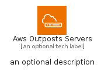

# AwsOutpostsServers


```text
aws-q1-2024/Architecture/Compute/AwsOutpostsServers
```

```text
include('aws-q1-2024/Architecture/Compute/AwsOutpostsServers')
```


| Illustration | AwsOutpostsServers | AwsOutpostsServersCard | AwsOutpostsServersGroup |
| :---: | :---: | :---: | :---: |
|  |  |  |  |


## Sprites
The item provides the following sriptes:

- `<$AwsOutpostsServersXs>`
- `<$AwsOutpostsServersSm>`
- `<$AwsOutpostsServersMd>`
- `<$AwsOutpostsServersLg>`


## AwsOutpostsServers

### Load remotely
```plantuml
@startuml
' configures the library
!global $LIB_BASE_LOCATION="https://raw.githubusercontent.com/tmorin/plantuml-libs/master/distribution"

' loads the library's bootstrap
!include $LIB_BASE_LOCATION/bootstrap.puml

' loads the package bootstrap
include('aws-q1-2024/bootstrap')

' loads the Item which embeds the element AwsOutpostsServers
include('aws-q1-2024/Architecture/Compute/AwsOutpostsServers')

' renders the element
AwsOutpostsServers('AwsOutpostsServers', 'Aws Outposts Servers', 'an optional tech label', 'an optional description')
@enduml
```

### Load locally
```plantuml
@startuml
' configures the library
!global $INCLUSION_MODE="local"
!global $LIB_BASE_LOCATION="../../.."

' loads the library's bootstrap
!include $LIB_BASE_LOCATION/bootstrap.puml

' loads the package bootstrap
include('aws-q1-2024/bootstrap')

' loads the Item which embeds the element AwsOutpostsServers
include('aws-q1-2024/Architecture/Compute/AwsOutpostsServers')

' renders the element
AwsOutpostsServers('AwsOutpostsServers', 'Aws Outposts Servers', 'an optional tech label', 'an optional description')
@enduml
```

## AwsOutpostsServersCard

### Load remotely
```plantuml
@startuml
' configures the library
!global $LIB_BASE_LOCATION="https://raw.githubusercontent.com/tmorin/plantuml-libs/master/distribution"

' loads the library's bootstrap
!include $LIB_BASE_LOCATION/bootstrap.puml

' loads the package bootstrap
include('aws-q1-2024/bootstrap')

' loads the Item which embeds the element AwsOutpostsServersCard
include('aws-q1-2024/Architecture/Compute/AwsOutpostsServers')

' renders the element
AwsOutpostsServersCard('AwsOutpostsServersCard', 'Aws Outposts Servers Card', 'an optional description')
@enduml
```

### Load locally
```plantuml
@startuml
' configures the library
!global $INCLUSION_MODE="local"
!global $LIB_BASE_LOCATION="../../.."

' loads the library's bootstrap
!include $LIB_BASE_LOCATION/bootstrap.puml

' loads the package bootstrap
include('aws-q1-2024/bootstrap')

' loads the Item which embeds the element AwsOutpostsServersCard
include('aws-q1-2024/Architecture/Compute/AwsOutpostsServers')

' renders the element
AwsOutpostsServersCard('AwsOutpostsServersCard', 'Aws Outposts Servers Card', 'an optional description')
@enduml
```

## AwsOutpostsServersGroup

### Load remotely
```plantuml
@startuml
' configures the library
!global $LIB_BASE_LOCATION="https://raw.githubusercontent.com/tmorin/plantuml-libs/master/distribution"

' loads the library's bootstrap
!include $LIB_BASE_LOCATION/bootstrap.puml

' loads the package bootstrap
include('aws-q1-2024/bootstrap')

' loads the Item which embeds the element AwsOutpostsServersGroup
include('aws-q1-2024/Architecture/Compute/AwsOutpostsServers')

' renders the element
AwsOutpostsServersGroup('AwsOutpostsServersGroup', 'Aws Outposts Servers Group', 'an optional tech label') {
    note as note
        the content of the group
    end note
}
@enduml
```

### Load locally
```plantuml
@startuml
' configures the library
!global $INCLUSION_MODE="local"
!global $LIB_BASE_LOCATION="../../.."

' loads the library's bootstrap
!include $LIB_BASE_LOCATION/bootstrap.puml

' loads the package bootstrap
include('aws-q1-2024/bootstrap')

' loads the Item which embeds the element AwsOutpostsServersGroup
include('aws-q1-2024/Architecture/Compute/AwsOutpostsServers')

' renders the element
AwsOutpostsServersGroup('AwsOutpostsServersGroup', 'Aws Outposts Servers Group', 'an optional tech label') {
    note as note
        the content of the group
    end note
}
@enduml
```

