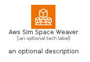
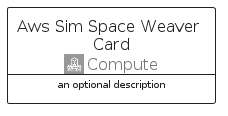
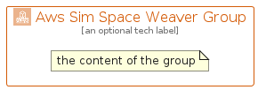

# AwsSimSpaceWeaver


```text
aws-q1-2024/Architecture/Compute/AwsSimSpaceWeaver
```

```text
include('aws-q1-2024/Architecture/Compute/AwsSimSpaceWeaver')
```


| Illustration | AwsSimSpaceWeaver | AwsSimSpaceWeaverCard | AwsSimSpaceWeaverGroup |
| :---: | :---: | :---: | :---: |
|  |  |  |  |


## Sprites
The item provides the following sriptes:

- `<$AwsSimSpaceWeaverXs>`
- `<$AwsSimSpaceWeaverSm>`
- `<$AwsSimSpaceWeaverMd>`
- `<$AwsSimSpaceWeaverLg>`


## AwsSimSpaceWeaver

### Load remotely
```plantuml
@startuml
' configures the library
!global $LIB_BASE_LOCATION="https://raw.githubusercontent.com/tmorin/plantuml-libs/master/distribution"

' loads the library's bootstrap
!include $LIB_BASE_LOCATION/bootstrap.puml

' loads the package bootstrap
include('aws-q1-2024/bootstrap')

' loads the Item which embeds the element AwsSimSpaceWeaver
include('aws-q1-2024/Architecture/Compute/AwsSimSpaceWeaver')

' renders the element
AwsSimSpaceWeaver('AwsSimSpaceWeaver', 'Aws Sim Space Weaver', 'an optional tech label', 'an optional description')
@enduml
```

### Load locally
```plantuml
@startuml
' configures the library
!global $INCLUSION_MODE="local"
!global $LIB_BASE_LOCATION="../../.."

' loads the library's bootstrap
!include $LIB_BASE_LOCATION/bootstrap.puml

' loads the package bootstrap
include('aws-q1-2024/bootstrap')

' loads the Item which embeds the element AwsSimSpaceWeaver
include('aws-q1-2024/Architecture/Compute/AwsSimSpaceWeaver')

' renders the element
AwsSimSpaceWeaver('AwsSimSpaceWeaver', 'Aws Sim Space Weaver', 'an optional tech label', 'an optional description')
@enduml
```

## AwsSimSpaceWeaverCard

### Load remotely
```plantuml
@startuml
' configures the library
!global $LIB_BASE_LOCATION="https://raw.githubusercontent.com/tmorin/plantuml-libs/master/distribution"

' loads the library's bootstrap
!include $LIB_BASE_LOCATION/bootstrap.puml

' loads the package bootstrap
include('aws-q1-2024/bootstrap')

' loads the Item which embeds the element AwsSimSpaceWeaverCard
include('aws-q1-2024/Architecture/Compute/AwsSimSpaceWeaver')

' renders the element
AwsSimSpaceWeaverCard('AwsSimSpaceWeaverCard', 'Aws Sim Space Weaver Card', 'an optional description')
@enduml
```

### Load locally
```plantuml
@startuml
' configures the library
!global $INCLUSION_MODE="local"
!global $LIB_BASE_LOCATION="../../.."

' loads the library's bootstrap
!include $LIB_BASE_LOCATION/bootstrap.puml

' loads the package bootstrap
include('aws-q1-2024/bootstrap')

' loads the Item which embeds the element AwsSimSpaceWeaverCard
include('aws-q1-2024/Architecture/Compute/AwsSimSpaceWeaver')

' renders the element
AwsSimSpaceWeaverCard('AwsSimSpaceWeaverCard', 'Aws Sim Space Weaver Card', 'an optional description')
@enduml
```

## AwsSimSpaceWeaverGroup

### Load remotely
```plantuml
@startuml
' configures the library
!global $LIB_BASE_LOCATION="https://raw.githubusercontent.com/tmorin/plantuml-libs/master/distribution"

' loads the library's bootstrap
!include $LIB_BASE_LOCATION/bootstrap.puml

' loads the package bootstrap
include('aws-q1-2024/bootstrap')

' loads the Item which embeds the element AwsSimSpaceWeaverGroup
include('aws-q1-2024/Architecture/Compute/AwsSimSpaceWeaver')

' renders the element
AwsSimSpaceWeaverGroup('AwsSimSpaceWeaverGroup', 'Aws Sim Space Weaver Group', 'an optional tech label') {
    note as note
        the content of the group
    end note
}
@enduml
```

### Load locally
```plantuml
@startuml
' configures the library
!global $INCLUSION_MODE="local"
!global $LIB_BASE_LOCATION="../../.."

' loads the library's bootstrap
!include $LIB_BASE_LOCATION/bootstrap.puml

' loads the package bootstrap
include('aws-q1-2024/bootstrap')

' loads the Item which embeds the element AwsSimSpaceWeaverGroup
include('aws-q1-2024/Architecture/Compute/AwsSimSpaceWeaver')

' renders the element
AwsSimSpaceWeaverGroup('AwsSimSpaceWeaverGroup', 'Aws Sim Space Weaver Group', 'an optional tech label') {
    note as note
        the content of the group
    end note
}
@enduml
```

