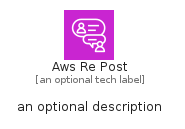

# AwsRePost


```text
aws-q1-2024/Architecture/CustomerEnablement/AwsRePost
```

```text
include('aws-q1-2024/Architecture/CustomerEnablement/AwsRePost')
```


| Illustration | AwsRePost | AwsRePostCard | AwsRePostGroup |
| :---: | :---: | :---: | :---: |
|  |  |  |  |


## Sprites
The item provides the following sriptes:

- `<$AwsRePostXs>`
- `<$AwsRePostSm>`
- `<$AwsRePostMd>`
- `<$AwsRePostLg>`


## AwsRePost

### Load remotely
```plantuml
@startuml
' configures the library
!global $LIB_BASE_LOCATION="https://raw.githubusercontent.com/tmorin/plantuml-libs/master/distribution"

' loads the library's bootstrap
!include $LIB_BASE_LOCATION/bootstrap.puml

' loads the package bootstrap
include('aws-q1-2024/bootstrap')

' loads the Item which embeds the element AwsRePost
include('aws-q1-2024/Architecture/CustomerEnablement/AwsRePost')

' renders the element
AwsRePost('AwsRePost', 'Aws Re Post', 'an optional tech label', 'an optional description')
@enduml
```

### Load locally
```plantuml
@startuml
' configures the library
!global $INCLUSION_MODE="local"
!global $LIB_BASE_LOCATION="../../.."

' loads the library's bootstrap
!include $LIB_BASE_LOCATION/bootstrap.puml

' loads the package bootstrap
include('aws-q1-2024/bootstrap')

' loads the Item which embeds the element AwsRePost
include('aws-q1-2024/Architecture/CustomerEnablement/AwsRePost')

' renders the element
AwsRePost('AwsRePost', 'Aws Re Post', 'an optional tech label', 'an optional description')
@enduml
```

## AwsRePostCard

### Load remotely
```plantuml
@startuml
' configures the library
!global $LIB_BASE_LOCATION="https://raw.githubusercontent.com/tmorin/plantuml-libs/master/distribution"

' loads the library's bootstrap
!include $LIB_BASE_LOCATION/bootstrap.puml

' loads the package bootstrap
include('aws-q1-2024/bootstrap')

' loads the Item which embeds the element AwsRePostCard
include('aws-q1-2024/Architecture/CustomerEnablement/AwsRePost')

' renders the element
AwsRePostCard('AwsRePostCard', 'Aws Re Post Card', 'an optional description')
@enduml
```

### Load locally
```plantuml
@startuml
' configures the library
!global $INCLUSION_MODE="local"
!global $LIB_BASE_LOCATION="../../.."

' loads the library's bootstrap
!include $LIB_BASE_LOCATION/bootstrap.puml

' loads the package bootstrap
include('aws-q1-2024/bootstrap')

' loads the Item which embeds the element AwsRePostCard
include('aws-q1-2024/Architecture/CustomerEnablement/AwsRePost')

' renders the element
AwsRePostCard('AwsRePostCard', 'Aws Re Post Card', 'an optional description')
@enduml
```

## AwsRePostGroup

### Load remotely
```plantuml
@startuml
' configures the library
!global $LIB_BASE_LOCATION="https://raw.githubusercontent.com/tmorin/plantuml-libs/master/distribution"

' loads the library's bootstrap
!include $LIB_BASE_LOCATION/bootstrap.puml

' loads the package bootstrap
include('aws-q1-2024/bootstrap')

' loads the Item which embeds the element AwsRePostGroup
include('aws-q1-2024/Architecture/CustomerEnablement/AwsRePost')

' renders the element
AwsRePostGroup('AwsRePostGroup', 'Aws Re Post Group', 'an optional tech label') {
    note as note
        the content of the group
    end note
}
@enduml
```

### Load locally
```plantuml
@startuml
' configures the library
!global $INCLUSION_MODE="local"
!global $LIB_BASE_LOCATION="../../.."

' loads the library's bootstrap
!include $LIB_BASE_LOCATION/bootstrap.puml

' loads the package bootstrap
include('aws-q1-2024/bootstrap')

' loads the Item which embeds the element AwsRePostGroup
include('aws-q1-2024/Architecture/CustomerEnablement/AwsRePost')

' renders the element
AwsRePostGroup('AwsRePostGroup', 'Aws Re Post Group', 'an optional tech label') {
    note as note
        the content of the group
    end note
}
@enduml
```

