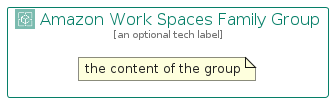

# AmazonWorkSpacesFamily


```text
aws-q1-2024/Architecture/EndUserComputing/AmazonWorkSpacesFamily
```

```text
include('aws-q1-2024/Architecture/EndUserComputing/AmazonWorkSpacesFamily')
```


| Illustration | AmazonWorkSpacesFamily | AmazonWorkSpacesFamilyCard | AmazonWorkSpacesFamilyGroup |
| :---: | :---: | :---: | :---: |
|  |  |  |  |


## Sprites
The item provides the following sriptes:

- `<$AmazonWorkSpacesFamilyXs>`
- `<$AmazonWorkSpacesFamilySm>`
- `<$AmazonWorkSpacesFamilyMd>`
- `<$AmazonWorkSpacesFamilyLg>`


## AmazonWorkSpacesFamily

### Load remotely
```plantuml
@startuml
' configures the library
!global $LIB_BASE_LOCATION="https://raw.githubusercontent.com/tmorin/plantuml-libs/master/distribution"

' loads the library's bootstrap
!include $LIB_BASE_LOCATION/bootstrap.puml

' loads the package bootstrap
include('aws-q1-2024/bootstrap')

' loads the Item which embeds the element AmazonWorkSpacesFamily
include('aws-q1-2024/Architecture/EndUserComputing/AmazonWorkSpacesFamily')

' renders the element
AmazonWorkSpacesFamily('AmazonWorkSpacesFamily', 'Amazon Work Spaces Family', 'an optional tech label', 'an optional description')
@enduml
```

### Load locally
```plantuml
@startuml
' configures the library
!global $INCLUSION_MODE="local"
!global $LIB_BASE_LOCATION="../../.."

' loads the library's bootstrap
!include $LIB_BASE_LOCATION/bootstrap.puml

' loads the package bootstrap
include('aws-q1-2024/bootstrap')

' loads the Item which embeds the element AmazonWorkSpacesFamily
include('aws-q1-2024/Architecture/EndUserComputing/AmazonWorkSpacesFamily')

' renders the element
AmazonWorkSpacesFamily('AmazonWorkSpacesFamily', 'Amazon Work Spaces Family', 'an optional tech label', 'an optional description')
@enduml
```

## AmazonWorkSpacesFamilyCard

### Load remotely
```plantuml
@startuml
' configures the library
!global $LIB_BASE_LOCATION="https://raw.githubusercontent.com/tmorin/plantuml-libs/master/distribution"

' loads the library's bootstrap
!include $LIB_BASE_LOCATION/bootstrap.puml

' loads the package bootstrap
include('aws-q1-2024/bootstrap')

' loads the Item which embeds the element AmazonWorkSpacesFamilyCard
include('aws-q1-2024/Architecture/EndUserComputing/AmazonWorkSpacesFamily')

' renders the element
AmazonWorkSpacesFamilyCard('AmazonWorkSpacesFamilyCard', 'Amazon Work Spaces Family Card', 'an optional description')
@enduml
```

### Load locally
```plantuml
@startuml
' configures the library
!global $INCLUSION_MODE="local"
!global $LIB_BASE_LOCATION="../../.."

' loads the library's bootstrap
!include $LIB_BASE_LOCATION/bootstrap.puml

' loads the package bootstrap
include('aws-q1-2024/bootstrap')

' loads the Item which embeds the element AmazonWorkSpacesFamilyCard
include('aws-q1-2024/Architecture/EndUserComputing/AmazonWorkSpacesFamily')

' renders the element
AmazonWorkSpacesFamilyCard('AmazonWorkSpacesFamilyCard', 'Amazon Work Spaces Family Card', 'an optional description')
@enduml
```

## AmazonWorkSpacesFamilyGroup

### Load remotely
```plantuml
@startuml
' configures the library
!global $LIB_BASE_LOCATION="https://raw.githubusercontent.com/tmorin/plantuml-libs/master/distribution"

' loads the library's bootstrap
!include $LIB_BASE_LOCATION/bootstrap.puml

' loads the package bootstrap
include('aws-q1-2024/bootstrap')

' loads the Item which embeds the element AmazonWorkSpacesFamilyGroup
include('aws-q1-2024/Architecture/EndUserComputing/AmazonWorkSpacesFamily')

' renders the element
AmazonWorkSpacesFamilyGroup('AmazonWorkSpacesFamilyGroup', 'Amazon Work Spaces Family Group', 'an optional tech label') {
    note as note
        the content of the group
    end note
}
@enduml
```

### Load locally
```plantuml
@startuml
' configures the library
!global $INCLUSION_MODE="local"
!global $LIB_BASE_LOCATION="../../.."

' loads the library's bootstrap
!include $LIB_BASE_LOCATION/bootstrap.puml

' loads the package bootstrap
include('aws-q1-2024/bootstrap')

' loads the Item which embeds the element AmazonWorkSpacesFamilyGroup
include('aws-q1-2024/Architecture/EndUserComputing/AmazonWorkSpacesFamily')

' renders the element
AmazonWorkSpacesFamilyGroup('AmazonWorkSpacesFamilyGroup', 'Amazon Work Spaces Family Group', 'an optional tech label') {
    note as note
        the content of the group
    end note
}
@enduml
```

