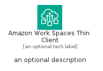

# AmazonWorkSpacesThinClient


```text
aws-q1-2024/Architecture/EndUserComputing/AmazonWorkSpacesThinClient
```

```text
include('aws-q1-2024/Architecture/EndUserComputing/AmazonWorkSpacesThinClient')
```


| Illustration | AmazonWorkSpacesThinClient | AmazonWorkSpacesThinClientCard | AmazonWorkSpacesThinClientGroup |
| :---: | :---: | :---: | :---: |
|  |  |  |  |


## Sprites
The item provides the following sriptes:

- `<$AmazonWorkSpacesThinClientXs>`
- `<$AmazonWorkSpacesThinClientSm>`
- `<$AmazonWorkSpacesThinClientMd>`
- `<$AmazonWorkSpacesThinClientLg>`


## AmazonWorkSpacesThinClient

### Load remotely
```plantuml
@startuml
' configures the library
!global $LIB_BASE_LOCATION="https://raw.githubusercontent.com/tmorin/plantuml-libs/master/distribution"

' loads the library's bootstrap
!include $LIB_BASE_LOCATION/bootstrap.puml

' loads the package bootstrap
include('aws-q1-2024/bootstrap')

' loads the Item which embeds the element AmazonWorkSpacesThinClient
include('aws-q1-2024/Architecture/EndUserComputing/AmazonWorkSpacesThinClient')

' renders the element
AmazonWorkSpacesThinClient('AmazonWorkSpacesThinClient', 'Amazon Work Spaces Thin Client', 'an optional tech label', 'an optional description')
@enduml
```

### Load locally
```plantuml
@startuml
' configures the library
!global $INCLUSION_MODE="local"
!global $LIB_BASE_LOCATION="../../.."

' loads the library's bootstrap
!include $LIB_BASE_LOCATION/bootstrap.puml

' loads the package bootstrap
include('aws-q1-2024/bootstrap')

' loads the Item which embeds the element AmazonWorkSpacesThinClient
include('aws-q1-2024/Architecture/EndUserComputing/AmazonWorkSpacesThinClient')

' renders the element
AmazonWorkSpacesThinClient('AmazonWorkSpacesThinClient', 'Amazon Work Spaces Thin Client', 'an optional tech label', 'an optional description')
@enduml
```

## AmazonWorkSpacesThinClientCard

### Load remotely
```plantuml
@startuml
' configures the library
!global $LIB_BASE_LOCATION="https://raw.githubusercontent.com/tmorin/plantuml-libs/master/distribution"

' loads the library's bootstrap
!include $LIB_BASE_LOCATION/bootstrap.puml

' loads the package bootstrap
include('aws-q1-2024/bootstrap')

' loads the Item which embeds the element AmazonWorkSpacesThinClientCard
include('aws-q1-2024/Architecture/EndUserComputing/AmazonWorkSpacesThinClient')

' renders the element
AmazonWorkSpacesThinClientCard('AmazonWorkSpacesThinClientCard', 'Amazon Work Spaces Thin Client Card', 'an optional description')
@enduml
```

### Load locally
```plantuml
@startuml
' configures the library
!global $INCLUSION_MODE="local"
!global $LIB_BASE_LOCATION="../../.."

' loads the library's bootstrap
!include $LIB_BASE_LOCATION/bootstrap.puml

' loads the package bootstrap
include('aws-q1-2024/bootstrap')

' loads the Item which embeds the element AmazonWorkSpacesThinClientCard
include('aws-q1-2024/Architecture/EndUserComputing/AmazonWorkSpacesThinClient')

' renders the element
AmazonWorkSpacesThinClientCard('AmazonWorkSpacesThinClientCard', 'Amazon Work Spaces Thin Client Card', 'an optional description')
@enduml
```

## AmazonWorkSpacesThinClientGroup

### Load remotely
```plantuml
@startuml
' configures the library
!global $LIB_BASE_LOCATION="https://raw.githubusercontent.com/tmorin/plantuml-libs/master/distribution"

' loads the library's bootstrap
!include $LIB_BASE_LOCATION/bootstrap.puml

' loads the package bootstrap
include('aws-q1-2024/bootstrap')

' loads the Item which embeds the element AmazonWorkSpacesThinClientGroup
include('aws-q1-2024/Architecture/EndUserComputing/AmazonWorkSpacesThinClient')

' renders the element
AmazonWorkSpacesThinClientGroup('AmazonWorkSpacesThinClientGroup', 'Amazon Work Spaces Thin Client Group', 'an optional tech label') {
    note as note
        the content of the group
    end note
}
@enduml
```

### Load locally
```plantuml
@startuml
' configures the library
!global $INCLUSION_MODE="local"
!global $LIB_BASE_LOCATION="../../.."

' loads the library's bootstrap
!include $LIB_BASE_LOCATION/bootstrap.puml

' loads the package bootstrap
include('aws-q1-2024/bootstrap')

' loads the Item which embeds the element AmazonWorkSpacesThinClientGroup
include('aws-q1-2024/Architecture/EndUserComputing/AmazonWorkSpacesThinClient')

' renders the element
AmazonWorkSpacesThinClientGroup('AmazonWorkSpacesThinClientGroup', 'Amazon Work Spaces Thin Client Group', 'an optional tech label') {
    note as note
        the content of the group
    end note
}
@enduml
```

