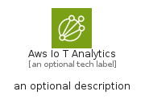
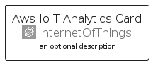

# AwsIoTAnalytics


```text
aws-q1-2024/Architecture/InternetOfThings/AwsIoTAnalytics
```

```text
include('aws-q1-2024/Architecture/InternetOfThings/AwsIoTAnalytics')
```


| Illustration | AwsIoTAnalytics | AwsIoTAnalyticsCard | AwsIoTAnalyticsGroup |
| :---: | :---: | :---: | :---: |
|  |  |  |  |


## Sprites
The item provides the following sriptes:

- `<$AwsIoTAnalyticsXs>`
- `<$AwsIoTAnalyticsSm>`
- `<$AwsIoTAnalyticsMd>`
- `<$AwsIoTAnalyticsLg>`


## AwsIoTAnalytics

### Load remotely
```plantuml
@startuml
' configures the library
!global $LIB_BASE_LOCATION="https://raw.githubusercontent.com/tmorin/plantuml-libs/master/distribution"

' loads the library's bootstrap
!include $LIB_BASE_LOCATION/bootstrap.puml

' loads the package bootstrap
include('aws-q1-2024/bootstrap')

' loads the Item which embeds the element AwsIoTAnalytics
include('aws-q1-2024/Architecture/InternetOfThings/AwsIoTAnalytics')

' renders the element
AwsIoTAnalytics('AwsIoTAnalytics', 'Aws Io T Analytics', 'an optional tech label', 'an optional description')
@enduml
```

### Load locally
```plantuml
@startuml
' configures the library
!global $INCLUSION_MODE="local"
!global $LIB_BASE_LOCATION="../../.."

' loads the library's bootstrap
!include $LIB_BASE_LOCATION/bootstrap.puml

' loads the package bootstrap
include('aws-q1-2024/bootstrap')

' loads the Item which embeds the element AwsIoTAnalytics
include('aws-q1-2024/Architecture/InternetOfThings/AwsIoTAnalytics')

' renders the element
AwsIoTAnalytics('AwsIoTAnalytics', 'Aws Io T Analytics', 'an optional tech label', 'an optional description')
@enduml
```

## AwsIoTAnalyticsCard

### Load remotely
```plantuml
@startuml
' configures the library
!global $LIB_BASE_LOCATION="https://raw.githubusercontent.com/tmorin/plantuml-libs/master/distribution"

' loads the library's bootstrap
!include $LIB_BASE_LOCATION/bootstrap.puml

' loads the package bootstrap
include('aws-q1-2024/bootstrap')

' loads the Item which embeds the element AwsIoTAnalyticsCard
include('aws-q1-2024/Architecture/InternetOfThings/AwsIoTAnalytics')

' renders the element
AwsIoTAnalyticsCard('AwsIoTAnalyticsCard', 'Aws Io T Analytics Card', 'an optional description')
@enduml
```

### Load locally
```plantuml
@startuml
' configures the library
!global $INCLUSION_MODE="local"
!global $LIB_BASE_LOCATION="../../.."

' loads the library's bootstrap
!include $LIB_BASE_LOCATION/bootstrap.puml

' loads the package bootstrap
include('aws-q1-2024/bootstrap')

' loads the Item which embeds the element AwsIoTAnalyticsCard
include('aws-q1-2024/Architecture/InternetOfThings/AwsIoTAnalytics')

' renders the element
AwsIoTAnalyticsCard('AwsIoTAnalyticsCard', 'Aws Io T Analytics Card', 'an optional description')
@enduml
```

## AwsIoTAnalyticsGroup

### Load remotely
```plantuml
@startuml
' configures the library
!global $LIB_BASE_LOCATION="https://raw.githubusercontent.com/tmorin/plantuml-libs/master/distribution"

' loads the library's bootstrap
!include $LIB_BASE_LOCATION/bootstrap.puml

' loads the package bootstrap
include('aws-q1-2024/bootstrap')

' loads the Item which embeds the element AwsIoTAnalyticsGroup
include('aws-q1-2024/Architecture/InternetOfThings/AwsIoTAnalytics')

' renders the element
AwsIoTAnalyticsGroup('AwsIoTAnalyticsGroup', 'Aws Io T Analytics Group', 'an optional tech label') {
    note as note
        the content of the group
    end note
}
@enduml
```

### Load locally
```plantuml
@startuml
' configures the library
!global $INCLUSION_MODE="local"
!global $LIB_BASE_LOCATION="../../.."

' loads the library's bootstrap
!include $LIB_BASE_LOCATION/bootstrap.puml

' loads the package bootstrap
include('aws-q1-2024/bootstrap')

' loads the Item which embeds the element AwsIoTAnalyticsGroup
include('aws-q1-2024/Architecture/InternetOfThings/AwsIoTAnalytics')

' renders the element
AwsIoTAnalyticsGroup('AwsIoTAnalyticsGroup', 'Aws Io T Analytics Group', 'an optional tech label') {
    note as note
        the content of the group
    end note
}
@enduml
```

