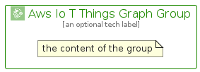

# AwsIoTThingsGraph


```text
aws-q1-2024/Architecture/InternetOfThings/AwsIoTThingsGraph
```

```text
include('aws-q1-2024/Architecture/InternetOfThings/AwsIoTThingsGraph')
```


| Illustration | AwsIoTThingsGraph | AwsIoTThingsGraphCard | AwsIoTThingsGraphGroup |
| :---: | :---: | :---: | :---: |
|  |  |  |  |


## Sprites
The item provides the following sriptes:

- `<$AwsIoTThingsGraphXs>`
- `<$AwsIoTThingsGraphSm>`
- `<$AwsIoTThingsGraphMd>`
- `<$AwsIoTThingsGraphLg>`


## AwsIoTThingsGraph

### Load remotely
```plantuml
@startuml
' configures the library
!global $LIB_BASE_LOCATION="https://raw.githubusercontent.com/tmorin/plantuml-libs/master/distribution"

' loads the library's bootstrap
!include $LIB_BASE_LOCATION/bootstrap.puml

' loads the package bootstrap
include('aws-q1-2024/bootstrap')

' loads the Item which embeds the element AwsIoTThingsGraph
include('aws-q1-2024/Architecture/InternetOfThings/AwsIoTThingsGraph')

' renders the element
AwsIoTThingsGraph('AwsIoTThingsGraph', 'Aws Io T Things Graph', 'an optional tech label', 'an optional description')
@enduml
```

### Load locally
```plantuml
@startuml
' configures the library
!global $INCLUSION_MODE="local"
!global $LIB_BASE_LOCATION="../../.."

' loads the library's bootstrap
!include $LIB_BASE_LOCATION/bootstrap.puml

' loads the package bootstrap
include('aws-q1-2024/bootstrap')

' loads the Item which embeds the element AwsIoTThingsGraph
include('aws-q1-2024/Architecture/InternetOfThings/AwsIoTThingsGraph')

' renders the element
AwsIoTThingsGraph('AwsIoTThingsGraph', 'Aws Io T Things Graph', 'an optional tech label', 'an optional description')
@enduml
```

## AwsIoTThingsGraphCard

### Load remotely
```plantuml
@startuml
' configures the library
!global $LIB_BASE_LOCATION="https://raw.githubusercontent.com/tmorin/plantuml-libs/master/distribution"

' loads the library's bootstrap
!include $LIB_BASE_LOCATION/bootstrap.puml

' loads the package bootstrap
include('aws-q1-2024/bootstrap')

' loads the Item which embeds the element AwsIoTThingsGraphCard
include('aws-q1-2024/Architecture/InternetOfThings/AwsIoTThingsGraph')

' renders the element
AwsIoTThingsGraphCard('AwsIoTThingsGraphCard', 'Aws Io T Things Graph Card', 'an optional description')
@enduml
```

### Load locally
```plantuml
@startuml
' configures the library
!global $INCLUSION_MODE="local"
!global $LIB_BASE_LOCATION="../../.."

' loads the library's bootstrap
!include $LIB_BASE_LOCATION/bootstrap.puml

' loads the package bootstrap
include('aws-q1-2024/bootstrap')

' loads the Item which embeds the element AwsIoTThingsGraphCard
include('aws-q1-2024/Architecture/InternetOfThings/AwsIoTThingsGraph')

' renders the element
AwsIoTThingsGraphCard('AwsIoTThingsGraphCard', 'Aws Io T Things Graph Card', 'an optional description')
@enduml
```

## AwsIoTThingsGraphGroup

### Load remotely
```plantuml
@startuml
' configures the library
!global $LIB_BASE_LOCATION="https://raw.githubusercontent.com/tmorin/plantuml-libs/master/distribution"

' loads the library's bootstrap
!include $LIB_BASE_LOCATION/bootstrap.puml

' loads the package bootstrap
include('aws-q1-2024/bootstrap')

' loads the Item which embeds the element AwsIoTThingsGraphGroup
include('aws-q1-2024/Architecture/InternetOfThings/AwsIoTThingsGraph')

' renders the element
AwsIoTThingsGraphGroup('AwsIoTThingsGraphGroup', 'Aws Io T Things Graph Group', 'an optional tech label') {
    note as note
        the content of the group
    end note
}
@enduml
```

### Load locally
```plantuml
@startuml
' configures the library
!global $INCLUSION_MODE="local"
!global $LIB_BASE_LOCATION="../../.."

' loads the library's bootstrap
!include $LIB_BASE_LOCATION/bootstrap.puml

' loads the package bootstrap
include('aws-q1-2024/bootstrap')

' loads the Item which embeds the element AwsIoTThingsGraphGroup
include('aws-q1-2024/Architecture/InternetOfThings/AwsIoTThingsGraph')

' renders the element
AwsIoTThingsGraphGroup('AwsIoTThingsGraphGroup', 'Aws Io T Things Graph Group', 'an optional tech label') {
    note as note
        the content of the group
    end note
}
@enduml
```

