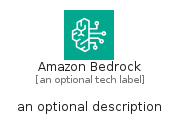
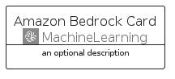

# AmazonBedrock


```text
aws-q1-2024/Architecture/MachineLearning/AmazonBedrock
```

```text
include('aws-q1-2024/Architecture/MachineLearning/AmazonBedrock')
```


| Illustration | AmazonBedrock | AmazonBedrockCard | AmazonBedrockGroup |
| :---: | :---: | :---: | :---: |
|  |  |  |  |


## Sprites
The item provides the following sriptes:

- `<$AmazonBedrockXs>`
- `<$AmazonBedrockSm>`
- `<$AmazonBedrockMd>`
- `<$AmazonBedrockLg>`


## AmazonBedrock

### Load remotely
```plantuml
@startuml
' configures the library
!global $LIB_BASE_LOCATION="https://raw.githubusercontent.com/tmorin/plantuml-libs/master/distribution"

' loads the library's bootstrap
!include $LIB_BASE_LOCATION/bootstrap.puml

' loads the package bootstrap
include('aws-q1-2024/bootstrap')

' loads the Item which embeds the element AmazonBedrock
include('aws-q1-2024/Architecture/MachineLearning/AmazonBedrock')

' renders the element
AmazonBedrock('AmazonBedrock', 'Amazon Bedrock', 'an optional tech label', 'an optional description')
@enduml
```

### Load locally
```plantuml
@startuml
' configures the library
!global $INCLUSION_MODE="local"
!global $LIB_BASE_LOCATION="../../.."

' loads the library's bootstrap
!include $LIB_BASE_LOCATION/bootstrap.puml

' loads the package bootstrap
include('aws-q1-2024/bootstrap')

' loads the Item which embeds the element AmazonBedrock
include('aws-q1-2024/Architecture/MachineLearning/AmazonBedrock')

' renders the element
AmazonBedrock('AmazonBedrock', 'Amazon Bedrock', 'an optional tech label', 'an optional description')
@enduml
```

## AmazonBedrockCard

### Load remotely
```plantuml
@startuml
' configures the library
!global $LIB_BASE_LOCATION="https://raw.githubusercontent.com/tmorin/plantuml-libs/master/distribution"

' loads the library's bootstrap
!include $LIB_BASE_LOCATION/bootstrap.puml

' loads the package bootstrap
include('aws-q1-2024/bootstrap')

' loads the Item which embeds the element AmazonBedrockCard
include('aws-q1-2024/Architecture/MachineLearning/AmazonBedrock')

' renders the element
AmazonBedrockCard('AmazonBedrockCard', 'Amazon Bedrock Card', 'an optional description')
@enduml
```

### Load locally
```plantuml
@startuml
' configures the library
!global $INCLUSION_MODE="local"
!global $LIB_BASE_LOCATION="../../.."

' loads the library's bootstrap
!include $LIB_BASE_LOCATION/bootstrap.puml

' loads the package bootstrap
include('aws-q1-2024/bootstrap')

' loads the Item which embeds the element AmazonBedrockCard
include('aws-q1-2024/Architecture/MachineLearning/AmazonBedrock')

' renders the element
AmazonBedrockCard('AmazonBedrockCard', 'Amazon Bedrock Card', 'an optional description')
@enduml
```

## AmazonBedrockGroup

### Load remotely
```plantuml
@startuml
' configures the library
!global $LIB_BASE_LOCATION="https://raw.githubusercontent.com/tmorin/plantuml-libs/master/distribution"

' loads the library's bootstrap
!include $LIB_BASE_LOCATION/bootstrap.puml

' loads the package bootstrap
include('aws-q1-2024/bootstrap')

' loads the Item which embeds the element AmazonBedrockGroup
include('aws-q1-2024/Architecture/MachineLearning/AmazonBedrock')

' renders the element
AmazonBedrockGroup('AmazonBedrockGroup', 'Amazon Bedrock Group', 'an optional tech label') {
    note as note
        the content of the group
    end note
}
@enduml
```

### Load locally
```plantuml
@startuml
' configures the library
!global $INCLUSION_MODE="local"
!global $LIB_BASE_LOCATION="../../.."

' loads the library's bootstrap
!include $LIB_BASE_LOCATION/bootstrap.puml

' loads the package bootstrap
include('aws-q1-2024/bootstrap')

' loads the Item which embeds the element AmazonBedrockGroup
include('aws-q1-2024/Architecture/MachineLearning/AmazonBedrock')

' renders the element
AmazonBedrockGroup('AmazonBedrockGroup', 'Amazon Bedrock Group', 'an optional tech label') {
    note as note
        the content of the group
    end note
}
@enduml
```

