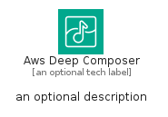
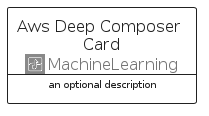
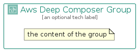

# AwsDeepComposer


```text
aws-q1-2024/Architecture/MachineLearning/AwsDeepComposer
```

```text
include('aws-q1-2024/Architecture/MachineLearning/AwsDeepComposer')
```


| Illustration | AwsDeepComposer | AwsDeepComposerCard | AwsDeepComposerGroup |
| :---: | :---: | :---: | :---: |
|  |  |  |  |


## Sprites
The item provides the following sriptes:

- `<$AwsDeepComposerXs>`
- `<$AwsDeepComposerSm>`
- `<$AwsDeepComposerMd>`
- `<$AwsDeepComposerLg>`


## AwsDeepComposer

### Load remotely
```plantuml
@startuml
' configures the library
!global $LIB_BASE_LOCATION="https://raw.githubusercontent.com/tmorin/plantuml-libs/master/distribution"

' loads the library's bootstrap
!include $LIB_BASE_LOCATION/bootstrap.puml

' loads the package bootstrap
include('aws-q1-2024/bootstrap')

' loads the Item which embeds the element AwsDeepComposer
include('aws-q1-2024/Architecture/MachineLearning/AwsDeepComposer')

' renders the element
AwsDeepComposer('AwsDeepComposer', 'Aws Deep Composer', 'an optional tech label', 'an optional description')
@enduml
```

### Load locally
```plantuml
@startuml
' configures the library
!global $INCLUSION_MODE="local"
!global $LIB_BASE_LOCATION="../../.."

' loads the library's bootstrap
!include $LIB_BASE_LOCATION/bootstrap.puml

' loads the package bootstrap
include('aws-q1-2024/bootstrap')

' loads the Item which embeds the element AwsDeepComposer
include('aws-q1-2024/Architecture/MachineLearning/AwsDeepComposer')

' renders the element
AwsDeepComposer('AwsDeepComposer', 'Aws Deep Composer', 'an optional tech label', 'an optional description')
@enduml
```

## AwsDeepComposerCard

### Load remotely
```plantuml
@startuml
' configures the library
!global $LIB_BASE_LOCATION="https://raw.githubusercontent.com/tmorin/plantuml-libs/master/distribution"

' loads the library's bootstrap
!include $LIB_BASE_LOCATION/bootstrap.puml

' loads the package bootstrap
include('aws-q1-2024/bootstrap')

' loads the Item which embeds the element AwsDeepComposerCard
include('aws-q1-2024/Architecture/MachineLearning/AwsDeepComposer')

' renders the element
AwsDeepComposerCard('AwsDeepComposerCard', 'Aws Deep Composer Card', 'an optional description')
@enduml
```

### Load locally
```plantuml
@startuml
' configures the library
!global $INCLUSION_MODE="local"
!global $LIB_BASE_LOCATION="../../.."

' loads the library's bootstrap
!include $LIB_BASE_LOCATION/bootstrap.puml

' loads the package bootstrap
include('aws-q1-2024/bootstrap')

' loads the Item which embeds the element AwsDeepComposerCard
include('aws-q1-2024/Architecture/MachineLearning/AwsDeepComposer')

' renders the element
AwsDeepComposerCard('AwsDeepComposerCard', 'Aws Deep Composer Card', 'an optional description')
@enduml
```

## AwsDeepComposerGroup

### Load remotely
```plantuml
@startuml
' configures the library
!global $LIB_BASE_LOCATION="https://raw.githubusercontent.com/tmorin/plantuml-libs/master/distribution"

' loads the library's bootstrap
!include $LIB_BASE_LOCATION/bootstrap.puml

' loads the package bootstrap
include('aws-q1-2024/bootstrap')

' loads the Item which embeds the element AwsDeepComposerGroup
include('aws-q1-2024/Architecture/MachineLearning/AwsDeepComposer')

' renders the element
AwsDeepComposerGroup('AwsDeepComposerGroup', 'Aws Deep Composer Group', 'an optional tech label') {
    note as note
        the content of the group
    end note
}
@enduml
```

### Load locally
```plantuml
@startuml
' configures the library
!global $INCLUSION_MODE="local"
!global $LIB_BASE_LOCATION="../../.."

' loads the library's bootstrap
!include $LIB_BASE_LOCATION/bootstrap.puml

' loads the package bootstrap
include('aws-q1-2024/bootstrap')

' loads the Item which embeds the element AwsDeepComposerGroup
include('aws-q1-2024/Architecture/MachineLearning/AwsDeepComposer')

' renders the element
AwsDeepComposerGroup('AwsDeepComposerGroup', 'Aws Deep Composer Group', 'an optional tech label') {
    note as note
        the content of the group
    end note
}
@enduml
```

