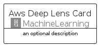

# AwsDeepLens


```text
aws-q1-2024/Architecture/MachineLearning/AwsDeepLens
```

```text
include('aws-q1-2024/Architecture/MachineLearning/AwsDeepLens')
```


| Illustration | AwsDeepLens | AwsDeepLensCard | AwsDeepLensGroup |
| :---: | :---: | :---: | :---: |
|  |  |  |  |


## Sprites
The item provides the following sriptes:

- `<$AwsDeepLensXs>`
- `<$AwsDeepLensSm>`
- `<$AwsDeepLensMd>`
- `<$AwsDeepLensLg>`


## AwsDeepLens

### Load remotely
```plantuml
@startuml
' configures the library
!global $LIB_BASE_LOCATION="https://raw.githubusercontent.com/tmorin/plantuml-libs/master/distribution"

' loads the library's bootstrap
!include $LIB_BASE_LOCATION/bootstrap.puml

' loads the package bootstrap
include('aws-q1-2024/bootstrap')

' loads the Item which embeds the element AwsDeepLens
include('aws-q1-2024/Architecture/MachineLearning/AwsDeepLens')

' renders the element
AwsDeepLens('AwsDeepLens', 'Aws Deep Lens', 'an optional tech label', 'an optional description')
@enduml
```

### Load locally
```plantuml
@startuml
' configures the library
!global $INCLUSION_MODE="local"
!global $LIB_BASE_LOCATION="../../.."

' loads the library's bootstrap
!include $LIB_BASE_LOCATION/bootstrap.puml

' loads the package bootstrap
include('aws-q1-2024/bootstrap')

' loads the Item which embeds the element AwsDeepLens
include('aws-q1-2024/Architecture/MachineLearning/AwsDeepLens')

' renders the element
AwsDeepLens('AwsDeepLens', 'Aws Deep Lens', 'an optional tech label', 'an optional description')
@enduml
```

## AwsDeepLensCard

### Load remotely
```plantuml
@startuml
' configures the library
!global $LIB_BASE_LOCATION="https://raw.githubusercontent.com/tmorin/plantuml-libs/master/distribution"

' loads the library's bootstrap
!include $LIB_BASE_LOCATION/bootstrap.puml

' loads the package bootstrap
include('aws-q1-2024/bootstrap')

' loads the Item which embeds the element AwsDeepLensCard
include('aws-q1-2024/Architecture/MachineLearning/AwsDeepLens')

' renders the element
AwsDeepLensCard('AwsDeepLensCard', 'Aws Deep Lens Card', 'an optional description')
@enduml
```

### Load locally
```plantuml
@startuml
' configures the library
!global $INCLUSION_MODE="local"
!global $LIB_BASE_LOCATION="../../.."

' loads the library's bootstrap
!include $LIB_BASE_LOCATION/bootstrap.puml

' loads the package bootstrap
include('aws-q1-2024/bootstrap')

' loads the Item which embeds the element AwsDeepLensCard
include('aws-q1-2024/Architecture/MachineLearning/AwsDeepLens')

' renders the element
AwsDeepLensCard('AwsDeepLensCard', 'Aws Deep Lens Card', 'an optional description')
@enduml
```

## AwsDeepLensGroup

### Load remotely
```plantuml
@startuml
' configures the library
!global $LIB_BASE_LOCATION="https://raw.githubusercontent.com/tmorin/plantuml-libs/master/distribution"

' loads the library's bootstrap
!include $LIB_BASE_LOCATION/bootstrap.puml

' loads the package bootstrap
include('aws-q1-2024/bootstrap')

' loads the Item which embeds the element AwsDeepLensGroup
include('aws-q1-2024/Architecture/MachineLearning/AwsDeepLens')

' renders the element
AwsDeepLensGroup('AwsDeepLensGroup', 'Aws Deep Lens Group', 'an optional tech label') {
    note as note
        the content of the group
    end note
}
@enduml
```

### Load locally
```plantuml
@startuml
' configures the library
!global $INCLUSION_MODE="local"
!global $LIB_BASE_LOCATION="../../.."

' loads the library's bootstrap
!include $LIB_BASE_LOCATION/bootstrap.puml

' loads the package bootstrap
include('aws-q1-2024/bootstrap')

' loads the Item which embeds the element AwsDeepLensGroup
include('aws-q1-2024/Architecture/MachineLearning/AwsDeepLens')

' renders the element
AwsDeepLensGroup('AwsDeepLensGroup', 'Aws Deep Lens Group', 'an optional tech label') {
    note as note
        the content of the group
    end note
}
@enduml
```

