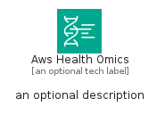

# AwsHealthOmics


```text
aws-q1-2024/Architecture/MachineLearning/AwsHealthOmics
```

```text
include('aws-q1-2024/Architecture/MachineLearning/AwsHealthOmics')
```


| Illustration | AwsHealthOmics | AwsHealthOmicsCard | AwsHealthOmicsGroup |
| :---: | :---: | :---: | :---: |
|  |  |  |  |


## Sprites
The item provides the following sriptes:

- `<$AwsHealthOmicsXs>`
- `<$AwsHealthOmicsSm>`
- `<$AwsHealthOmicsMd>`
- `<$AwsHealthOmicsLg>`


## AwsHealthOmics

### Load remotely
```plantuml
@startuml
' configures the library
!global $LIB_BASE_LOCATION="https://raw.githubusercontent.com/tmorin/plantuml-libs/master/distribution"

' loads the library's bootstrap
!include $LIB_BASE_LOCATION/bootstrap.puml

' loads the package bootstrap
include('aws-q1-2024/bootstrap')

' loads the Item which embeds the element AwsHealthOmics
include('aws-q1-2024/Architecture/MachineLearning/AwsHealthOmics')

' renders the element
AwsHealthOmics('AwsHealthOmics', 'Aws Health Omics', 'an optional tech label', 'an optional description')
@enduml
```

### Load locally
```plantuml
@startuml
' configures the library
!global $INCLUSION_MODE="local"
!global $LIB_BASE_LOCATION="../../.."

' loads the library's bootstrap
!include $LIB_BASE_LOCATION/bootstrap.puml

' loads the package bootstrap
include('aws-q1-2024/bootstrap')

' loads the Item which embeds the element AwsHealthOmics
include('aws-q1-2024/Architecture/MachineLearning/AwsHealthOmics')

' renders the element
AwsHealthOmics('AwsHealthOmics', 'Aws Health Omics', 'an optional tech label', 'an optional description')
@enduml
```

## AwsHealthOmicsCard

### Load remotely
```plantuml
@startuml
' configures the library
!global $LIB_BASE_LOCATION="https://raw.githubusercontent.com/tmorin/plantuml-libs/master/distribution"

' loads the library's bootstrap
!include $LIB_BASE_LOCATION/bootstrap.puml

' loads the package bootstrap
include('aws-q1-2024/bootstrap')

' loads the Item which embeds the element AwsHealthOmicsCard
include('aws-q1-2024/Architecture/MachineLearning/AwsHealthOmics')

' renders the element
AwsHealthOmicsCard('AwsHealthOmicsCard', 'Aws Health Omics Card', 'an optional description')
@enduml
```

### Load locally
```plantuml
@startuml
' configures the library
!global $INCLUSION_MODE="local"
!global $LIB_BASE_LOCATION="../../.."

' loads the library's bootstrap
!include $LIB_BASE_LOCATION/bootstrap.puml

' loads the package bootstrap
include('aws-q1-2024/bootstrap')

' loads the Item which embeds the element AwsHealthOmicsCard
include('aws-q1-2024/Architecture/MachineLearning/AwsHealthOmics')

' renders the element
AwsHealthOmicsCard('AwsHealthOmicsCard', 'Aws Health Omics Card', 'an optional description')
@enduml
```

## AwsHealthOmicsGroup

### Load remotely
```plantuml
@startuml
' configures the library
!global $LIB_BASE_LOCATION="https://raw.githubusercontent.com/tmorin/plantuml-libs/master/distribution"

' loads the library's bootstrap
!include $LIB_BASE_LOCATION/bootstrap.puml

' loads the package bootstrap
include('aws-q1-2024/bootstrap')

' loads the Item which embeds the element AwsHealthOmicsGroup
include('aws-q1-2024/Architecture/MachineLearning/AwsHealthOmics')

' renders the element
AwsHealthOmicsGroup('AwsHealthOmicsGroup', 'Aws Health Omics Group', 'an optional tech label') {
    note as note
        the content of the group
    end note
}
@enduml
```

### Load locally
```plantuml
@startuml
' configures the library
!global $INCLUSION_MODE="local"
!global $LIB_BASE_LOCATION="../../.."

' loads the library's bootstrap
!include $LIB_BASE_LOCATION/bootstrap.puml

' loads the package bootstrap
include('aws-q1-2024/bootstrap')

' loads the Item which embeds the element AwsHealthOmicsGroup
include('aws-q1-2024/Architecture/MachineLearning/AwsHealthOmics')

' renders the element
AwsHealthOmicsGroup('AwsHealthOmicsGroup', 'Aws Health Omics Group', 'an optional tech label') {
    note as note
        the content of the group
    end note
}
@enduml
```

