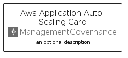

# AwsApplicationAutoScaling


```text
aws-q1-2024/Architecture/ManagementGovernance/AwsApplicationAutoScaling
```

```text
include('aws-q1-2024/Architecture/ManagementGovernance/AwsApplicationAutoScaling')
```


| Illustration | AwsApplicationAutoScaling | AwsApplicationAutoScalingCard | AwsApplicationAutoScalingGroup |
| :---: | :---: | :---: | :---: |
|  |  |  |  |


## Sprites
The item provides the following sriptes:

- `<$AwsApplicationAutoScalingXs>`
- `<$AwsApplicationAutoScalingSm>`
- `<$AwsApplicationAutoScalingMd>`
- `<$AwsApplicationAutoScalingLg>`


## AwsApplicationAutoScaling

### Load remotely
```plantuml
@startuml
' configures the library
!global $LIB_BASE_LOCATION="https://raw.githubusercontent.com/tmorin/plantuml-libs/master/distribution"

' loads the library's bootstrap
!include $LIB_BASE_LOCATION/bootstrap.puml

' loads the package bootstrap
include('aws-q1-2024/bootstrap')

' loads the Item which embeds the element AwsApplicationAutoScaling
include('aws-q1-2024/Architecture/ManagementGovernance/AwsApplicationAutoScaling')

' renders the element
AwsApplicationAutoScaling('AwsApplicationAutoScaling', 'Aws Application Auto Scaling', 'an optional tech label', 'an optional description')
@enduml
```

### Load locally
```plantuml
@startuml
' configures the library
!global $INCLUSION_MODE="local"
!global $LIB_BASE_LOCATION="../../.."

' loads the library's bootstrap
!include $LIB_BASE_LOCATION/bootstrap.puml

' loads the package bootstrap
include('aws-q1-2024/bootstrap')

' loads the Item which embeds the element AwsApplicationAutoScaling
include('aws-q1-2024/Architecture/ManagementGovernance/AwsApplicationAutoScaling')

' renders the element
AwsApplicationAutoScaling('AwsApplicationAutoScaling', 'Aws Application Auto Scaling', 'an optional tech label', 'an optional description')
@enduml
```

## AwsApplicationAutoScalingCard

### Load remotely
```plantuml
@startuml
' configures the library
!global $LIB_BASE_LOCATION="https://raw.githubusercontent.com/tmorin/plantuml-libs/master/distribution"

' loads the library's bootstrap
!include $LIB_BASE_LOCATION/bootstrap.puml

' loads the package bootstrap
include('aws-q1-2024/bootstrap')

' loads the Item which embeds the element AwsApplicationAutoScalingCard
include('aws-q1-2024/Architecture/ManagementGovernance/AwsApplicationAutoScaling')

' renders the element
AwsApplicationAutoScalingCard('AwsApplicationAutoScalingCard', 'Aws Application Auto Scaling Card', 'an optional description')
@enduml
```

### Load locally
```plantuml
@startuml
' configures the library
!global $INCLUSION_MODE="local"
!global $LIB_BASE_LOCATION="../../.."

' loads the library's bootstrap
!include $LIB_BASE_LOCATION/bootstrap.puml

' loads the package bootstrap
include('aws-q1-2024/bootstrap')

' loads the Item which embeds the element AwsApplicationAutoScalingCard
include('aws-q1-2024/Architecture/ManagementGovernance/AwsApplicationAutoScaling')

' renders the element
AwsApplicationAutoScalingCard('AwsApplicationAutoScalingCard', 'Aws Application Auto Scaling Card', 'an optional description')
@enduml
```

## AwsApplicationAutoScalingGroup

### Load remotely
```plantuml
@startuml
' configures the library
!global $LIB_BASE_LOCATION="https://raw.githubusercontent.com/tmorin/plantuml-libs/master/distribution"

' loads the library's bootstrap
!include $LIB_BASE_LOCATION/bootstrap.puml

' loads the package bootstrap
include('aws-q1-2024/bootstrap')

' loads the Item which embeds the element AwsApplicationAutoScalingGroup
include('aws-q1-2024/Architecture/ManagementGovernance/AwsApplicationAutoScaling')

' renders the element
AwsApplicationAutoScalingGroup('AwsApplicationAutoScalingGroup', 'Aws Application Auto Scaling Group', 'an optional tech label') {
    note as note
        the content of the group
    end note
}
@enduml
```

### Load locally
```plantuml
@startuml
' configures the library
!global $INCLUSION_MODE="local"
!global $LIB_BASE_LOCATION="../../.."

' loads the library's bootstrap
!include $LIB_BASE_LOCATION/bootstrap.puml

' loads the package bootstrap
include('aws-q1-2024/bootstrap')

' loads the Item which embeds the element AwsApplicationAutoScalingGroup
include('aws-q1-2024/Architecture/ManagementGovernance/AwsApplicationAutoScaling')

' renders the element
AwsApplicationAutoScalingGroup('AwsApplicationAutoScalingGroup', 'Aws Application Auto Scaling Group', 'an optional tech label') {
    note as note
        the content of the group
    end note
}
@enduml
```

