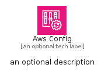
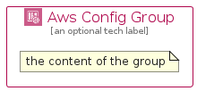

# AwsConfig


```text
aws-q1-2024/Architecture/ManagementGovernance/AwsConfig
```

```text
include('aws-q1-2024/Architecture/ManagementGovernance/AwsConfig')
```


| Illustration | AwsConfig | AwsConfigCard | AwsConfigGroup |
| :---: | :---: | :---: | :---: |
|  |  |  |  |


## Sprites
The item provides the following sriptes:

- `<$AwsConfigXs>`
- `<$AwsConfigSm>`
- `<$AwsConfigMd>`
- `<$AwsConfigLg>`


## AwsConfig

### Load remotely
```plantuml
@startuml
' configures the library
!global $LIB_BASE_LOCATION="https://raw.githubusercontent.com/tmorin/plantuml-libs/master/distribution"

' loads the library's bootstrap
!include $LIB_BASE_LOCATION/bootstrap.puml

' loads the package bootstrap
include('aws-q1-2024/bootstrap')

' loads the Item which embeds the element AwsConfig
include('aws-q1-2024/Architecture/ManagementGovernance/AwsConfig')

' renders the element
AwsConfig('AwsConfig', 'Aws Config', 'an optional tech label', 'an optional description')
@enduml
```

### Load locally
```plantuml
@startuml
' configures the library
!global $INCLUSION_MODE="local"
!global $LIB_BASE_LOCATION="../../.."

' loads the library's bootstrap
!include $LIB_BASE_LOCATION/bootstrap.puml

' loads the package bootstrap
include('aws-q1-2024/bootstrap')

' loads the Item which embeds the element AwsConfig
include('aws-q1-2024/Architecture/ManagementGovernance/AwsConfig')

' renders the element
AwsConfig('AwsConfig', 'Aws Config', 'an optional tech label', 'an optional description')
@enduml
```

## AwsConfigCard

### Load remotely
```plantuml
@startuml
' configures the library
!global $LIB_BASE_LOCATION="https://raw.githubusercontent.com/tmorin/plantuml-libs/master/distribution"

' loads the library's bootstrap
!include $LIB_BASE_LOCATION/bootstrap.puml

' loads the package bootstrap
include('aws-q1-2024/bootstrap')

' loads the Item which embeds the element AwsConfigCard
include('aws-q1-2024/Architecture/ManagementGovernance/AwsConfig')

' renders the element
AwsConfigCard('AwsConfigCard', 'Aws Config Card', 'an optional description')
@enduml
```

### Load locally
```plantuml
@startuml
' configures the library
!global $INCLUSION_MODE="local"
!global $LIB_BASE_LOCATION="../../.."

' loads the library's bootstrap
!include $LIB_BASE_LOCATION/bootstrap.puml

' loads the package bootstrap
include('aws-q1-2024/bootstrap')

' loads the Item which embeds the element AwsConfigCard
include('aws-q1-2024/Architecture/ManagementGovernance/AwsConfig')

' renders the element
AwsConfigCard('AwsConfigCard', 'Aws Config Card', 'an optional description')
@enduml
```

## AwsConfigGroup

### Load remotely
```plantuml
@startuml
' configures the library
!global $LIB_BASE_LOCATION="https://raw.githubusercontent.com/tmorin/plantuml-libs/master/distribution"

' loads the library's bootstrap
!include $LIB_BASE_LOCATION/bootstrap.puml

' loads the package bootstrap
include('aws-q1-2024/bootstrap')

' loads the Item which embeds the element AwsConfigGroup
include('aws-q1-2024/Architecture/ManagementGovernance/AwsConfig')

' renders the element
AwsConfigGroup('AwsConfigGroup', 'Aws Config Group', 'an optional tech label') {
    note as note
        the content of the group
    end note
}
@enduml
```

### Load locally
```plantuml
@startuml
' configures the library
!global $INCLUSION_MODE="local"
!global $LIB_BASE_LOCATION="../../.."

' loads the library's bootstrap
!include $LIB_BASE_LOCATION/bootstrap.puml

' loads the package bootstrap
include('aws-q1-2024/bootstrap')

' loads the Item which embeds the element AwsConfigGroup
include('aws-q1-2024/Architecture/ManagementGovernance/AwsConfig')

' renders the element
AwsConfigGroup('AwsConfigGroup', 'Aws Config Group', 'an optional tech label') {
    note as note
        the content of the group
    end note
}
@enduml
```

