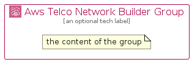

# AwsTelcoNetworkBuilder


```text
aws-q1-2024/Architecture/ManagementGovernance/AwsTelcoNetworkBuilder
```

```text
include('aws-q1-2024/Architecture/ManagementGovernance/AwsTelcoNetworkBuilder')
```


| Illustration | AwsTelcoNetworkBuilder | AwsTelcoNetworkBuilderCard | AwsTelcoNetworkBuilderGroup |
| :---: | :---: | :---: | :---: |
|  |  |  |  |


## Sprites
The item provides the following sriptes:

- `<$AwsTelcoNetworkBuilderXs>`
- `<$AwsTelcoNetworkBuilderSm>`
- `<$AwsTelcoNetworkBuilderMd>`
- `<$AwsTelcoNetworkBuilderLg>`


## AwsTelcoNetworkBuilder

### Load remotely
```plantuml
@startuml
' configures the library
!global $LIB_BASE_LOCATION="https://raw.githubusercontent.com/tmorin/plantuml-libs/master/distribution"

' loads the library's bootstrap
!include $LIB_BASE_LOCATION/bootstrap.puml

' loads the package bootstrap
include('aws-q1-2024/bootstrap')

' loads the Item which embeds the element AwsTelcoNetworkBuilder
include('aws-q1-2024/Architecture/ManagementGovernance/AwsTelcoNetworkBuilder')

' renders the element
AwsTelcoNetworkBuilder('AwsTelcoNetworkBuilder', 'Aws Telco Network Builder', 'an optional tech label', 'an optional description')
@enduml
```

### Load locally
```plantuml
@startuml
' configures the library
!global $INCLUSION_MODE="local"
!global $LIB_BASE_LOCATION="../../.."

' loads the library's bootstrap
!include $LIB_BASE_LOCATION/bootstrap.puml

' loads the package bootstrap
include('aws-q1-2024/bootstrap')

' loads the Item which embeds the element AwsTelcoNetworkBuilder
include('aws-q1-2024/Architecture/ManagementGovernance/AwsTelcoNetworkBuilder')

' renders the element
AwsTelcoNetworkBuilder('AwsTelcoNetworkBuilder', 'Aws Telco Network Builder', 'an optional tech label', 'an optional description')
@enduml
```

## AwsTelcoNetworkBuilderCard

### Load remotely
```plantuml
@startuml
' configures the library
!global $LIB_BASE_LOCATION="https://raw.githubusercontent.com/tmorin/plantuml-libs/master/distribution"

' loads the library's bootstrap
!include $LIB_BASE_LOCATION/bootstrap.puml

' loads the package bootstrap
include('aws-q1-2024/bootstrap')

' loads the Item which embeds the element AwsTelcoNetworkBuilderCard
include('aws-q1-2024/Architecture/ManagementGovernance/AwsTelcoNetworkBuilder')

' renders the element
AwsTelcoNetworkBuilderCard('AwsTelcoNetworkBuilderCard', 'Aws Telco Network Builder Card', 'an optional description')
@enduml
```

### Load locally
```plantuml
@startuml
' configures the library
!global $INCLUSION_MODE="local"
!global $LIB_BASE_LOCATION="../../.."

' loads the library's bootstrap
!include $LIB_BASE_LOCATION/bootstrap.puml

' loads the package bootstrap
include('aws-q1-2024/bootstrap')

' loads the Item which embeds the element AwsTelcoNetworkBuilderCard
include('aws-q1-2024/Architecture/ManagementGovernance/AwsTelcoNetworkBuilder')

' renders the element
AwsTelcoNetworkBuilderCard('AwsTelcoNetworkBuilderCard', 'Aws Telco Network Builder Card', 'an optional description')
@enduml
```

## AwsTelcoNetworkBuilderGroup

### Load remotely
```plantuml
@startuml
' configures the library
!global $LIB_BASE_LOCATION="https://raw.githubusercontent.com/tmorin/plantuml-libs/master/distribution"

' loads the library's bootstrap
!include $LIB_BASE_LOCATION/bootstrap.puml

' loads the package bootstrap
include('aws-q1-2024/bootstrap')

' loads the Item which embeds the element AwsTelcoNetworkBuilderGroup
include('aws-q1-2024/Architecture/ManagementGovernance/AwsTelcoNetworkBuilder')

' renders the element
AwsTelcoNetworkBuilderGroup('AwsTelcoNetworkBuilderGroup', 'Aws Telco Network Builder Group', 'an optional tech label') {
    note as note
        the content of the group
    end note
}
@enduml
```

### Load locally
```plantuml
@startuml
' configures the library
!global $INCLUSION_MODE="local"
!global $LIB_BASE_LOCATION="../../.."

' loads the library's bootstrap
!include $LIB_BASE_LOCATION/bootstrap.puml

' loads the package bootstrap
include('aws-q1-2024/bootstrap')

' loads the Item which embeds the element AwsTelcoNetworkBuilderGroup
include('aws-q1-2024/Architecture/ManagementGovernance/AwsTelcoNetworkBuilder')

' renders the element
AwsTelcoNetworkBuilderGroup('AwsTelcoNetworkBuilderGroup', 'Aws Telco Network Builder Group', 'an optional tech label') {
    note as note
        the content of the group
    end note
}
@enduml
```

