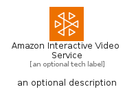

# AmazonInteractiveVideoService


```text
aws-q1-2024/Architecture/MediaServices/AmazonInteractiveVideoService
```

```text
include('aws-q1-2024/Architecture/MediaServices/AmazonInteractiveVideoService')
```


| Illustration | AmazonInteractiveVideoService | AmazonInteractiveVideoServiceCard | AmazonInteractiveVideoServiceGroup |
| :---: | :---: | :---: | :---: |
|  |  |  |  |


## Sprites
The item provides the following sriptes:

- `<$AmazonInteractiveVideoServiceXs>`
- `<$AmazonInteractiveVideoServiceSm>`
- `<$AmazonInteractiveVideoServiceMd>`
- `<$AmazonInteractiveVideoServiceLg>`


## AmazonInteractiveVideoService

### Load remotely
```plantuml
@startuml
' configures the library
!global $LIB_BASE_LOCATION="https://raw.githubusercontent.com/tmorin/plantuml-libs/master/distribution"

' loads the library's bootstrap
!include $LIB_BASE_LOCATION/bootstrap.puml

' loads the package bootstrap
include('aws-q1-2024/bootstrap')

' loads the Item which embeds the element AmazonInteractiveVideoService
include('aws-q1-2024/Architecture/MediaServices/AmazonInteractiveVideoService')

' renders the element
AmazonInteractiveVideoService('AmazonInteractiveVideoService', 'Amazon Interactive Video Service', 'an optional tech label', 'an optional description')
@enduml
```

### Load locally
```plantuml
@startuml
' configures the library
!global $INCLUSION_MODE="local"
!global $LIB_BASE_LOCATION="../../.."

' loads the library's bootstrap
!include $LIB_BASE_LOCATION/bootstrap.puml

' loads the package bootstrap
include('aws-q1-2024/bootstrap')

' loads the Item which embeds the element AmazonInteractiveVideoService
include('aws-q1-2024/Architecture/MediaServices/AmazonInteractiveVideoService')

' renders the element
AmazonInteractiveVideoService('AmazonInteractiveVideoService', 'Amazon Interactive Video Service', 'an optional tech label', 'an optional description')
@enduml
```

## AmazonInteractiveVideoServiceCard

### Load remotely
```plantuml
@startuml
' configures the library
!global $LIB_BASE_LOCATION="https://raw.githubusercontent.com/tmorin/plantuml-libs/master/distribution"

' loads the library's bootstrap
!include $LIB_BASE_LOCATION/bootstrap.puml

' loads the package bootstrap
include('aws-q1-2024/bootstrap')

' loads the Item which embeds the element AmazonInteractiveVideoServiceCard
include('aws-q1-2024/Architecture/MediaServices/AmazonInteractiveVideoService')

' renders the element
AmazonInteractiveVideoServiceCard('AmazonInteractiveVideoServiceCard', 'Amazon Interactive Video Service Card', 'an optional description')
@enduml
```

### Load locally
```plantuml
@startuml
' configures the library
!global $INCLUSION_MODE="local"
!global $LIB_BASE_LOCATION="../../.."

' loads the library's bootstrap
!include $LIB_BASE_LOCATION/bootstrap.puml

' loads the package bootstrap
include('aws-q1-2024/bootstrap')

' loads the Item which embeds the element AmazonInteractiveVideoServiceCard
include('aws-q1-2024/Architecture/MediaServices/AmazonInteractiveVideoService')

' renders the element
AmazonInteractiveVideoServiceCard('AmazonInteractiveVideoServiceCard', 'Amazon Interactive Video Service Card', 'an optional description')
@enduml
```

## AmazonInteractiveVideoServiceGroup

### Load remotely
```plantuml
@startuml
' configures the library
!global $LIB_BASE_LOCATION="https://raw.githubusercontent.com/tmorin/plantuml-libs/master/distribution"

' loads the library's bootstrap
!include $LIB_BASE_LOCATION/bootstrap.puml

' loads the package bootstrap
include('aws-q1-2024/bootstrap')

' loads the Item which embeds the element AmazonInteractiveVideoServiceGroup
include('aws-q1-2024/Architecture/MediaServices/AmazonInteractiveVideoService')

' renders the element
AmazonInteractiveVideoServiceGroup('AmazonInteractiveVideoServiceGroup', 'Amazon Interactive Video Service Group', 'an optional tech label') {
    note as note
        the content of the group
    end note
}
@enduml
```

### Load locally
```plantuml
@startuml
' configures the library
!global $INCLUSION_MODE="local"
!global $LIB_BASE_LOCATION="../../.."

' loads the library's bootstrap
!include $LIB_BASE_LOCATION/bootstrap.puml

' loads the package bootstrap
include('aws-q1-2024/bootstrap')

' loads the Item which embeds the element AmazonInteractiveVideoServiceGroup
include('aws-q1-2024/Architecture/MediaServices/AmazonInteractiveVideoService')

' renders the element
AmazonInteractiveVideoServiceGroup('AmazonInteractiveVideoServiceGroup', 'Amazon Interactive Video Service Group', 'an optional tech label') {
    note as note
        the content of the group
    end note
}
@enduml
```

