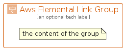

# AwsElementalLink


```text
aws-q1-2024/Architecture/MediaServices/AwsElementalLink
```

```text
include('aws-q1-2024/Architecture/MediaServices/AwsElementalLink')
```


| Illustration | AwsElementalLink | AwsElementalLinkCard | AwsElementalLinkGroup |
| :---: | :---: | :---: | :---: |
|  |  |  |  |


## Sprites
The item provides the following sriptes:

- `<$AwsElementalLinkXs>`
- `<$AwsElementalLinkSm>`
- `<$AwsElementalLinkMd>`
- `<$AwsElementalLinkLg>`


## AwsElementalLink

### Load remotely
```plantuml
@startuml
' configures the library
!global $LIB_BASE_LOCATION="https://raw.githubusercontent.com/tmorin/plantuml-libs/master/distribution"

' loads the library's bootstrap
!include $LIB_BASE_LOCATION/bootstrap.puml

' loads the package bootstrap
include('aws-q1-2024/bootstrap')

' loads the Item which embeds the element AwsElementalLink
include('aws-q1-2024/Architecture/MediaServices/AwsElementalLink')

' renders the element
AwsElementalLink('AwsElementalLink', 'Aws Elemental Link', 'an optional tech label', 'an optional description')
@enduml
```

### Load locally
```plantuml
@startuml
' configures the library
!global $INCLUSION_MODE="local"
!global $LIB_BASE_LOCATION="../../.."

' loads the library's bootstrap
!include $LIB_BASE_LOCATION/bootstrap.puml

' loads the package bootstrap
include('aws-q1-2024/bootstrap')

' loads the Item which embeds the element AwsElementalLink
include('aws-q1-2024/Architecture/MediaServices/AwsElementalLink')

' renders the element
AwsElementalLink('AwsElementalLink', 'Aws Elemental Link', 'an optional tech label', 'an optional description')
@enduml
```

## AwsElementalLinkCard

### Load remotely
```plantuml
@startuml
' configures the library
!global $LIB_BASE_LOCATION="https://raw.githubusercontent.com/tmorin/plantuml-libs/master/distribution"

' loads the library's bootstrap
!include $LIB_BASE_LOCATION/bootstrap.puml

' loads the package bootstrap
include('aws-q1-2024/bootstrap')

' loads the Item which embeds the element AwsElementalLinkCard
include('aws-q1-2024/Architecture/MediaServices/AwsElementalLink')

' renders the element
AwsElementalLinkCard('AwsElementalLinkCard', 'Aws Elemental Link Card', 'an optional description')
@enduml
```

### Load locally
```plantuml
@startuml
' configures the library
!global $INCLUSION_MODE="local"
!global $LIB_BASE_LOCATION="../../.."

' loads the library's bootstrap
!include $LIB_BASE_LOCATION/bootstrap.puml

' loads the package bootstrap
include('aws-q1-2024/bootstrap')

' loads the Item which embeds the element AwsElementalLinkCard
include('aws-q1-2024/Architecture/MediaServices/AwsElementalLink')

' renders the element
AwsElementalLinkCard('AwsElementalLinkCard', 'Aws Elemental Link Card', 'an optional description')
@enduml
```

## AwsElementalLinkGroup

### Load remotely
```plantuml
@startuml
' configures the library
!global $LIB_BASE_LOCATION="https://raw.githubusercontent.com/tmorin/plantuml-libs/master/distribution"

' loads the library's bootstrap
!include $LIB_BASE_LOCATION/bootstrap.puml

' loads the package bootstrap
include('aws-q1-2024/bootstrap')

' loads the Item which embeds the element AwsElementalLinkGroup
include('aws-q1-2024/Architecture/MediaServices/AwsElementalLink')

' renders the element
AwsElementalLinkGroup('AwsElementalLinkGroup', 'Aws Elemental Link Group', 'an optional tech label') {
    note as note
        the content of the group
    end note
}
@enduml
```

### Load locally
```plantuml
@startuml
' configures the library
!global $INCLUSION_MODE="local"
!global $LIB_BASE_LOCATION="../../.."

' loads the library's bootstrap
!include $LIB_BASE_LOCATION/bootstrap.puml

' loads the package bootstrap
include('aws-q1-2024/bootstrap')

' loads the Item which embeds the element AwsElementalLinkGroup
include('aws-q1-2024/Architecture/MediaServices/AwsElementalLink')

' renders the element
AwsElementalLinkGroup('AwsElementalLinkGroup', 'Aws Elemental Link Group', 'an optional tech label') {
    note as note
        the content of the group
    end note
}
@enduml
```

