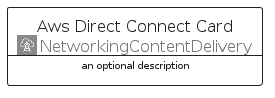
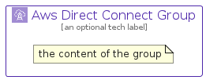

# AwsDirectConnect


```text
aws-q1-2024/Architecture/NetworkingContentDelivery/AwsDirectConnect
```

```text
include('aws-q1-2024/Architecture/NetworkingContentDelivery/AwsDirectConnect')
```


| Illustration | AwsDirectConnect | AwsDirectConnectCard | AwsDirectConnectGroup |
| :---: | :---: | :---: | :---: |
|  |  |  |  |


## Sprites
The item provides the following sriptes:

- `<$AwsDirectConnectXs>`
- `<$AwsDirectConnectSm>`
- `<$AwsDirectConnectMd>`
- `<$AwsDirectConnectLg>`


## AwsDirectConnect

### Load remotely
```plantuml
@startuml
' configures the library
!global $LIB_BASE_LOCATION="https://raw.githubusercontent.com/tmorin/plantuml-libs/master/distribution"

' loads the library's bootstrap
!include $LIB_BASE_LOCATION/bootstrap.puml

' loads the package bootstrap
include('aws-q1-2024/bootstrap')

' loads the Item which embeds the element AwsDirectConnect
include('aws-q1-2024/Architecture/NetworkingContentDelivery/AwsDirectConnect')

' renders the element
AwsDirectConnect('AwsDirectConnect', 'Aws Direct Connect', 'an optional tech label', 'an optional description')
@enduml
```

### Load locally
```plantuml
@startuml
' configures the library
!global $INCLUSION_MODE="local"
!global $LIB_BASE_LOCATION="../../.."

' loads the library's bootstrap
!include $LIB_BASE_LOCATION/bootstrap.puml

' loads the package bootstrap
include('aws-q1-2024/bootstrap')

' loads the Item which embeds the element AwsDirectConnect
include('aws-q1-2024/Architecture/NetworkingContentDelivery/AwsDirectConnect')

' renders the element
AwsDirectConnect('AwsDirectConnect', 'Aws Direct Connect', 'an optional tech label', 'an optional description')
@enduml
```

## AwsDirectConnectCard

### Load remotely
```plantuml
@startuml
' configures the library
!global $LIB_BASE_LOCATION="https://raw.githubusercontent.com/tmorin/plantuml-libs/master/distribution"

' loads the library's bootstrap
!include $LIB_BASE_LOCATION/bootstrap.puml

' loads the package bootstrap
include('aws-q1-2024/bootstrap')

' loads the Item which embeds the element AwsDirectConnectCard
include('aws-q1-2024/Architecture/NetworkingContentDelivery/AwsDirectConnect')

' renders the element
AwsDirectConnectCard('AwsDirectConnectCard', 'Aws Direct Connect Card', 'an optional description')
@enduml
```

### Load locally
```plantuml
@startuml
' configures the library
!global $INCLUSION_MODE="local"
!global $LIB_BASE_LOCATION="../../.."

' loads the library's bootstrap
!include $LIB_BASE_LOCATION/bootstrap.puml

' loads the package bootstrap
include('aws-q1-2024/bootstrap')

' loads the Item which embeds the element AwsDirectConnectCard
include('aws-q1-2024/Architecture/NetworkingContentDelivery/AwsDirectConnect')

' renders the element
AwsDirectConnectCard('AwsDirectConnectCard', 'Aws Direct Connect Card', 'an optional description')
@enduml
```

## AwsDirectConnectGroup

### Load remotely
```plantuml
@startuml
' configures the library
!global $LIB_BASE_LOCATION="https://raw.githubusercontent.com/tmorin/plantuml-libs/master/distribution"

' loads the library's bootstrap
!include $LIB_BASE_LOCATION/bootstrap.puml

' loads the package bootstrap
include('aws-q1-2024/bootstrap')

' loads the Item which embeds the element AwsDirectConnectGroup
include('aws-q1-2024/Architecture/NetworkingContentDelivery/AwsDirectConnect')

' renders the element
AwsDirectConnectGroup('AwsDirectConnectGroup', 'Aws Direct Connect Group', 'an optional tech label') {
    note as note
        the content of the group
    end note
}
@enduml
```

### Load locally
```plantuml
@startuml
' configures the library
!global $INCLUSION_MODE="local"
!global $LIB_BASE_LOCATION="../../.."

' loads the library's bootstrap
!include $LIB_BASE_LOCATION/bootstrap.puml

' loads the package bootstrap
include('aws-q1-2024/bootstrap')

' loads the Item which embeds the element AwsDirectConnectGroup
include('aws-q1-2024/Architecture/NetworkingContentDelivery/AwsDirectConnect')

' renders the element
AwsDirectConnectGroup('AwsDirectConnectGroup', 'Aws Direct Connect Group', 'an optional tech label') {
    note as note
        the content of the group
    end note
}
@enduml
```

