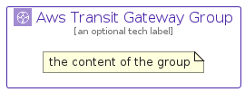

# AwsTransitGateway


```text
aws-q1-2024/Architecture/NetworkingContentDelivery/AwsTransitGateway
```

```text
include('aws-q1-2024/Architecture/NetworkingContentDelivery/AwsTransitGateway')
```


| Illustration | AwsTransitGateway | AwsTransitGatewayCard | AwsTransitGatewayGroup |
| :---: | :---: | :---: | :---: |
|  |  |  |  |


## Sprites
The item provides the following sriptes:

- `<$AwsTransitGatewayXs>`
- `<$AwsTransitGatewaySm>`
- `<$AwsTransitGatewayMd>`
- `<$AwsTransitGatewayLg>`


## AwsTransitGateway

### Load remotely
```plantuml
@startuml
' configures the library
!global $LIB_BASE_LOCATION="https://raw.githubusercontent.com/tmorin/plantuml-libs/master/distribution"

' loads the library's bootstrap
!include $LIB_BASE_LOCATION/bootstrap.puml

' loads the package bootstrap
include('aws-q1-2024/bootstrap')

' loads the Item which embeds the element AwsTransitGateway
include('aws-q1-2024/Architecture/NetworkingContentDelivery/AwsTransitGateway')

' renders the element
AwsTransitGateway('AwsTransitGateway', 'Aws Transit Gateway', 'an optional tech label', 'an optional description')
@enduml
```

### Load locally
```plantuml
@startuml
' configures the library
!global $INCLUSION_MODE="local"
!global $LIB_BASE_LOCATION="../../.."

' loads the library's bootstrap
!include $LIB_BASE_LOCATION/bootstrap.puml

' loads the package bootstrap
include('aws-q1-2024/bootstrap')

' loads the Item which embeds the element AwsTransitGateway
include('aws-q1-2024/Architecture/NetworkingContentDelivery/AwsTransitGateway')

' renders the element
AwsTransitGateway('AwsTransitGateway', 'Aws Transit Gateway', 'an optional tech label', 'an optional description')
@enduml
```

## AwsTransitGatewayCard

### Load remotely
```plantuml
@startuml
' configures the library
!global $LIB_BASE_LOCATION="https://raw.githubusercontent.com/tmorin/plantuml-libs/master/distribution"

' loads the library's bootstrap
!include $LIB_BASE_LOCATION/bootstrap.puml

' loads the package bootstrap
include('aws-q1-2024/bootstrap')

' loads the Item which embeds the element AwsTransitGatewayCard
include('aws-q1-2024/Architecture/NetworkingContentDelivery/AwsTransitGateway')

' renders the element
AwsTransitGatewayCard('AwsTransitGatewayCard', 'Aws Transit Gateway Card', 'an optional description')
@enduml
```

### Load locally
```plantuml
@startuml
' configures the library
!global $INCLUSION_MODE="local"
!global $LIB_BASE_LOCATION="../../.."

' loads the library's bootstrap
!include $LIB_BASE_LOCATION/bootstrap.puml

' loads the package bootstrap
include('aws-q1-2024/bootstrap')

' loads the Item which embeds the element AwsTransitGatewayCard
include('aws-q1-2024/Architecture/NetworkingContentDelivery/AwsTransitGateway')

' renders the element
AwsTransitGatewayCard('AwsTransitGatewayCard', 'Aws Transit Gateway Card', 'an optional description')
@enduml
```

## AwsTransitGatewayGroup

### Load remotely
```plantuml
@startuml
' configures the library
!global $LIB_BASE_LOCATION="https://raw.githubusercontent.com/tmorin/plantuml-libs/master/distribution"

' loads the library's bootstrap
!include $LIB_BASE_LOCATION/bootstrap.puml

' loads the package bootstrap
include('aws-q1-2024/bootstrap')

' loads the Item which embeds the element AwsTransitGatewayGroup
include('aws-q1-2024/Architecture/NetworkingContentDelivery/AwsTransitGateway')

' renders the element
AwsTransitGatewayGroup('AwsTransitGatewayGroup', 'Aws Transit Gateway Group', 'an optional tech label') {
    note as note
        the content of the group
    end note
}
@enduml
```

### Load locally
```plantuml
@startuml
' configures the library
!global $INCLUSION_MODE="local"
!global $LIB_BASE_LOCATION="../../.."

' loads the library's bootstrap
!include $LIB_BASE_LOCATION/bootstrap.puml

' loads the package bootstrap
include('aws-q1-2024/bootstrap')

' loads the Item which embeds the element AwsTransitGatewayGroup
include('aws-q1-2024/Architecture/NetworkingContentDelivery/AwsTransitGateway')

' renders the element
AwsTransitGatewayGroup('AwsTransitGatewayGroup', 'Aws Transit Gateway Group', 'an optional tech label') {
    note as note
        the content of the group
    end note
}
@enduml
```

