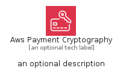
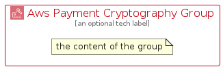

# AwsPaymentCryptography


```text
aws-q1-2024/Architecture/SecurityIdentityCompliance/AwsPaymentCryptography
```

```text
include('aws-q1-2024/Architecture/SecurityIdentityCompliance/AwsPaymentCryptography')
```


| Illustration | AwsPaymentCryptography | AwsPaymentCryptographyCard | AwsPaymentCryptographyGroup |
| :---: | :---: | :---: | :---: |
|  |  |  |  |


## Sprites
The item provides the following sriptes:

- `<$AwsPaymentCryptographyXs>`
- `<$AwsPaymentCryptographySm>`
- `<$AwsPaymentCryptographyMd>`
- `<$AwsPaymentCryptographyLg>`


## AwsPaymentCryptography

### Load remotely
```plantuml
@startuml
' configures the library
!global $LIB_BASE_LOCATION="https://raw.githubusercontent.com/tmorin/plantuml-libs/master/distribution"

' loads the library's bootstrap
!include $LIB_BASE_LOCATION/bootstrap.puml

' loads the package bootstrap
include('aws-q1-2024/bootstrap')

' loads the Item which embeds the element AwsPaymentCryptography
include('aws-q1-2024/Architecture/SecurityIdentityCompliance/AwsPaymentCryptography')

' renders the element
AwsPaymentCryptography('AwsPaymentCryptography', 'Aws Payment Cryptography', 'an optional tech label', 'an optional description')
@enduml
```

### Load locally
```plantuml
@startuml
' configures the library
!global $INCLUSION_MODE="local"
!global $LIB_BASE_LOCATION="../../.."

' loads the library's bootstrap
!include $LIB_BASE_LOCATION/bootstrap.puml

' loads the package bootstrap
include('aws-q1-2024/bootstrap')

' loads the Item which embeds the element AwsPaymentCryptography
include('aws-q1-2024/Architecture/SecurityIdentityCompliance/AwsPaymentCryptography')

' renders the element
AwsPaymentCryptography('AwsPaymentCryptography', 'Aws Payment Cryptography', 'an optional tech label', 'an optional description')
@enduml
```

## AwsPaymentCryptographyCard

### Load remotely
```plantuml
@startuml
' configures the library
!global $LIB_BASE_LOCATION="https://raw.githubusercontent.com/tmorin/plantuml-libs/master/distribution"

' loads the library's bootstrap
!include $LIB_BASE_LOCATION/bootstrap.puml

' loads the package bootstrap
include('aws-q1-2024/bootstrap')

' loads the Item which embeds the element AwsPaymentCryptographyCard
include('aws-q1-2024/Architecture/SecurityIdentityCompliance/AwsPaymentCryptography')

' renders the element
AwsPaymentCryptographyCard('AwsPaymentCryptographyCard', 'Aws Payment Cryptography Card', 'an optional description')
@enduml
```

### Load locally
```plantuml
@startuml
' configures the library
!global $INCLUSION_MODE="local"
!global $LIB_BASE_LOCATION="../../.."

' loads the library's bootstrap
!include $LIB_BASE_LOCATION/bootstrap.puml

' loads the package bootstrap
include('aws-q1-2024/bootstrap')

' loads the Item which embeds the element AwsPaymentCryptographyCard
include('aws-q1-2024/Architecture/SecurityIdentityCompliance/AwsPaymentCryptography')

' renders the element
AwsPaymentCryptographyCard('AwsPaymentCryptographyCard', 'Aws Payment Cryptography Card', 'an optional description')
@enduml
```

## AwsPaymentCryptographyGroup

### Load remotely
```plantuml
@startuml
' configures the library
!global $LIB_BASE_LOCATION="https://raw.githubusercontent.com/tmorin/plantuml-libs/master/distribution"

' loads the library's bootstrap
!include $LIB_BASE_LOCATION/bootstrap.puml

' loads the package bootstrap
include('aws-q1-2024/bootstrap')

' loads the Item which embeds the element AwsPaymentCryptographyGroup
include('aws-q1-2024/Architecture/SecurityIdentityCompliance/AwsPaymentCryptography')

' renders the element
AwsPaymentCryptographyGroup('AwsPaymentCryptographyGroup', 'Aws Payment Cryptography Group', 'an optional tech label') {
    note as note
        the content of the group
    end note
}
@enduml
```

### Load locally
```plantuml
@startuml
' configures the library
!global $INCLUSION_MODE="local"
!global $LIB_BASE_LOCATION="../../.."

' loads the library's bootstrap
!include $LIB_BASE_LOCATION/bootstrap.puml

' loads the package bootstrap
include('aws-q1-2024/bootstrap')

' loads the Item which embeds the element AwsPaymentCryptographyGroup
include('aws-q1-2024/Architecture/SecurityIdentityCompliance/AwsPaymentCryptography')

' renders the element
AwsPaymentCryptographyGroup('AwsPaymentCryptographyGroup', 'Aws Payment Cryptography Group', 'an optional tech label') {
    note as note
        the content of the group
    end note
}
@enduml
```

